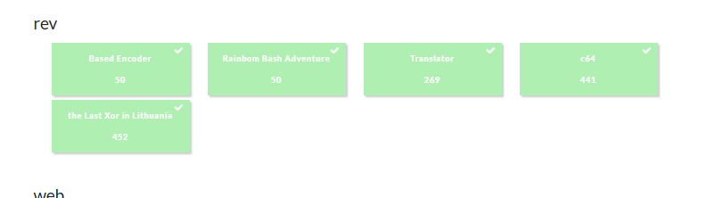

import Callout from '@/components/Callout.astro'
import { Icon } from 'astro-icon/components'

Break the Syntax was a pretty cool CTF. Sitting comfortably around intermediate level difficulty, however I really loved the rev challenges, they were so unique and such a nice breath of fresh air. I managed to full solve all rev tasks quite quickly, and moved on to help my teammates with other categories. We competed as part of [rakuz4n](https://ctftime.org/team/383658), which is a fun team made up of friends that I captain.



## rev - the Last Xor in Lithuania (452 points)

### **high-level overview**

we are given a binary called **a.out**  and an assignment which hints towards XOR (Exclusive OR) operations. from the Break the Syntax 2025 CTF, this was the rev task with the least amount of solves, which is surprising due to its simple nature, as opposed to other rev tasks.

### **control flow architecture**

(i used Binja with Pseudo C decompilation)

the binary uses a tightly-scoped entrypoint, passing all logic through a single function:


```c
int main(int argc, char** argv) {
    sub_40119d(argv[1]);
    return 0;
}
```

this is a single entry point into decryption and validation logic.
the function ```sub_40119d``` sets up the xor-based stage exec.


### **sub_40119d**

inside of the `sub_40119d` function, we observe :

1. the first input byte is extracted and used as a decryption key` input[0]`
2. the function `sub_401149 ` is called to xor-decrypt a 0xc7-byte block at `0x4073d2`
3. the binary then enters a loop, calling each entry in a function pointer table stored at  `0x404c60 `, incrementing through the table

simplified , cleaned up pseudocode  (i renamed the function  `sub_401149` that was mentioned in step 2 as ` xor_decrypt` 

```c
void sub_40119d(char* input) {
    uint8_t xor_key = input[0];
    xor_decrypt(0x4073d2, 0xc7, xor_key);

    void (**table)() = (void**)0x404c60;
    size_t i = 1;
    while (1) {
        table[i - 1](input[i]);
        i++;
    }
}
```

### **xor decryption logic**

` sub_401149`   , or as we renamed it, ` xor_decrypt` , applies a basic in-place xor over a fixed-size buffer:

```c
void xor_decrypt(uint8_t* data, size_t len, uint8_t key) {
    for (size_t i = 0; i < len; ++i) {
        data[i] ^= key;
    }
}
```

### **function pointer chain**

starting at `0x404c60`, the binary defines a flat array of 48 function pointers. each points to an encrypted memory section (for example, `f_0_section`, `f_1_section`, ...). these regions contain encrypted functions that validate one byte of input each.

#### pointer layout:

```c
0x404c60 → 0x4073d2
0x404c68 → 0x40749b
...
```

none of these function blocks are valid code until decrypted. after decryption, the first few bytes conform to a typical function **prologue**. this is the key to decryption, remember

### **decrypting stage 0: key discovery**

to decrypt the first block at `0x4073d2` , we brute-force the xor key until we find a valid x86 function signature. one such example ->

```asm
55             push   rbp
48 89 e5       mov    rbp, rsp
```

== mentioned prologue.

only one key yields this result: `0x42` (ascii 'B'). so the correct first byte of input is `B`.

### **flag recovery**

each stage uses a predictable function header and the validation logic is simple. so our plan is to :

1. extract the encrypted block for each function pointer
2. brute force xor keys 0x00-0xff until the decrypted version starts with :
```
55 48 89 e5
```
3. record the key — it corresponds to one flag byte.

this approach yields a sequence of 48 xor keys, each independently discoverable :

`}3M1T_4_T4_R0X_3NO_ZSU3D4T_N4P_GN1TPYRC3D{FTCStB`

oh wait, its reversed? O_o (think about why)

final flag : 

`**BtSCTF{D3CRYPT1NG_P4N_T4D3USZ_ON3_X0R_4T_4_T1M3}**`

## rev - c64 (441 points)

the challenge presents a .d64 commodore 64 disk image containing two files:


***decrypt*** — a basic v2 program that loads and executes a decryption routine
***secret*** — a sequential file containing an encrypted message


we are informed that the message in **secret** has been encrypted using the logic implemented in **decrypt**, and that a passphrase is required to unlock it. our objective is to reverse-engineer the decryption process and recover the flag, which follows the format `BTSCTF<...>`.

### disk image and decrypt analysis

we begin by examining the disk image using c1541 (a tool from the VICE emulator suite)

```shell
c1541 disk.d64 -list

0 "bts_disk"     2a
1   "secret"      seq
1   "decrypt"     prg
```

we extract the files for offline inspection

```shell
c1541 disk.d64 -read "secret" secret.seq
c1541 disk.d64 -read "decrypt" decrypt.prg
```

``decrypt`` is a commodore basic v2 program that loads and runs automatically. it performs the following actions:


1. opens and reads secret into a variable a$

2. asks the user to enter an 8-character key


3. checks that:

* the key is exactly 8 characters long

* the 8th character is equal to character 6 XOR character 7

4. runs a small embedded 6502 machine code routine to calculate a starting “decrypt key” (we'll call it dk, as in derived/decrypt key)

5. uses that dk in a loop to decrypt the contents of a$, byte by byte

### program control flow analysis

execution starts at line 2 with:
```
2 gosub 1000
4 input b$
10 gosub 4000
```

* line 2 loads the file secret into string variable a$
* line 4 prompts the user to input an 8-character decryption key, stored in b$
* line 10 initiates validation and transformation routines

### loading the encrypted data

the subroutine at line 1000 opens and reads the secret file:

```
1000 print "searching for a secret file on drive 8.."
1001 open 2,8,2,"secret,s,r"
1002 input#2,a$
1003 if st<>0 then print "cannot find a secret file": close 2: end
1004 print "secret file found!"
1005 print "enter decryption key (8 chars)"
1006 poke 6, len(a$)
1008 lli = 0
1009 return
```

the important part here is that the encrypted contents are read into the string a$

### key validation logic

key validation is performed at line 4000:

```
4002 if len(b$) <> 8 then print "invalid key length!": goto 3000
4020 y = asc(mid$(b$,7,1))
4025 gosub 1500
4026 dk = peek(250)
4030 if y <> asc(mid$(b$,8,1)) then print "invalid key!": goto 3000
```

* the key must be exactly 8 characters
* y is set to the ascii value of the 7th character
* the subroutine at line 1500 uses b$[0]..b$[6] to compute a derived value (dk)
* finally, a condition checks that b$[7] == b$[5] xor b$[6]


-> this is the core of the key (secret passphrase) validation. only keys where the 8th byte equals the xor of characters 6 and 7 are accepted.


### machine code routines

the program defines two short 6502 subroutines via a data block at line 10000 and loads them into memory address $c000 (decimal 49152) using 

```
2020 for i=0 to 17
2030 read a: poke 49152+i, a
2040 next
```

the first subroutine (at`$c000`) performs xor:


```
lda $fb      ; load operand1
eor $fc      ; xor with operand2
sta $fd      ; store result
rts
```

the second subroutine (at `$c007`) performs a 1-bit left shift and merges in a new lsb:


```
asl $fa      ; shift accumulator
lda $fb
and #$01
ora $fa
sta $fa
rts
```

### computing the initial decrypt key (dk)

subroutine 1500 computes the initial value used for decryption, stored at `$fa` (memory address 250):

```
1501 poke 250,0
1505 poke 251,y        ; y = key[6]
1506 sys 49159         ; perform initial shift with key[6]

1510 for x=1 to 6
1515 z = asc(mid$(b$,x,1))
1520 poke 251,z
1530 poke 252,y
1540 sys 49152         ; xor key[x] with y
1546 sys 49159         ; shift result into $fa
1550 y = peek(253)
1560 next x
```

this builds a 7-bit value by combining the least significant bits (LSB) of the first 7 key characters.this is VERY important and a blatant flaw. due to its importance im also inserting equivalent pseudocode :

```python
def derive_dk(key):
    y = key[6]
    result = y & 1
    for i in range(6):
        x = key[i]
        tmp = x ^ y
        result = ((result << 1) | (x & 1)) & 0x7f
        y = tmp
    return result
```

this function determines the initial decryption key, dk ^_^

### decryption logic

the main loop begins at line 30:

```
13 poke 11, tt - 47        ; tt was 165 → value 118 stored at $0b
30 lli = lli + 1
31 xd = asc(mid$(a$,lli,1))
35 if xd > 127 then xd = xd - 160
40 poke 251, xd
41 poke 252, dk
50 sys 49152               ; dk = xd xor dk
51 dk = peek(253)
52 poke 252, dk
53 poke 251, peek(11)      ; constant 118
54 sys 49152
98 print chr$(peek(253));
99 if peek(6) <= lli then goto 3000
100 goto 30
```

this loop processes one byte of a$ at a time and decrypts it. inserting equivalent pseudocode :

```python
dk = initial_dk
for byte in secret_data:
    if byte > 127:
        byte -= 160      
    temp = byte ^ dk
    dk = temp
    char = temp ^ 118
    print(chr(char), end='')
```

we can see that each character is decrypted by applying two xor operations:

1. `temp = byte xor dk`
2. `output = temp xor 0x76`

then dk is updated to the last temp for the next iteration. this is a simple xor-based stream cipher seeded by the dk (decrypted key) from the user supplied key
see it now?

### keyspace weakness and brute-force strategy


#### keyspace flaw

* only the least significant bit of each of the first 7 characters affects dk
* this gives only 2⁷ = 128 possible dk values


#### validation weakness


only constraint on characters 6–8 is:

```
key[7] == key[5] xor key[6]
```

the other characters can be freely selected to match a desired lsb pattern

#### brute-force plan

i tested all 128 possible dk values until printable ASCII text was found.

after some bruteforcing... derived `dk` turns out to be 0x51

i interpreted `dk = 0x51` as the LSB pattern of the key.
this meant that the LSBs of characters 1–7 in the key must be:
`1, 0, 1, 0, 0, 0, 1`

this gives us a constructed key `122211Ap`

running :

```python
with open("secret.seq","rb") as f:
    ct = bytearray(b & 0x7f for b in f.read())

key = b"122211Ap"
flag = decrypt(ct, key).decode("ascii", "replace")
print(flag)
```

prints out the flag 

`BTSCTF<M0N3Y-I$-HIDDEN-1NSI0E-THE-4M1GA>`


