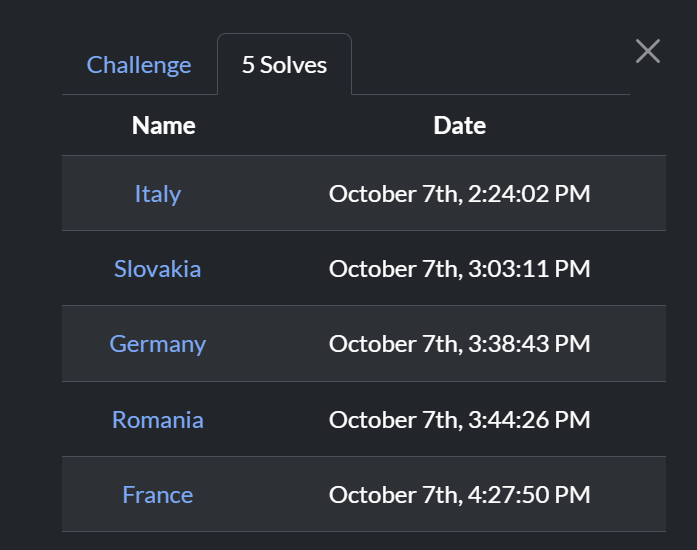
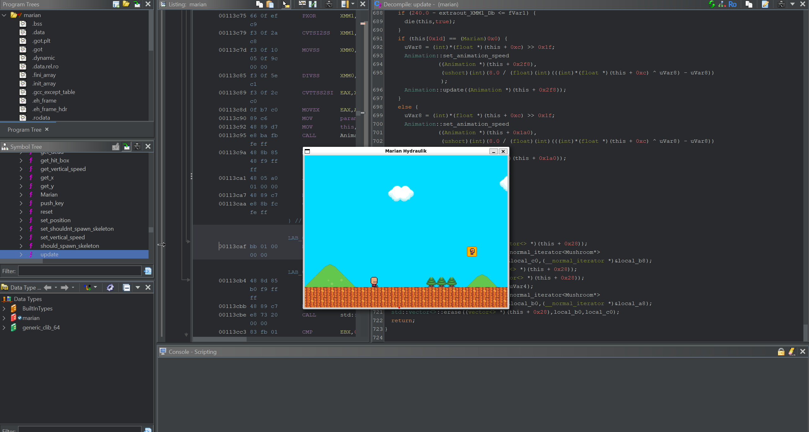
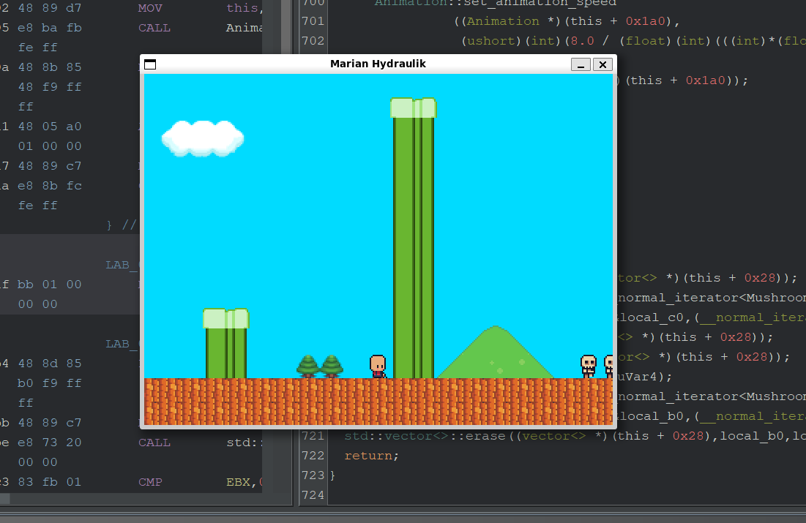
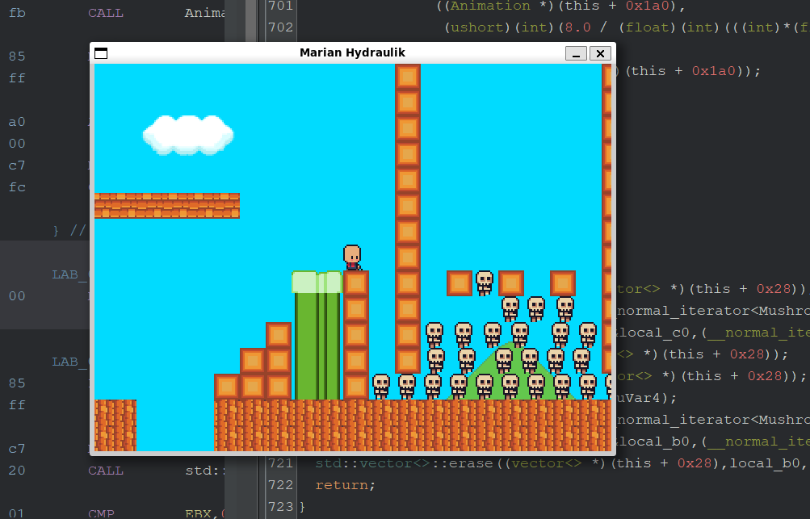
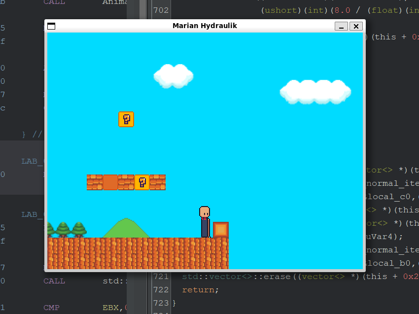
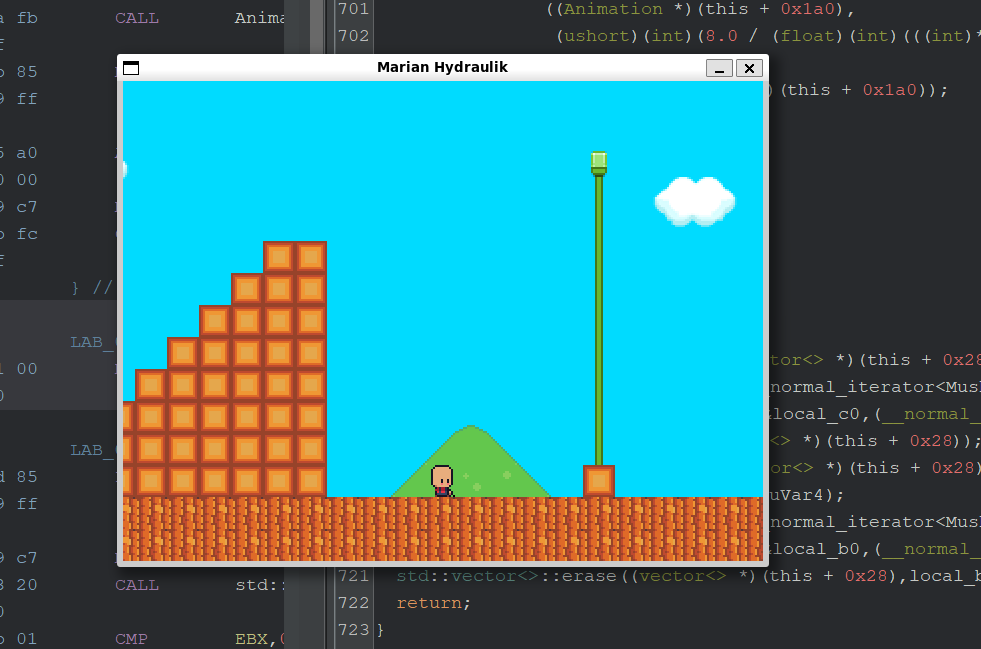
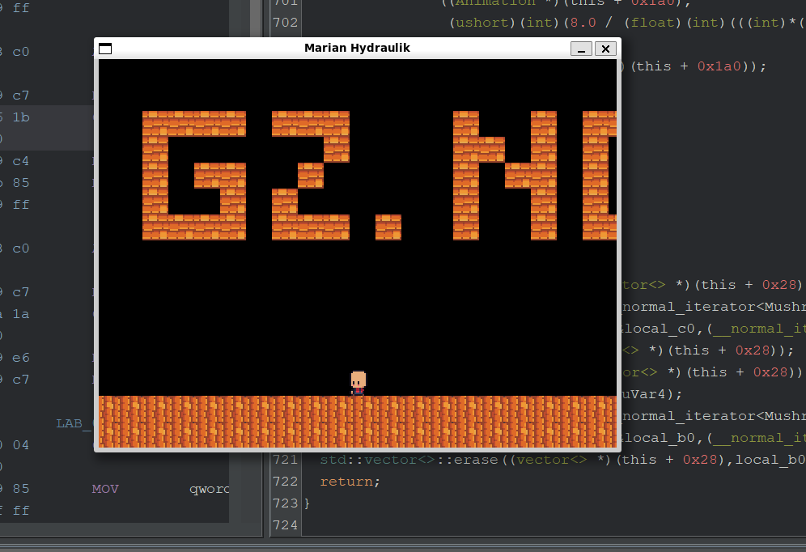

import Callout from '@/components/Callout.astro'

Recently we ([Slovak Cyber Team](https://cyberteam.sk/)), the national team of the Slovak Republic, competed at the European Cybersecurity Challenge (ECSC), the competition whose preparation took a very long time. However, our hard work paid off, and we managed to end up 4th in the final standings, a historical placement for Slovakia (ECSC 2024, Torino, Italy, 21st place), defeating giants in the process, almost winning the A/D CTF (We were overtaken in the last 3 ticks, unbelievable)!


## rev - Marian Hydraulik (5 solves)
> Surely, you can't cheat this game, right?
> Note : First solve locally, and then move to the remote. Connect to the remote with VNC.
> Hint : Check Marian::update, maybe you'll find something interesting there?

I managed to second solve this challenge, so that was pretty cool.



We are given a single artifact which is an ELF binary called "marian".
```shell
$ ./file marian
> marian: ELF 64-bit LSB pie executable, x86-64, version 1 (GNU/Linux), dynamically linked, interpreter /lib64/ld-linux-x86-64.so.2, BuildID[sha1]=da8e85ef76fde554e4b43590ec59a82294f59d73, for GNU/Linux 3.2.0, not stripped
```

Executing the binary starts a game :



Short TL;DR : The game is a tiny SFML platformer prototype, basically a "Mario (apparently for polish people Marian Hydraulik) that goes right" demo, whose real purpose is to turn a color-coded PNG sketch into a playable level. You run, smash, eat, jump. The game opens a 640×480 window titled "Marian Hydraulik" and renders a 320x240 view (scaled 2x), where tile size is 16x16 and view shows 20x15 tiles.

> [!NOTE]
> SFML (Simple and Fast Multimedia Library), is a cross-platform software development library designed to provide a simple application programming interface to various multimedia components. SFML is an excellent library that can be used to create 2D games and similar applications in C++. It's an abstraction over OpenGL and various system APIs, presenting a consistent and easy-to-use interface.

Now, the very first thing that I did was simple - play the game. We need an obstacle to pop up to figure out what our next move is. And very much expectedly so, we stumble upon an obstacle very quickly.



A massive pipe is standing in our way. Initial analysis of the game controls gives us no clue on what to do next - we can only jump a small distance on the Y axis and move left or right. This is where we reached a dead end in the game analysis, so I fired up Ghidra. 
Reading the main function shows essentially nothing other than boilerplate setup functions. `Marian::update` is the function in which changes to the Marian object (the character) are made, and consequently the changes to our sprite we need to make in order to cheat the game.

`Marian::update` shows over 700 lines of code. Uploading for curiosity, collapsing for sanity.

```c title="marian::update.c" collapse={6-723}

/* Marian::update(unsigned int, MapManager&) */

void __thiscall Marian::update(Marian *this,uint param_1,MapManager *param_2)

{
  float fVar1;
  bool bVar2;
  char cVar3;
  undefined8 uVar4;
  undefined8 uVar5;
  float *pfVar6;
  int *piVar7;
  uint uVar8;
  double dVar9;
  float extraout_XMM1_Db;
  undefined1 auVar10 [16];
  undefined8 local_6b8;
  undefined8 local_6b0;
  undefined8 local_6a8;
  undefined8 local_6a0;
  undefined8 local_698;
  undefined8 local_690;
  undefined8 local_688;
  undefined8 local_680;
  undefined8 local_678;
  undefined8 local_670;
  undefined1 local_668 [8];
  undefined8 local_660;
  vector<> local_658 [32];
  vector<> local_638 [32];
  undefined8 local_618;
  undefined8 local_610;
  undefined8 local_608;
  undefined8 local_600;
  int local_5f8 [12];
  undefined8 local_5c8;
  undefined8 local_5c0;
  undefined8 local_5b8;
  undefined8 local_5b0;
  undefined4 local_5a8;
  float local_5a4;
  float local_5a0;
  float local_59c;
  float local_598;
  float local_594;
  float local_590;
  float local_58c;
  vector local_588 [32];
  vector<> local_568 [32];
  undefined4 local_548;
  undefined4 local_544;
  undefined4 local_540;
  undefined4 local_53c;
  undefined4 local_538;
  allocator<Cell> local_529;
  vector local_528 [32];
  vector<> local_508 [32];
  undefined4 local_4e8;
  undefined4 local_4e4;
  undefined4 local_4e0;
  undefined4 local_4dc;
  allocator<Cell> local_4c9;
  vector local_4c8 [32];
  Rect local_4a8 [36];
  undefined4 local_484;
  allocator<Cell> local_47d;
  undefined4 local_47c;
  vector local_478 [32];
  vector local_458 [32];
  vector<> local_438 [32];
  undefined4 local_418;
  undefined4 local_414;
  undefined4 local_410;
  undefined4 local_40c;
  undefined4 local_408;
  allocator<Cell> local_401;
  float local_400;
  float local_3fc;
  vector local_3f8 [32];
  vector<> local_3d8 [32];
  undefined4 local_3b8;
  undefined4 local_3b4;
  undefined4 local_3b0;
  undefined4 local_3ac;
  undefined4 local_3a8;
  allocator<Cell> local_399;
  vector local_398 [32];
  Rect local_378 [36];
  undefined4 local_354;
  allocator<Cell> local_34d;
  undefined4 local_34c;
  vector local_348 [32];
  Rect local_328 [28];
  undefined4 local_30c;
  allocator<Cell> local_305;
  undefined4 local_304;
  undefined4 local_300;
  Color local_2fc [4];
  Mushroom local_2f8 [352];
  vector local_198 [32];
  vector<> local_178 [32];
  undefined4 local_158;
  undefined4 local_154;
  undefined4 local_150;
  undefined4 local_14c;
  undefined4 local_148;
  allocator<Cell> local_139;
  undefined1 local_138 [16];
  undefined1 local_128 [16];
  vector local_118 [32];
  Rect local_f8 [32];
  undefined4 local_d8;
  allocator<Cell> local_d1;
  undefined4 local_d0;
  float local_cc;
  int local_c8 [2];
  undefined8 local_c0;
  undefined8 local_b8;
  undefined8 local_b0;
  undefined8 local_a8;
  int *local_a0;
  Mushroom *local_98;
  Mushroom *local_90;
  undefined4 *local_88;
  vector<> *local_80;
  vector<> *local_78;
  int *local_70;
  vector<> *local_68;
  int *local_60;
  vector<> *local_58;
  int *local_50;
  vector<> *local_48;
  vector<> *local_40;
  vector<> *local_38;
  char local_29;
  
  local_5f8[0] = 0xb;
  local_5f8[1] = 4;
  local_5f8[2] = 0xc;
  local_5f8[3] = 0xc;
  local_5f8[4] = 4;
  local_5f8[5] = 0x13;
  local_5f8[6] = 7;
  local_5f8[7] = 0x11;
  local_5f8[8] = 0x14;
  local_38 = (vector<> *)(this + 0x40);
  local_600 = std::vector<>::begin(local_38);
  local_608 = std::vector<>::end(local_38);
  while (bVar2 = __gnu_cxx::operator!=
                           ((__normal_iterator *)&local_600,(__normal_iterator *)&local_608), bVa r2)
  {
    local_a0 = (int *)__gnu_cxx::__normal_iterator<>::operator*((__normal_iterator<> *)&local_60 0);
    if (local_5f8[(int)(uint)*(ushort *)(this + 6)] == *local_a0) {
      *(short *)(this + 6) = *(short *)(this + 6) + 1;
      if (8 < *(ushort *)(this + 6)) {
        local_5c0 = std::vector<>::end((vector<> *)(this + 0x450));
        __gnu_cxx::__normal_iterator<>::__normal_iterator<Cell*>
                  ((__normal_iterator<> *)&local_5c8,(__normal_iterator *)&local_5c0);
        local_5a8 = 4;
        uVar4 = std::vector<>::end((vector<> *)(this + 0x450));
        uVar5 = std::vector<>::begin((vector<> *)(this + 0x450));
        local_5b0 = std::remove<>(uVar5,uVar4,&local_5a8);
        __gnu_cxx::__normal_iterator<>::__normal_iterator<Cell*>
                  ((__normal_iterator<> *)&local_5b8,(__normal_iterator *)&local_5b0);
        std::vector<>::erase((vector<> *)(this + 0x450),local_5b8,local_5c8);
        *(undefined2 *)(this + 6) = 0;
        this[5] = (Marian)0x1;
      }
    }
    else {
      *(undefined2 *)(this + 6) = 0;
    }
    __gnu_cxx::__normal_iterator<>::operator++((__normal_iterator<> *)&local_600);
  }
  std::vector<>::clear((vector<> *)(this + 0x40));
  if (*(float *)(this + 8) != 0.0) {
    *(undefined4 *)(this + 0x10) = *(undefined4 *)(this + 8);
    *(undefined4 *)(this + 8) = 0;
  }
  local_40 = (vector<> *)(this + 0x28);
  local_610 = std::vector<>::begin(local_40);
  local_618 = std::vector<>::end(local_40);
  while (bVar2 = __gnu_cxx::operator!=
                           ((__normal_iterator *)&local_610,(__normal_iterator *)&local_618), bVa r2)
  {
    local_98 = (Mushroom *)
               __gnu_cxx::__normal_iterator<>::operator*((__normal_iterator<> *)&local_610);
    Mushroom::update(local_98,param_1,param_2);
    __gnu_cxx::__normal_iterator<>::operator++((__normal_iterator<> *)&local_610);
  }
  if (this[2] != (Marian)0x0) {
    if (*(short *)(this + 0x1e) == 0) {
      local_cc = *(float *)(this + 0x10) + 0.25;
      pfVar6 = std::min<float>(&local_cc,(float *)&MAX_VERTICAL_SPEED);
      *(float *)(this + 0x10) = *pfVar6;
      *(float *)(this + 0x18) = *(float *)(this + 0x10) + *(float *)(this + 0x18);
    }
    else if (*(short *)(this + 0x1e) == 1) {
      *(undefined4 *)(this + 0x10) = 0xc0800000;
    }
    local_c8[0] = *(ushort *)(this + 0x1e) - 1;
    local_c8[1] = 0;
    piVar7 = std::max<int>(local_c8 + 1,local_c8);
    *(short *)(this + 0x1e) = (short)*piVar7;
    goto LAB_00113ddf;
  }
  local_29 = '\0';
  std::vector<>::vector(local_638);
  std::vector<>::vector(local_658);
                    /* try { // try from 00112217 to 00112519 has its CatchHandler @ 0011401d */
  _local_668 = get_hit_box(this);
  this[4] = (Marian)0x0;
  if (1424.0 < *(float *)(this + 0x14)) {
    *this = (Marian)0x1;
  }
  if ((5.0 < *(float *)(this + 0x14)) || (*this == (Marian)0x0)) {
LAB_0011229e:
    bVar2 = false;
  }
  else {
    cVar3 = sf::Keyboard::isKeyPressed(0x4a);
    if (cVar3 != '\x01') goto LAB_0011229e;
    bVar2 = true;
  }
  if (bVar2) {
    *(undefined4 *)(this + 0x14) = 0x44b50000;
    *(undefined4 *)(this + 0x18) = 0x42c00000;
    *(undefined2 *)(this + 0x22) = 0x200;
    bVar2 = false;
  }
  else {
    if (this[1] == (Marian)0x0) {
      cVar3 = sf::Keyboard::isKeyPressed(0x48);
      if (cVar3 == '\0') {
        cVar3 = sf::Keyboard::isKeyPressed(0x47);
        if (cVar3 != '\x01') goto LAB_00112326;
        bVar2 = true;
      }
      else {
LAB_00112326:
        bVar2 = false;
      }
      if (bVar2) {
        local_29 = '\x01';
        local_5a4 = -2.0;
        local_5a0 = *(float *)(this + 0xc) - 0.25;
        pfVar6 = std::max<float>(&local_5a0,&local_5a4);
        *(float *)(this + 0xc) = *pfVar6;
      }
      cVar3 = sf::Keyboard::isKeyPressed(0x47);
      if (cVar3 == '\0') {
        cVar3 = sf::Keyboard::isKeyPressed(0x48);
        if (cVar3 != '\x01') goto LAB_001123b6;
        bVar2 = true;
      }
      else {
LAB_001123b6:
        bVar2 = false;
      }
      if (bVar2) {
        local_29 = '\x01';
        local_59c = *(float *)(this + 0xc) + 0.25;
        pfVar6 = std::min<float>(&local_59c,(float *)&MARIAN_WALK_SPEED);
        *(float *)(this + 0xc) = *pfVar6;
      }
    }
    if (local_29 == '\0') {
      if (*(float *)(this + 0xc) <= 0.0) {
        if (*(float *)(this + 0xc) < 0.0) {
          local_590 = *(float *)(this + 0xc) + 0.25;
          local_58c = 0.0;
          pfVar6 = std::min<float>(&local_58c,&local_590);
          *(float *)(this + 0xc) = *pfVar6;
        }
      }
      else {
        local_598 = *(float *)(this + 0xc) - 0.25;
        local_594 = 0.0;
        pfVar6 = std::max<float>(&local_594,&local_598);
        *(float *)(this + 0xc) = *pfVar6;
      }
    }
    auVar10 = _local_668;
    if (this[0x1d] != (Marian)0x0) {
      cVar3 = sf::Keyboard::isKeyPressed(2);
      if (cVar3 == '\x01') {
LAB_00112522:
        bVar2 = true;
        auVar10 = _local_668;
      }
      else {
        cVar3 = sf::Keyboard::isKeyPressed(0x4a);
        if (cVar3 == '\x01') goto LAB_00112522;
        bVar2 = false;
        auVar10 = _local_668;
      }
      if (bVar2) {
        if (this[1] == (Marian)0x0) {
          this[1] = (Marian)0x1;
          *(float *)(this + 0x18) = *(float *)(this + 0x18) + 16.0;
        }
      }
      else if (this[1] == (Marian)0x1) {
        local_660._4_4_ = auVar10._12_4_;
        local_660 = CONCAT44(local_660._4_4_ + 16.0,auVar10._8_4_);
        local_668._4_4_ = auVar10._4_4_;
        local_668._0_4_ = auVar10._0_4_;
        local_668._4_4_ = (float)local_668._4_4_ - 16.0;
        local_548 = 0;
        local_544 = 1;
        local_540 = 4;
        local_53c = 5;
        local_538 = 6;
        std::allocator<Cell>::allocator();
                    /* try { // try from 00112642 to 00112646 has its CatchHandler @ 00113ea3 */
        std::vector<>::vector(local_568,&local_548,5,&local_529);
                    /* try { // try from 00112666 to 0011266a has its CatchHandler @ 00113e8f */
        MapManager::map_collision(local_588,(Rect *)param_2);
        std::vector<>::operator=(local_638,local_588);
        std::vector<>::~vector((vector<> *)local_588);
        std::vector<>::~vector(local_568);
        std::allocator<Cell>::~allocator(&local_529);
        uVar4 = std::vector<>::end(local_638);
        uVar5 = std::vector<>::begin(local_638);
                    /* try { // try from 001126d8 to 001126dc has its CatchHandler @ 0011401d */
        bVar2 = std::all_of<>(uVar5,uVar4);
        auVar10._8_8_ = local_660;
        auVar10._0_8_ = local_668;
        if (bVar2) {
          this[1] = (Marian)0x0;
          *(float *)(this + 0x18) = *(float *)(this + 0x18) - 16.0;
        }
        else {
          local_4e8 = 0;
          local_4e4 = 4;
          local_4e0 = 5;
          local_4dc = 6;
          std::allocator<Cell>::allocator();
                    /* try { // try from 0011279c to 001127a0 has its CatchHandler @ 00113ece */
          std::vector<>::vector(local_508,&local_4e8,4,&local_4c9);
                    /* try { // try from 001127c0 to 001127c4 has its CatchHandler @ 00113eba */
          MapManager::map_collision(local_528,(Rect *)param_2);
          std::vector<>::operator=(local_638,local_528);
          std::vector<>::~vector((vector<> *)local_528);
          std::vector<>::~vector(local_508);
          std::allocator<Cell>::~allocator(&local_4c9);
          uVar4 = std::vector<>::end(local_638);
          uVar5 = std::vector<>::begin(local_638);
                    /* try { // try from 00112832 to 00112836 has its CatchHandler @ 0011401d */
          bVar2 = std::all_of<>(uVar5,uVar4);
          auVar10._8_8_ = local_660;
          auVar10._0_8_ = local_668;
          if (bVar2) {
            this[1] = (Marian)0x0;
            *(float *)(this + 0x18) = *(float *)(this + 0x18) - 16.0;
            local_484 = 1;
            std::allocator<Cell>::allocator();
                    /* try { // try from 001128d7 to 001128db has its CatchHandler @ 00113ef9 */
            std::vector<>::vector(local_4a8,&local_484,1,&local_47d);
                    /* try { // try from 00112902 to 00112906 has its CatchHandler @ 00113ee5 */
            MapManager::map_collision(local_4c8,(vector *)param_2,local_4a8);
            std::vector<>::~vector((vector<> *)local_4c8);
            std::vector<>::~vector((vector<> *)local_4a8);
            std::allocator<Cell>::~allocator(&local_47d);
            local_48 = local_658;
            local_670 = std::vector<>::begin(local_48);
            local_678 = std::vector<>::end(local_48);
            while( true ) {
              bVar2 = __gnu_cxx::operator!=
                                ((__normal_iterator *)&local_670,(__normal_iterator *)&local_678) ;
              auVar10._8_8_ = local_660;
              auVar10._0_8_ = local_668;
              if (!bVar2) break;
              local_50 = (int *)__gnu_cxx::__normal_iterator<>::operator*
                                          ((__normal_iterator<> *)&local_670);
              local_47c = 3;
                    /* try { // try from 001129c7 to 00112c30 has its CatchHandler @ 0011401d */
              MapManager::set_map_cell
                        (param_2,(ushort)*local_50,(ushort)local_50[1],(Cell *)&local_47c);
              MapManager::add_brick_particles
                        (param_2,(ushort)(*local_50 << 4),(ushort)(local_50[1] << 4));
              __gnu_cxx::__normal_iterator<>::operator++((__normal_iterator<> *)&local_670);
            }
          }
        }
      }
    }
    _local_668 = auVar10;
    auVar10 = get_hit_box(this);
    local_660 = auVar10._8_8_;
    local_668._0_4_ = auVar10._0_4_;
    local_668._4_4_ = auVar10._4_4_;
    local_668._0_4_ = *(float *)(this + 0xc) + (float)local_668._0_4_;
    MapManager::map_collision(local_478,(Rect *)param_2);
    std::vector<>::operator=(local_638,local_478);
    std::vector<>::~vector((vector<> *)local_478);
    uVar4 = std::vector<>::end(local_638);
    uVar5 = std::vector<>::begin(local_638);
    bVar2 = std::all_of<>(uVar5,uVar4);
    if (bVar2) {
      *(float *)(this + 0x14) = *(float *)(this + 0xc) + *(float *)(this + 0x14);
    }
    else {
      local_29 = '\0';
      if (*(float *)(this + 0xc) <= 0.0) {
        if (*(float *)(this + 0xc) < 0.0) {
          dVar9 = floor((double)((*(float *)(this + 0x14) + *(float *)(this + 0xc)) / 16.0));
          *(float *)(this + 0x14) = (float)((dVar9 + 1.0) * 16.0);
        }
      }
      else {
        dVar9 = ceil((double)((*(float *)(this + 0x14) + *(float *)(this + 0xc)) / 16.0));
        *(float *)(this + 0x14) = (float)((dVar9 - 1.0) * 16.0);
      }
      *(undefined4 *)(this + 0xc) = 0;
    }
    auVar10 = get_hit_box(this);
    local_660 = auVar10._8_8_;
    local_668._4_4_ = auVar10._4_4_;
    local_668._0_4_ = auVar10._0_4_;
    local_668._4_4_ = (float)local_668._4_4_ + 1.0;
    local_418 = 0;
    local_414 = 1;
    local_410 = 4;
    local_40c = 5;
    local_408 = 6;
    std::allocator<Cell>::allocator();
                    /* try { // try from 00112ced to 00112cf1 has its CatchHandler @ 00113f24 */
    std::vector<>::vector(local_438,&local_418,5,&local_401);
                    /* try { // try from 00112d11 to 00112d15 has its CatchHandler @ 00113f10 */
    MapManager::map_collision(local_458,(Rect *)param_2);
    std::vector<>::operator=(local_638,local_458);
    std::vector<>::~vector((vector<> *)local_458);
    std::vector<>::~vector(local_438);
    std::allocator<Cell>::~allocator(&local_401);
                    /* try { // try from 00112d61 to 00112f4a has its CatchHandler @ 0011401d */
    cVar3 = sf::Keyboard::isKeyPressed(0x49);
    if ((cVar3 == '\x01') || (cVar3 = sf::Keyboard::isKeyPressed(0x19), cVar3 == '\x01')) {
      bVar2 = true;
    }
    else {
      bVar2 = false;
    }
    if (bVar2) {
      if ((this[0x1d] == (Marian)0x1) && (cVar3 = sf::Keyboard::isKeyPressed(0xb), cVar3 == '\x0 1'))
      {
        bVar2 = true;
      }
      else {
        bVar2 = false;
      }
      if (bVar2) {
        *(undefined4 *)(this + 0x10) = 0xc0800000;
      }
      else {
        if (*(float *)(this + 0x10) == 0.0) {
          uVar4 = std::vector<>::end(local_638);
          uVar5 = std::vector<>::begin(local_638);
          bVar2 = std::all_of<>(uVar5,uVar4);
          if (bVar2) goto LAB_00112e36;
          bVar2 = true;
        }
        else {
LAB_00112e36:
          bVar2 = false;
        }
        if (bVar2) {
          *(undefined4 *)(this + 0x10) = 0xc0800000;
          this[0x1c] = (Marian)0x8;
        }
        else if (this[0x1c] == (Marian)0x0) {
          local_400 = *(float *)(this + 0x10) + 0.25;
          pfVar6 = std::min<float>(&local_400,(float *)&MAX_VERTICAL_SPEED);
          *(float *)(this + 0x10) = *pfVar6;
        }
        else {
          *(undefined4 *)(this + 0x10) = 0xc0800000;
          this[0x1c] = (Marian)((char)this[0x1c] + -1);
        }
      }
    }
    else {
      local_3fc = *(float *)(this + 0x10) + 0.25;
      pfVar6 = std::min<float>(&local_3fc,(float *)&MAX_VERTICAL_SPEED);
      *(float *)(this + 0x10) = *pfVar6;
      this[0x1c] = (Marian)0x0;
    }
    auVar10 = get_hit_box(this);
    local_660 = auVar10._8_8_;
    local_668._4_4_ = auVar10._4_4_;
    local_668._0_4_ = auVar10._0_4_;
    local_668._4_4_ = *(float *)(this + 0x10) + (float)local_668._4_4_;
    local_3b8 = 0;
    local_3b4 = 1;
    local_3b0 = 4;
    local_3ac = 5;
    local_3a8 = 6;
    std::allocator<Cell>::allocator();
                    /* try { // try from 0011300b to 0011300f has its CatchHandler @ 00113f4f */
    std::vector<>::vector(local_3d8,&local_3b8,5,&local_399);
                    /* try { // try from 0011302f to 00113033 has its CatchHandler @ 00113f3b */
    MapManager::map_collision(local_3f8,(Rect *)param_2);
    std::vector<>::operator=(local_638,local_3f8);
    std::vector<>::~vector((vector<> *)local_3f8);
    std::vector<>::~vector(local_3d8);
    std::allocator<Cell>::~allocator(&local_399);
    uVar4 = std::vector<>::end(local_638);
    uVar5 = std::vector<>::begin(local_638);
                    /* try { // try from 001130a1 to 001130a5 has its CatchHandler @ 0011401d */
    bVar2 = std::all_of<>(uVar5,uVar4);
    if (bVar2) {
      *(float *)(this + 0x18) = *(float *)(this + 0x10) + *(float *)(this + 0x18);
    }
    else {
      if (0.0 <= *(float *)(this + 0x10)) {
        if (0.0 < *(float *)(this + 0x10)) {
          dVar9 = ceil((double)((*(float *)(this + 0x18) + *(float *)(this + 0x10)) / 16.0));
          *(float *)(this + 0x18) = (float)((dVar9 - 1.0) * 16.0);
        }
      }
      else {
        if ((this[1] == (Marian)0x0) && (this[0x1d] != (Marian)0x0)) {
          local_354 = 1;
          std::allocator<Cell>::allocator();
                    /* try { // try from 00113158 to 0011315c has its CatchHandler @ 00113f7a */
          std::vector<>::vector(local_378,&local_354,1,&local_34d);
                    /* try { // try from 00113186 to 0011318a has its CatchHandler @ 00113f66 */
          MapManager::map_collision(local_398,(vector *)param_2,local_378);
          std::vector<>::~vector((vector<> *)local_398);
          std::vector<>::~vector((vector<> *)local_378);
          std::allocator<Cell>::~allocator(&local_34d);
          local_58 = local_658;
          local_680 = std::vector<>::begin(local_58);
          local_688 = std::vector<>::end(local_58);
          while (bVar2 = __gnu_cxx::operator!=
                                   ((__normal_iterator *)&local_680,(__normal_iterator *)&local_6 88)
                , bVar2) {
            local_60 = (int *)__gnu_cxx::__normal_iterator<>::operator*
                                        ((__normal_iterator<> *)&local_680);
            local_34c = 3;
                    /* try { // try from 0011324b to 00113279 has its CatchHandler @ 0011401d */
            MapManager::set_map_cell
                      (param_2,(ushort)*local_60,(ushort)local_60[1],(Cell *)&local_34c);
            MapManager::add_brick_particles
                      (param_2,(ushort)(*local_60 << 4),(ushort)(local_60[1] << 4));
            __gnu_cxx::__normal_iterator<>::operator++((__normal_iterator<> *)&local_680);
          }
        }
        local_30c = 5;
        std::allocator<Cell>::allocator();
                    /* try { // try from 001132ee to 001132f2 has its CatchHandler @ 00113fa5 */
        std::vector<>::vector(local_328,&local_30c,1,&local_305);
                    /* try { // try from 0011331c to 00113320 has its CatchHandler @ 00113f91 */
        MapManager::map_collision(local_348,(vector *)param_2,local_328);
        std::vector<>::~vector((vector<> *)local_348);
        std::vector<>::~vector((vector<> *)local_328);
        std::allocator<Cell>::~allocator(&local_305);
        local_68 = local_658;
        local_690 = std::vector<>::begin(local_68);
        local_698 = std::vector<>::end(local_68);
        while (bVar2 = __gnu_cxx::operator!=
                                 ((__normal_iterator *)&local_690,(__normal_iterator *)&local_698 ),
              bVar2) {
          local_70 = (int *)__gnu_cxx::__normal_iterator<>::operator*
                                      ((__normal_iterator<> *)&local_690);
          local_304 = 0;
                    /* try { // try from 001133e1 to 00113498 has its CatchHandler @ 0011401d */
          MapManager::set_map_cell(param_2,(ushort)*local_70,(ushort)local_70[1],(Cell *)&local_3 04)
          ;
          local_300 = MapManager::get_map_sketch_pixel((ushort)param_2,(ushort)*local_70);
          sf::Color::Color(local_2fc,0xff,'I','U',0xff);
          cVar3 = sf::operator==(local_2fc,(Color *)&local_300);
          if (cVar3 == '\0') {
                    /* try { // try from 001134e1 to 001136ce has its CatchHandler @ 0011401d */
            MapManager::add_question_block_coin
                      (param_2,(ushort)(*local_70 << 4),(ushort)(local_70[1] << 4));
          }
          else {
            Mushroom::Mushroom(local_2f8,(float)(*local_70 << 4),(float)(local_70[1] << 4));
                    /* try { // try from 001134a6 to 001134aa has its CatchHandler @ 00113fb9 */
            std::vector<>::push_back((vector<> *)(this + 0x28),local_2f8);
            Mushroom::~Mushroom(local_2f8);
          }
          __gnu_cxx::__normal_iterator<>::operator++((__normal_iterator<> *)&local_690);
        }
        dVar9 = floor((double)((*(float *)(this + 0x18) + *(float *)(this + 0x10)) / 16.0));
        *(float *)(this + 0x18) = (float)((dVar9 + 1.0) * 16.0);
      }
      this[0x1c] = (Marian)0x0;
      *(undefined4 *)(this + 0x10) = 0;
    }
    if (*(float *)(this + 0xc) == 0.0) {
      if (local_29 == '\x01') {
        this[3] = (Marian)(this[3] != (Marian)0x1);
      }
    }
    else if (*(float *)(this + 0xc) <= 0.0) {
      if (*(float *)(this + 0xc) < 0.0) {
        this[3] = (Marian)0x1;
      }
    }
    else {
      this[3] = (Marian)0x0;
    }
    auVar10 = get_hit_box(this);
    local_660 = auVar10._8_8_;
    local_668._4_4_ = auVar10._4_4_;
    local_668._0_4_ = auVar10._0_4_;
    local_668._4_4_ = (float)local_668._4_4_ + 1.0;
    local_158 = 0;
    local_154 = 1;
    local_150 = 4;
    local_14c = 5;
    local_148 = 6;
    std::allocator<Cell>::allocator();
                    /* try { // try from 0011378b to 0011378f has its CatchHandler @ 00113fe1 */
    std::vector<>::vector(local_178,&local_158,5,&local_139);
                    /* try { // try from 001137af to 001137b3 has its CatchHandler @ 00113fcd */
    MapManager::map_collision(local_198,(Rect *)param_2);
    std::vector<>::operator=(local_638,local_198);
    std::vector<>::~vector((vector<> *)local_198);
    std::vector<>::~vector(local_178);
    std::allocator<Cell>::~allocator(&local_139);
    uVar4 = std::vector<>::end(local_638);
    uVar5 = std::vector<>::begin(local_638);
                    /* try { // try from 00113821 to 001139c7 has its CatchHandler @ 0011401d */
    bVar2 = std::all_of<>(uVar5,uVar4);
    if (!bVar2) {
      this[4] = (Marian)0x1;
    }
    local_78 = (vector<> *)(this + 0x28);
    local_6a0 = std::vector<>::begin(local_78);
    local_6a8 = std::vector<>::end(local_78);
    while( true ) {
      bVar2 = __gnu_cxx::operator!=((__normal_iterator *)&local_6a0,(__normal_iterator *)&local_ 6a8)
      ;
      if (!bVar2) break;
      local_90 = (Mushroom *)
                 __gnu_cxx::__normal_iterator<>::operator*((__normal_iterator<> *)&local_6a0);
      auVar10 = get_hit_box(this);
      local_138 = auVar10;
      auVar10 = Mushroom::get_hit_box(local_90);
      local_128 = auVar10;
      cVar3 = sf::Rect<float>::intersects((Rect<float> *)local_138,(Rect *)local_128);
      if (cVar3 == '\x01') {
        Mushroom::set_dead(local_90,true);
        if (this[0x1d] == (Marian)0x0) {
          this[0x1d] = (Marian)0x1;
          *(undefined2 *)(this + 0x20) = 0x40;
          *(float *)(this + 0x18) = *(float *)(this + 0x18) - 16.0;
        }
      }
      __gnu_cxx::__normal_iterator<>::operator++((__normal_iterator<> *)&local_6a0);
    }
    if (*(short *)(this + 0x22) != 0) {
      *(short *)(this + 0x22) = *(short *)(this + 0x22) + -1;
    }
    _local_668 = get_hit_box(this);
    local_d8 = 2;
    std::allocator<Cell>::allocator();
                    /* try { // try from 00113a40 to 00113a44 has its CatchHandler @ 00114009 */
    std::vector<>::vector(local_f8,&local_d8,1,&local_d1);
                    /* try { // try from 00113a6e to 00113a72 has its CatchHandler @ 00113ff5 */
    MapManager::map_collision(local_118,(vector *)param_2,local_f8);
    std::vector<>::~vector((vector<> *)local_118);
    std::vector<>::~vector((vector<> *)local_f8);
    std::allocator<Cell>::~allocator(&local_d1);
    local_80 = local_658;
    local_6b0 = std::vector<>::begin(local_80);
    local_6b8 = std::vector<>::end(local_80);
    while( true ) {
      bVar2 = __gnu_cxx::operator!=((__normal_iterator *)&local_6b0,(__normal_iterator *)&local_ 6b8)
      ;
      if (!bVar2) break;
      local_88 = (undefined4 *)
                 __gnu_cxx::__normal_iterator<>::operator*((__normal_iterator<> *)&local_6b0);
      local_d0 = 3;
                    /* try { // try from 00113b2f to 00113cae has its CatchHandler @ 0011401d */
      MapManager::set_map_cell(param_2,(ushort)*local_88,(ushort)local_88[1],(Cell *)&local_d0);
      __gnu_cxx::__normal_iterator<>::operator++((__normal_iterator<> *)&local_6b0);
    }
    if (*(short *)(this + 0x20) != 0) {
      *(short *)(this + 0x20) = *(short *)(this + 0x20) + -1;
    }
    fVar1 = *(float *)(this + 0x18);
    get_hit_box(this);
    if (240.0 - extraout_XMM1_Db <= fVar1) {
      die(this,true);
    }
    if (this[0x1d] == (Marian)0x0) {
      uVar8 = (int)*(float *)(this + 0xc) >> 0x1f;
      Animation::set_animation_speed
                ((Animation *)(this + 0x2f8),
                 (ushort)(int)(8.0 / (float)(int)(((int)*(float *)(this + 0xc) ^ uVar8) - uVar8)) );
      Animation::update((Animation *)(this + 0x2f8));
    }
    else {
      uVar8 = (int)*(float *)(this + 0xc) >> 0x1f;
      Animation::set_animation_speed
                ((Animation *)(this + 0x1a0),
                 (ushort)(int)(8.0 / (float)(int)(((int)*(float *)(this + 0xc) ^ uVar8) - uVar8)) );
      Animation::update((Animation *)(this + 0x1a0));
    }
    bVar2 = true;
  }
  std::vector<>::~vector(local_658);
  std::vector<>::~vector(local_638);
  if (!bVar2) {
    return;
  }
LAB_00113ddf:
  local_b8 = std::vector<>::end((vector<> *)(this + 0x28));
  __gnu_cxx::__normal_iterator<>::__normal_iterator<Mushroom*>
            ((__normal_iterator<> *)&local_c0,(__normal_iterator *)&local_b8);
  uVar4 = std::vector<>::end((vector<> *)(this + 0x28));
  uVar5 = std::vector<>::begin((vector<> *)(this + 0x28));
  local_a8 = std::remove_if<>(uVar5,uVar4);
  __gnu_cxx::__normal_iterator<>::__normal_iterator<Mushroom*>
            ((__normal_iterator<> *)&local_b0,(__normal_iterator *)&local_a8);
  std::vector<>::erase((vector<> *)(this + 0x28),local_b0,local_c0);
  return;
}


```

We immediately notice something interesting, directly after variable declaration.

```c
local_5f8[0] = 0xb;
local_5f8[1] = 4;
local_5f8[2] = 0xc;
local_5f8[3] = 0xc;
local_5f8[4] = 4;
local_5f8[5] = 0x13;
local_5f8[6] = 7;
local_5f8[7] = 0x11;
local_5f8[8] = 0x14;
```

The sequence `{0x0B, 0x04, 0x0C, 0x0C, 0x04, 0x13, 0x07, 0x11, 0x14}` are SFML keycodes (A=0 to Z=25) and they decode to -> `L E M M E T H R U`

This leads me to investigate the rest of this code area.

```c title="lemmethru.c"
local_5f8[0] = 0xb;
local_5f8[1] = 4;
local_5f8[2] = 0xc;
local_5f8[3] = 0xc;
local_5f8[4] = 4;
local_5f8[5] = 0x13;
local_5f8[6] = 7;
local_5f8[7] = 0x11;
local_5f8[8] = 0x14;
local_38 = (vector<> *)(this + 0x40);
local_600 = std::vector<>::begin(local_38);
local_608 = std::vector<>::end(local_38);
while (bVar2 = __gnu_cxx::operator!=
                         ((__normal_iterator *)&local_600,(__normal_iterator *)&local_608), bVar2)
{
  local_a0 = (int *)__gnu_cxx::__normal_iterator<>::operator*((__normal_iterator<> *)&local_600);
  if (local_5f8[(int)(uint)*(ushort *)(this + 6)] == *local_a0) {
    *(short *)(this + 6) = *(short *)(this + 6) + 1;
    if (8 < *(ushort *)(this + 6)) {
      local_5c0 = std::vector<>::end((vector<> *)(this + 0x450));
      __gnu_cxx::__normal_iterator<>::__normal_iterator<Cell*>
                ((__normal_iterator<> *)&local_5c8,(__normal_iterator *)&local_5c0);
      local_5a8 = 4;
      uVar4 = std::vector<>::end((vector<> *)(this + 0x450));
      uVar5 = std::vector<>::begin((vector<> *)(this + 0x450));
      local_5b0 = std::remove<>(uVar5,uVar4,&local_5a8);
      __gnu_cxx::__normal_iterator<>::__normal_iterator<Cell*>
                ((__normal_iterator<> *)&local_5b8,(__normal_iterator *)&local_5b0);
      std::vector<>::erase((vector<> *)(this + 0x450),local_5b8,local_5c8);
      *(undefined2 *)(this + 6) = 0;
      this[5] = (Marian)0x1;
    }
  }
  else {
    *(undefined2 *)(this + 6) = 0;
  }
  __gnu_cxx::__normal_iterator<>::operator++((__normal_iterator<> *)&local_600);
}
std::vector<>::clear((vector<> *)(this + 0x40));

```

The codes we found before are matched sequentially against `(this + 0x40)`, which is the ring of recently pushed keys, this vector is cleared after scanning. 
On a full match `(idx > 8)` the source erases `4` from Marian's collidable cells vector at `(this + 0x450)` using remove-erase, and it sets the `this[5]=1` flag, which is the flag identifying whether cheats are active.

>[!NOTE]
> This yields no clip on pipe tiles because elsewhere (and in convert_sketch) the solid pipe tiles are type `4`. Collision sampling is done repeatedly by `MapManager::map_collision()` against a list which allows what cell ids can pass through or not. When a call does not provide its own allow-list, it uses Marian's default, which is the vector we just saw at `(this + 0x450)`. After `LEMMETHRU` (explanation above this note), cell `4` becomes absent, so those tiles never get reported as blocking for Marian. However, we still collide with cell ids `0/1/5/6`, because falling through the ground out of the map wouldn't be beneficial for us, and there are blocks in the obstacles later which would invalidify their own respective cheats.

So how do we reproduce in play? Simply! Refer to the image above of the massive pipe, type in the keystrokes "LEMMETHRU" and from then on you can just walk / noclip through the pipe. Cool stuff!

And so we keep walking, killing skeletons until we stumble upon another obstacle.



We cannot pass through, as an "arena" of skeletons are standing in our way. There is no way to jump over it (the blocks reach to the minimum (or maximum?) of the y-axis), and they're a different cell id from the one which we bypass, so our no clip doesn't work on them. To Ghidra we go. And soon enough, we find another cheat - 

```c title="invulnerability.c"
_local_668 = get_hit_box(this);
this[4] = (Marian)0x0;
if (1424.0 < *(float *)(this + 0x14)) {
  *this = (Marian)0x1;
}
if ((5.0 < *(float *)(this + 0x14)) || (*this == (Marian)0x0)) {
LAB_0011229e:
  bVar2 = false;
}
else {
  cVar3 = sf::Keyboard::isKeyPressed(0x4a);
  if (cVar3 != '\x01') goto LAB_0011229e;
  bVar2 = true;
}
if (bVar2) {
  *(undefined4 *)(this + 0x14) = 0x44b50000;
  *(undefined4 *)(this + 0x18) = 0x42c00000;
  *(undefined2 *)(this + 0x22) = 0x200;
  bVar2 = false;
}
```

Check line `if (1424.0 < *(float *)(this + 0x14)) {`. 
`*(float*)(this+0x14)` is the X axis. If you ever exceed 1424.0, it sets a persistent flag as `*this = (Marian)0x1;`. Now, if you return back to the far left, `x <= 5.0` (refer to the line `if ((5.0 < *(float *)(this + 0x14)) || (*this == (Marian)0x0)) {`, directly under), it tests `Down` (`0x4A`)

When `Down` is pressed in this state with the persistent flag in check, it performs the following :
```c
*(float*)(this+0x14) = 1448.0f # X axis
*(float*)(this+0x18) = 96.0f # Y axis
*(short*)(this+0x22) = 0x200 # 512 frames of invulnerability
```

TL;DR? Reach the right edge as far as you can (trigger the first condition), run back to the start, press down. You're teleported back in front of the arena of skeletons with 512 frames/
ticks of invulnerability and you can pass through all of the skeletons without dying to the next part.

Now we continue as per routine. And now we stumble upon the last obstacle.



There's a large hole in the ground that you can't jump over. And so back to Ghidra we go to find the third cheat.

```c title="jetpack.c"
cVar3 = sf::Keyboard::isKeyPressed(0x49);
if ((cVar3 == '\x01') || (cVar3 = sf::Keyboard::isKeyPressed(0x19), cVar3 == '\x01')) {
  bVar2 = true;
}
else {
  bVar2 = false;
}
if (bVar2) {
  if ((this[0x1d] == (Marian)0x1) && (cVar3 = sf::Keyboard::isKeyPressed(0xb), cVar3 == '\x01')) {
    bVar2 = true;
  }
  else {
    bVar2 = false;
  }
  if (bVar2) {
    *(undefined4 *)(this + 0x10) = 0xc0800000;
  }
  else {
    if (*(float *)(this + 0x10) == 0.0) {
      uVar4 = std::vector<>::end(local_638);
      uVar5 = std::vector<>::begin(local_638);
      bVar2 = std::all_of<>(uVar5,uVar4);
      if (bVar2) goto LAB_00112e36;
      bVar2 = true;
    }
    else {
LAB_00112e36:
      bVar2 = false;
    }
    if (bVar2) {
      *(undefined4 *)(this + 0x10) = 0xc0800000;
      this[0x1c] = (Marian)0x8;
    }
    else if (this[0x1c] == (Marian)0x0) {
      local_400 = *(float *)(this + 0x10) + 0.25;
      pfVar6 = std::min<float>(&local_400,(float *)&MAX_VERTICAL_SPEED);
      *(float *)(this + 0x10) = *pfVar6;
    }
    else {
      *(undefined4 *)(this + 0x10) = 0xc0800000;
      this[0x1c] = (Marian)((char)this[0x1c] + -1);
    }
  }
}
else {
  local_3fc = *(float *)(this + 0x10) + 0.25;
  pfVar6 = std::min<float>(&local_3fc,(float *)&MAX_VERTICAL_SPEED);
  *(float *)(this + 0x10) = *pfVar6;
  this[0x1c] = (Marian)0x0;
}
```

Jump detection is `Up` (`0x49`) or `Z` (`0x19`).

If jumping and `this[0x1d] == 1` (Big, mario) and key `L` (`0x0B`) is `down` forces vy = `-4.0f` (`0xC0800000`) every update tick while the keys are held. That overrides gravity and any existing vy.

Else, it runs normal jump/airborne logic with gravity (`vy += 0.25` nerfed by `MAX_VERTICAL_SPEED`). There’s also a branch granting a short upward kick (`this[0x1c] = 8`) under a specific predicate (the decompiler shows `std::all_of` on a collision buffer), but this cheat path bypasses all of that.

Why does it work? Well, gravity is applied per frame in this section. The cheat path reassigns `vy` to `−4.0f` every frame after any gravity add that would otherwise occur, as long as the key condition holds true. Result? Continuous ascent/hover. At the end we find this stonk :



and walking through it teleports us to this area :



Above (after moving right) reads : GJ. NOW GO TEST ON THE REMOTE SERVICE. 
Replicating on the remote (which was VERY troublesome because I’m a monkey and VNC installation is up there with sagemath installation) directly gave us the flag at the end instead of the "GJ" text. 

## Flag

ECSC{71348}


>[!NOTE]
> All of these respective cheats had to be found among a massive 700 line pile of built-in native functions - such as jump, crouch, stand, horizontal and vertical branches, and modularization with main.
 


